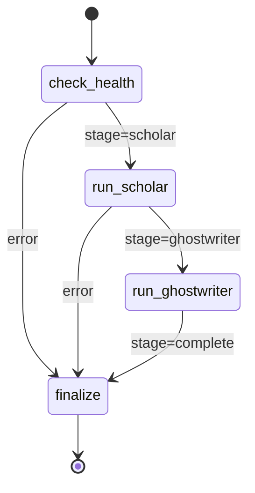
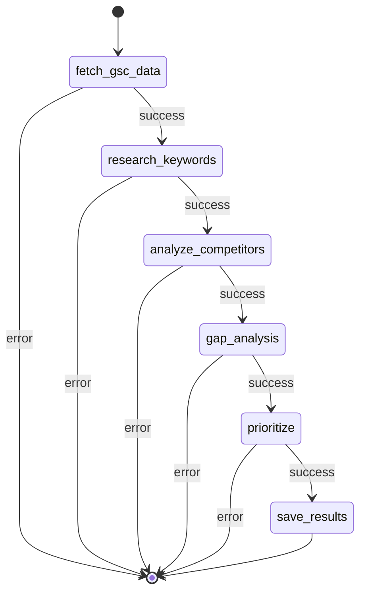
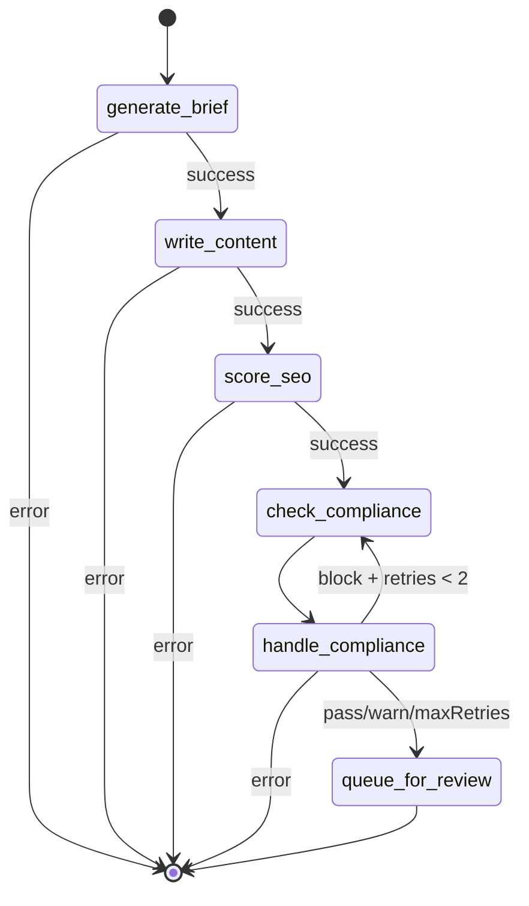

# Agent System Low-Level Design

**Version:** 1.0
**Last Updated:** 2026-02-12
**Audience:** Senior engineers, system architects, contributors

---

## 1. Overview

### Philosophy: State Machines, Not Scripts

Zintas AI agents are **deterministic state machines** built on LangGraph, not imperative scripts. Each agent:

- Defines a **state annotation** containing all inputs, intermediate results, and outputs
- Progresses through **nodes** (pure functions that return partial state updates)
- Uses **conditional edges** to route between nodes based on state
- Supports **checkpointing** for pause/resume (future feature)
- Is **testable** and **debuggable** by inspecting state at any node

This architecture contrasts with traditional AI agent frameworks that rely on LLM tool-calling loops with unpredictable behavior. Our agents have explicit control flow.

---

### LangGraph Annotation Pattern

All agents use the `Annotation.Root` pattern for type-safe state management:

```typescript
const ScholarState = Annotation.Root({
  clientId: Annotation<string>,
  orgId: Annotation<string>,
  runId: Annotation<string>,
  // ... more fields
})

type ScholarStateType = typeof ScholarState.State
```

**Benefits:**
- TypeScript autocomplete and type checking
- Partial state updates merge automatically
- State is immutable across nodes (functional programming)

---

### Checkpoint/Resume Model

Every agent run creates an `agent_runs` row with:

```typescript
interface AgentRun {
  id: string
  agent: 'conductor' | 'scholar' | 'ghostwriter' | 'analyst'
  status: 'running' | 'paused' | 'completed' | 'failed'
  checkpoint_data: Record<string, unknown> // Future: graph state snapshots
  config: Record<string, unknown> // Node-level progress metadata
}
```

**Current Implementation:**
- `config` field stores stage progress (e.g., `{ stage: 'scholar_completed' }`)
- Errors immediately transition to `failed` status

**Future Enhancement:**
- `checkpoint_data` will store LangGraph checkpoints for pause/resume
- Enables: "Pause all agent runs," "Resume from node X," "Rollback to checkpoint"

---

### Autonomy Tiers

Every agent action has an `autonomy_tier` (1-3) that determines approval requirements:

| Tier | Behavior | Use Cases |
|------|----------|-----------|
| **Tier 1** | Auto-deploy | Keyword tracking, profile updates, analytics |
| **Tier 2** | Human approval required | Content publishing, major config changes |
| **Tier 3** | Manual execution only | Schema migrations, integration setup |

**Implementation:**
```typescript
interface AgentAction {
  autonomy_tier: 1 | 2 | 3
  status: 'pending' | 'approved' | 'rejected' | 'deployed' | 'rolled_back'
  approved_by: string | null // User ID for Tier 2
  approved_at: string | null
  deployed_at: string | null
}
```

**Examples:**
- Scholar creating keywords → Tier 1 (auto-deploys on save)
- Ghostwriter queueing content → Tier 2 (requires human review)
- Conductor changing API keys → Tier 3 (manual-only, never auto)

---

## 2. Conductor Agent

**Purpose:** Orchestrates the weekly content pipeline by sequencing Scholar → Ghostwriter, with health checks and error propagation.

**Triggers:**
- Weekly cron (Sundays at 2 AM UTC)
- Manual API call: `POST /api/conductor/run`

---

### State Diagram



---

### State Definition

```typescript
const ConductorState = Annotation.Root({
  clientId: Annotation<string>,          // UUID of practice client
  orgId: Annotation<string>,             // Multi-tenancy scope
  runId: Annotation<string>,             // agent_runs.id (this run)
  stage: Annotation<string>,             // Current pipeline stage
  scholarRunId: Annotation<string | null>, // agent_runs.id of Scholar child run
  scholarKeywords: Annotation<number>,   // Count of keywords found
  scholarTopics: Annotation<ContentTopic[] | null>, // Topics for Ghostwriter
  ghostwriterResults: Annotation<string[]>, // Content piece IDs generated
  error: Annotation<string | null>,      // Propagated error message
})
```

---

### Node Functions

#### `checkHealth`

**Inputs:** `clientId`
**Outputs:** `{ stage: 'scholar' | 'failed', error?: string }`
**Side Effects:** Updates `agent_runs.config` with `{ stage: 'health_check_passed' }`

**Logic:**
1. Fetch client from `clients` table
2. Verify `account_health === 'active'`
3. Refresh Google OAuth tokens via `refreshTokenIfNeeded()` (throws if expired)
4. If all checks pass → `stage: 'scholar'`
5. If any check fails → `stage: 'failed', error: '<reason>'`

**Error Scenarios:**
- Client not found → `'Client not found'`
- Account health not active → `'Client account health is inactive'`
- Google tokens expired → `'Google tokens expired or invalid'`

---

#### `runScholarNode`

**Inputs:** `clientId`, `orgId`
**Outputs:** `{ stage: 'ghostwriter' | 'failed', scholarRunId, scholarKeywords, scholarTopics?, error? }`
**Side Effects:**
- Creates a new `agent_runs` row for Scholar
- Updates Conductor's `agent_runs.config` with `{ scholarRunId }`

**Logic:**
1. Call `await runScholar(clientId, orgId)` (blocks until complete)
2. If Scholar result `status === 'failed'` → return `{ stage: 'failed', error }`
3. Extract `contentTopics` from Scholar result
4. Update Conductor run: `{ stage: 'scholar_completed', scholarRunId }`
5. Return `{ stage: 'ghostwriter', scholarTopics: [...] }`

**Note:** Currently returns empty `topics` array due to placeholder logic. In production, Scholar's `saveResults` node should return topics via its result object.

---

#### `runGhostwriterNode`

**Inputs:** `scholarTopics`
**Outputs:** `{ stage: 'complete', ghostwriterResults: string[] }`
**Side Effects:**
- Creates multiple `agent_runs` rows (one per topic)
- Updates Conductor's `agent_runs.config` with content piece count

**Logic:**
1. Slice `scholarTopics` to max 2 topics (configurable limit)
2. For each topic:
   - Call `await runGhostwriter(clientId, orgId, topic)`
   - If successful, collect `contentPieceId`
   - Catch failures silently (partial success model)
3. Update Conductor run: `{ stage: 'ghostwriter_completed', contentPieces: results.length }`
4. Return `{ stage: 'complete', ghostwriterResults }`

**Partial Failure Handling:** Individual Ghostwriter failures don't stop the loop. Final result includes only successful pieces.

---

#### `finalize`

**Inputs:** `error`, `scholarKeywords`, `ghostwriterResults`, `scholarRunId`
**Outputs:** `{ stage: 'completed' | 'failed' }`
**Side Effects:** Updates `agent_runs` with final status, result, `completed_at`

**Logic:**
1. Determine status: `error ? 'failed' : 'completed'`
2. Build result object:
   ```typescript
   {
     scholarKeywords: number,
     contentPiecesGenerated: number,
     scholarRunId: string
   }
   ```
3. Update `agent_runs` row with status, result, error, `completed_at`

---

### Conditional Routing

#### `healthRouting`

```typescript
function healthRouting(state: ConductorState.State): string {
  if (state.error || state.stage === 'failed') return 'finalize'
  return 'run_scholar'
}
```

Routes `check_health` → `run_scholar` if healthy, else → `finalize`.

#### `shouldContinue`

```typescript
function shouldContinue(state: ConductorState.State): string {
  if (state.error || state.stage === 'failed') return 'finalize'
  return '__next__'
}
```

LangGraph convention: `__next__` means "follow the next edge in sequence."

---

### Graph Construction

```typescript
export function createConductorGraph() {
  const graph = new StateGraph(ConductorState)
    .addNode('check_health', checkHealth)
    .addNode('run_scholar', runScholarNode)
    .addNode('run_ghostwriter', runGhostwriterNode)
    .addNode('finalize', finalize)
    .addEdge(START, 'check_health')
    .addConditionalEdges('check_health', healthRouting, {
      run_scholar: 'run_scholar',
      finalize: 'finalize',
    })
    .addConditionalEdges('run_scholar', shouldContinue, {
      finalize: 'finalize',
      __next__: 'run_ghostwriter',
    })
    .addEdge('run_ghostwriter', 'finalize')
    .addEdge('finalize', END)

  return graph.compile()
}
```

---

### Error Handling

**Pattern:** Every node wraps logic in try-catch:
```typescript
try {
  const result = await operation()
  return { stage: 'next_stage', data: result }
} catch (err) {
  const message = err instanceof Error ? err.message : 'Unknown error'
  return { stage: 'failed', error: message }
}
```

**Propagation:** Once `error` is set, all subsequent `shouldContinue` checks route to `finalize`.

---

## 3. Scholar Agent

**Purpose:** Weekly keyword research pipeline — fetch Google Search Console data, research keywords via SE Ranking, analyze competitors, identify gaps, prioritize with Claude, save to database.

**Triggers:**
- Called by Conductor agent
- Manual API call: `POST /api/scholar/run`

---

### State Diagram



---

### State Definition

```typescript
const ScholarState = Annotation.Root({
  clientId: Annotation<string>,
  orgId: Annotation<string>,
  runId: Annotation<string>,
  practiceProfile: Annotation<PracticeProfile>, // Client's services, location, etc.
  siteUrl: Annotation<string>,
  gscData: Annotation<GSCQuery[]>,
  researchedKeywords: Annotation<KeywordData[]>,
  competitorKeywords: Annotation<CompetitorKeywordSet[]>,
  gapAnalysis: Annotation<KeywordData[]>,
  prioritizedKeywords: Annotation<PrioritizedKeyword[]>,
  contentTopics: Annotation<ContentTopic[]>,
  error: Annotation<string | null>,
})

interface PrioritizedKeyword {
  keyword: string
  searchVolume: number
  difficulty: number
  priority: number          // 1-30 rank
  reasoning: string         // Claude's rationale
  keywordType: string       // 'target' | 'gap' | 'branded'
  source: string            // 'research' | 'gap'
}

interface ContentTopic {
  keyword: string
  suggestedTitle: string    // Blog post title
  angle: string             // Content angle (e.g., "cost guide for Denver")
  estimatedVolume: number
}
```

---

### Node Functions

#### `fetchGSCData`

**API:** Google Search Console Search Analytics API
**Inputs:** `siteUrl`
**Outputs:** `{ gscData: GSCQuery[] }`
**Side Effects:** None (read-only)

**Logic:**
1. Initialize `GSCClient(clientId)` (auto-refreshes tokens)
2. Set date range: last 90 days
3. Call `gscClient.getTopQueries({ siteUrl, startDate, endDate, rowLimit: 500 })`
4. Return raw queries (keyword, clicks, impressions, CTR, position)

**Error Handling:** If GSC API fails (e.g., 403), update `agent_runs` to `failed` and return `{ error: 'message' }`.

---

#### `researchKeywords`

**API:** SE Ranking Keyword Research API
**Inputs:** `practiceProfile`
**Outputs:** `{ researchedKeywords: KeywordData[] }`
**Side Effects:** None (read-only)

**Seed Keyword Generation:**
```typescript
function generateSeedKeywords(profile: PracticeProfile): string[] {
  const services = profile.services ?? []
  const city = profile.city ?? ''
  const seeds: string[] = []

  for (const service of services) {
    seeds.push(`${service} near me`)
    if (city) {
      seeds.push(`${service} ${city}`)
      seeds.push(`best ${service} ${city}`)
      seeds.push(`${service} cost ${city}`)
    }
  }

  // Fallback if no services
  if (seeds.length === 0 && city) {
    const defaults = ['dentist', 'dental implants', 'teeth whitening', 'emergency dentist']
    for (const term of defaults) {
      seeds.push(`${term} ${city}`)
      seeds.push(`${term} near me`)
    }
  }

  return seeds
}
```

**Logic:**
1. Generate seed keywords from practice profile
2. Call `seClient.bulkKeywordResearch(seeds)` (batched internally)
3. Return array of `KeywordData` (keyword, searchVolume, difficulty, CPC, competition)

---

#### `analyzeCompetitors`

**API:** SE Ranking Competitor Keywords API
**Inputs:** `clientId` (to fetch competitors from `clients.competitors`)
**Outputs:** `{ competitorKeywords: CompetitorKeywordSet[] }`
**Side Effects:** None (read-only)

**Logic:**
1. Fetch client record, extract `competitors` array (format: `[{ domain, name }]`)
2. For each competitor:
   - Call `seClient.getCompetitorKeywords(domain)`
   - Store as `{ competitor: name, keywords: KeywordData[] }`
3. Return array of competitor keyword sets

---

#### `gapAnalysis`

**Inputs:** `gscData`, `researchedKeywords`, `competitorKeywords`
**Outputs:** `{ gapAnalysis: KeywordData[] }`
**Side Effects:** None (pure logic)

**Algorithm:**
```typescript
const myKeywords = new Set([
  ...state.gscData.map(q => q.query.toLowerCase()),
  ...state.researchedKeywords.map(k => k.keyword.toLowerCase())
])

const gaps = state.competitorKeywords.flatMap(comp =>
  comp.keywords.filter(k =>
    !myKeywords.has(k.keyword.toLowerCase()) &&
    k.searchVolume > 50 &&
    k.difficulty < 60
  )
)

const topGaps = gaps
  .sort((a, b) => b.searchVolume - a.searchVolume)
  .slice(0, 50)
```

**Filters:**
- Keyword not in our current rankings or research
- Minimum search volume: 50
- Maximum difficulty: 60 (easier to rank)
- Sort by search volume descending
- Take top 50 gaps

---

#### `prioritize`

**LLM:** Claude Sonnet 4 (4096 tokens)
**Inputs:** `researchedKeywords`, `gapAnalysis`, `practiceProfile`, `gscData`
**Outputs:** `{ prioritizedKeywords: PrioritizedKeyword[], contentTopics: ContentTopic[] }`
**Side Effects:** None (LLM call)

**Prompt Pattern:**
```typescript
const response = await model.invoke([
  {
    role: 'system',
    content: 'You are an expert dental SEO strategist. Analyze keyword data and prioritize opportunities for a dental practice. Always respond with valid JSON.',
  },
  {
    role: 'user',
    content: `Practice profile:
${JSON.stringify(state.practiceProfile, null, 2)}

Current GSC performance (top queries):
${JSON.stringify(state.gscData.slice(0, 20), null, 2)}

Keyword opportunities (${allKeywords.length} total):
${JSON.stringify(allKeywords.slice(0, 100), null, 2)}

Tasks:
1. Rank the top 30 keywords by priority. Consider: search volume, difficulty (prefer <40), relevance to this practice's services, and local intent.
2. For the top 5 keywords, suggest a content topic (blog post title + brief angle).
3. Return JSON with this exact structure:
{
  "prioritizedKeywords": [{ "keyword": "...", "searchVolume": 0, "difficulty": 0, "priority": 1, "reasoning": "...", "keywordType": "target|gap|branded", "source": "research|gap" }],
  "contentTopics": [{ "keyword": "...", "suggestedTitle": "...", "angle": "...", "estimatedVolume": 0 }]
}`,
  },
])
```

**JSON Extraction:**
```typescript
function extractJSON<T>(text: string): T {
  const jsonMatch = text.match(/```(?:json)?\s*([\s\S]*?)```/)
  const jsonStr = jsonMatch ? jsonMatch[1].trim() : text.trim()
  return JSON.parse(jsonStr) as T
}
```

**Output Example:**
```json
{
  "prioritizedKeywords": [
    {
      "keyword": "dental implants denver",
      "searchVolume": 1200,
      "difficulty": 35,
      "priority": 1,
      "reasoning": "High volume, low difficulty, strong local intent, matches practice services",
      "keywordType": "target",
      "source": "research"
    }
  ],
  "contentTopics": [
    {
      "keyword": "dental implants cost denver",
      "suggestedTitle": "How Much Do Dental Implants Cost in Denver? [2026 Price Guide]",
      "angle": "Cost breakdown, insurance coverage, financing options",
      "estimatedVolume": 800
    }
  ]
}
```

---

#### `saveResults`

**Inputs:** `prioritizedKeywords`, `contentTopics`
**Outputs:** `{}`
**Side Effects:**
- Upserts rows into `keywords` table
- Inserts rows into `agent_actions` table (content recommendations)
- Updates `agent_runs` status to `completed`

**Database Operations:**

1. **Upsert Keywords:**
```typescript
const keywordInputs: CreateKeywordInput[] = state.prioritizedKeywords.map(kw => ({
  org_id: state.orgId,
  client_id: state.clientId,
  keyword: kw.keyword,
  current_position: null,
  previous_position: null,
  best_position: null,
  search_volume: kw.searchVolume,
  difficulty: kw.difficulty,
  keyword_type: kw.keywordType ?? 'target',
  source: kw.source ?? 'scholar',
  serp_features: [],
  last_checked_at: null,
}))

await supabaseAdmin
  .from('keywords')
  .upsert(keywordInputs, { onConflict: 'client_id,keyword' })
```

2. **Create Agent Actions (Tier 1 — auto-deployed):**
```typescript
const actions: CreateAgentActionInput[] = state.contentTopics.map(topic => ({
  org_id: state.orgId,
  client_id: state.clientId,
  agent: 'scholar',
  action_type: 'content_recommendation',
  autonomy_tier: 1, // Auto-deploy
  status: 'pending',
  severity: 'info',
  description: `Content topic: ${topic.suggestedTitle} — ${topic.angle}`,
  proposed_data: { keyword: topic.keyword, suggestedTitle: topic.suggestedTitle, ... },
  rollback_data: {},
  content_piece_id: null,
}))

await supabaseAdmin.from('agent_actions').insert(actions)
```

3. **Complete Agent Run:**
```typescript
await updateRun(state.runId, {
  status: 'completed',
  result: {
    keywordsTracked: state.prioritizedKeywords.length,
    contentTopics: state.contentTopics.length,
    gapKeywords: state.gapAnalysis.length,
  },
  completed_at: new Date().toISOString(),
})
```

---

### Conditional Edges

All nodes use the same pattern:

```typescript
function shouldContinue(state: ScholarStateType): string {
  if (state.error) {
    return END
  }
  return 'next'
}

// In graph construction:
.addConditionalEdges('fetch_gsc_data', shouldContinue, {
  next: 'research_keywords',
  [END]: END,
})
```

If any node sets `error`, the graph exits immediately (fail-fast pattern).

---

## 4. Ghostwriter Agent

**Purpose:** Generate SEO-optimized, compliant blog posts from content topics. Includes brief generation, content writing, SEO scoring, compliance checking with auto-remediation, and review queue creation.

**Triggers:**
- Called by Conductor agent (per topic)
- Manual API call: `POST /api/ghostwriter/run`

---

### State Diagram



---

### State Definition

```typescript
const GhostwriterState = Annotation.Root({
  clientId: Annotation<string>,
  orgId: Annotation<string>,
  runId: Annotation<string>,
  practiceProfile: Annotation<PracticeProfile>,
  topic: Annotation<ContentTopic>,
  brief: Annotation<ContentBrief | null>,
  content: Annotation<GeneratedContent | null>,
  metaTitle: Annotation<string | null>,
  metaDescription: Annotation<string | null>,
  seoScore: Annotation<number>,
  complianceResult: Annotation<ComplianceResult | null>,
  contentPieceId: Annotation<string | null>,
  queueItemId: Annotation<string | null>,    // agent_actions.id
  rewriteAttempts: Annotation<number>,
  error: Annotation<string | null>,
})

interface ContentBrief {
  suggestedTitle: string
  h2Sections: string[]
  targetWordCount: number
  internalLinks: string[]
  uniqueAngles: string[]
  practiceHooks: string[]
}

interface GeneratedContent {
  html: string
  markdown: string
  wordCount: number
}
```

---

### Node Functions

#### `generateBrief`

**LLM:** Claude Sonnet 4 (2048 tokens)
**Inputs:** `topic`, `practiceProfile`
**Outputs:** `{ brief: ContentBrief }`
**Side Effects:** None (LLM call)

**Prompt:**
```typescript
const response = await model.invoke([
  {
    role: 'system',
    content: 'You are an expert dental SEO content strategist. Generate a detailed content brief. Always respond with valid JSON.',
  },
  {
    role: 'user',
    content: `Create a content brief for a dental practice blog post.

Practice profile:
${JSON.stringify(state.practiceProfile, null, 2)}

Target keyword: "${state.topic.keyword}"
Suggested title: "${state.topic.suggestedTitle}"
Angle: "${state.topic.angle}"

Return JSON:
{
  "suggestedTitle": "SEO-optimized title with keyword",
  "h2Sections": ["Section 1", "Section 2", ...],
  "targetWordCount": 1200,
  "internalLinks": ["suggested internal page links"],
  "uniqueAngles": ["angles to differentiate from competitors"],
  "practiceHooks": ["practice-specific details to weave in"]
}`,
  },
])
```

**Output Structure:**
```json
{
  "suggestedTitle": "How Much Do Dental Implants Cost in Denver? [2026 Guide]",
  "h2Sections": [
    "What Are Dental Implants?",
    "Average Cost of Dental Implants in Denver",
    "Factors That Affect Implant Pricing",
    "Does Insurance Cover Dental Implants?",
    "Financing Options at [Practice Name]"
  ],
  "targetWordCount": 1200,
  "internalLinks": ["/services/dental-implants", "/financing"],
  "uniqueAngles": ["Highlight practice's in-house financing", "Mention Dr. X's 20 years experience"],
  "practiceHooks": ["We offer 0% APR financing", "Our team has placed 5,000+ implants"]
}
```

---

#### `writeContent`

**LLM:** Claude Sonnet 4 (4096 tokens)
**Inputs:** `brief`, `practiceProfile`, `topic`
**Outputs:** `{ content: GeneratedContent, metaTitle, metaDescription }`
**Side Effects:** None (LLM call)

**System Prompt:**
```typescript
const systemPrompt = `You are a professional dental content writer. Write warm, professional content that:
- Uses a conversational yet authoritative tone
- Weaves in practice-specific details (doctor names, location)
- Maintains 2-3% keyword density for the target keyword
- Targets 8th grade reading level
- Includes a FAQ section with 3-4 questions
- Never gives specific medical advice or diagnoses
- Uses proper HTML formatting (h1, h2, h3, p, ul, li tags)

Practice: ${practiceName}${city ? ` in ${city}` : ''}
${doctors.length > 0 ? `Doctors: ${doctors.join(', ')}` : ''}

Return JSON with html, markdown, metaTitle, metaDescription.`
```

**User Prompt:**
```typescript
const userPrompt = `Write a blog post based on this brief:

Title: "${brief.suggestedTitle}"
Target keyword: "${state.topic.keyword}"
Sections: ${JSON.stringify(brief.h2Sections)}
Target word count: ${brief.targetWordCount}
Unique angles: ${JSON.stringify(brief.uniqueAngles)}
Practice hooks: ${JSON.stringify(brief.practiceHooks)}

Return JSON:
{
  "html": "<h1>Title</h1><p>...</p>...",
  "markdown": "# Title\n\n...",
  "metaTitle": "50-70 char SEO title",
  "metaDescription": "120-160 char meta description"
}`
```

**Output Example:**
```json
{
  "html": "<h1>How Much Do Dental Implants Cost in Denver?</h1><p>If you're considering dental implants in Denver, you're probably wondering about the cost...</p>",
  "markdown": "# How Much Do Dental Implants Cost in Denver?\n\nIf you're considering dental implants...",
  "metaTitle": "Dental Implant Cost in Denver [2026] | Denver Dental Spa",
  "metaDescription": "Learn the average cost of dental implants in Denver, insurance coverage, and financing options at Denver Dental Spa. Free consultation available."
}
```

**Word Count Calculation:**
```typescript
function countWords(text: string): number {
  return text.replace(/<[^>]*>/g, ' ').split(/\s+/).filter(Boolean).length
}
```

---

#### `scoreSEO`

**Inputs:** `content`, `metaTitle`, `metaDescription`, `topic.keyword`
**Outputs:** `{ seoScore: number }`
**Side Effects:** None (pure logic)

**Algorithm (100-point scale):**

| Factor | Points | Logic |
|--------|--------|-------|
| **Primary keyword in title** | 15 | `title.toLowerCase().includes(keyword)` |
| **Keyword in first 500 chars** | 10 | `plainText.slice(0, 500).includes(keyword)` |
| **Keyword in H2 headings** | 5 | `/<h2[^>]*>.*keyword.*<\/h2>/i.test(html)` |
| **Keyword density 1-3%** | 15 | `(keywordCount / totalWords) * 100 >= 1 && <= 3` |
| **Readability (avg sentence length 10-20 words)** | 10 | `totalWords / sentences.length` |
| **Meta title 50-70 chars** | 10 | `title.length >= 50 && <= 70` |
| **Meta description 120-160 chars** | 10 | `metaDesc.length >= 120 && <= 160` |
| **Has internal links** | 10 | `/<a\s+[^>]*href/i.test(html)` |
| **Has H2/H3 structure** | 10 | `/<h[23][^>]*>/i.test(html)` |
| **Word count > 800** | 5 | `wordCount > 800` |

**Implementation:**
```typescript
let score = 0

// Primary keyword in title (+15)
if (title.toLowerCase().includes(keyword)) {
  score += 15
}

// Keyword in first paragraph (+10)
const firstParagraph = plainText.slice(0, 500).toLowerCase()
if (firstParagraph.includes(keyword)) {
  score += 10
}

// ... (all 10 factors)

return { seoScore: Math.min(score, 100) }
```

**Typical Scores:**
- 85-100: Excellent (keyword-optimized, structured, meta tags perfect)
- 70-84: Good (minor meta tag issues)
- 50-69: Needs improvement (missing keyword density or structure)
- <50: Poor (multiple SEO issues)

---

#### `checkCompliance`

**Inputs:** `content.html`
**Outputs:** `{ complianceResult: ComplianceResult }`
**Side Effects:** LLM call (Compliance Engine)

Delegates to Compliance Engine (see Section 5). Returns:

```typescript
interface ComplianceResult {
  status: 'pass' | 'warn' | 'block'
  details: ComplianceDetail[]
}
```

---

#### `handleCompliance`

**Inputs:** `complianceResult`, `rewriteAttempts`
**Outputs:** Conditional — see logic below
**Side Effects:**
- May inject disclaimers into HTML (WARN)
- May call LLM to rewrite flagged sections (BLOCK)
- May update `content` state

**Logic:**

**1. PASS → Continue to queue**
```typescript
if (result.status === 'pass') {
  return {} // No changes
}
```

**2. WARN → Auto-inject disclaimers**
```typescript
if (result.status === 'warn') {
  let html = state.content?.html ?? ''
  const disclaimers = result.details
    .filter(d => d.disclaimer)
    .map(d => d.disclaimer as string)

  if (disclaimers.length > 0) {
    const disclaimerHtml = disclaimers
      .map(d => `<p class="disclaimer"><em>${d}</em></p>`)
      .join('\n')
    html = html + '\n' + disclaimerHtml
  }

  return { content: { ...state.content, html } }
}
```

**3. BLOCK → Rewrite (max 2 attempts)**
```typescript
if (result.status === 'block' && state.rewriteAttempts < 2) {
  const model = new ChatAnthropic({ model: 'claude-sonnet-4-20250514', maxTokens: 4096 })

  const flaggedSections = result.details
    .filter(d => d.severity === 'block')
    .map(d => `- "${d.phrase}" — ${d.reason}${d.suggestion ? `. Fix: ${d.suggestion}` : ''}`)
    .join('\n')

  const response = await model.invoke([
    {
      role: 'system',
      content: 'You are a dental content compliance editor. Rewrite ONLY the flagged sections while preserving the rest of the content. Return valid JSON with html and markdown fields.',
    },
    {
      role: 'user',
      content: `Rewrite the flagged sections in this dental content:

Current HTML:
${state.content?.html ?? ''}

Compliance issues to fix:
${flaggedSections}

Return JSON: { "html": "...", "markdown": "..." }`,
    },
  ])

  const parsed = extractJSON<{ html: string; markdown: string }>(responseText)

  return {
    content: {
      html: parsed.html,
      markdown: parsed.markdown,
      wordCount: countWords(parsed.html),
    },
    rewriteAttempts: state.rewriteAttempts + 1,
    complianceResult: null, // Reset to re-check
  }
}
```

**4. BLOCK + Max Retries → Queue anyway (Tier 2 critical)**
```typescript
// If still blocked after 2 rewrites, queue with severity=critical
return {}
```

---

#### `queueForReview`

**Inputs:** `content`, `brief`, `seoScore`, `complianceResult`
**Outputs:** `{ contentPieceId, queueItemId }`
**Side Effects:**
- Inserts row into `content_pieces` table
- Inserts row into `agent_actions` table (Tier 2 — requires approval)
- Updates `agent_runs` status to `completed`

**Database Operations:**

**1. Create Content Piece:**
```typescript
const contentInput: CreateContentPieceInput = {
  org_id: state.orgId,
  client_id: state.clientId,
  title: state.brief?.suggestedTitle ?? state.topic.suggestedTitle,
  body_html: state.content?.html ?? null,
  body_markdown: state.content?.markdown ?? null,
  content_type: 'blog_post',
  status: 'in_review',
  target_keyword: state.topic.keyword,
  related_keywords: [],
  seo_score: state.seoScore,
  word_count: state.content?.wordCount ?? 0,
  compliance_status: state.complianceResult?.status ?? 'pass',
  compliance_details: state.complianceResult?.details ?? [],
  meta_title: state.metaTitle,
  meta_description: state.metaDescription,
  published_url: null,
  published_at: null,
}

const { data: contentPiece } = await supabaseAdmin
  .from('content_pieces')
  .insert(contentInput)
  .select()
  .single()
```

**2. Create Agent Action (Tier 2 — requires approval):**
```typescript
const isCritical = state.complianceResult?.status === 'block'

const actionInput: CreateAgentActionInput = {
  org_id: state.orgId,
  client_id: state.clientId,
  agent: 'ghostwriter',
  action_type: 'content_review',
  autonomy_tier: 2, // Human approval required
  status: 'pending',
  severity: isCritical ? 'critical' : 'info',
  description: `New blog post: "${state.brief?.suggestedTitle}" targeting "${state.topic.keyword}"`,
  proposed_data: {
    contentPieceId,
    seoScore: state.seoScore,
    wordCount: state.content?.wordCount ?? 0,
    complianceStatus: state.complianceResult?.status ?? 'pass',
  },
  rollback_data: {},
  content_piece_id: contentPieceId,
}

const { data: action } = await supabaseAdmin
  .from('agent_actions')
  .insert(actionInput)
  .select()
  .single()
```

**3. Complete Agent Run:**
```typescript
await updateRun(state.runId, {
  status: 'completed',
  result: {
    contentPieceId,
    queueItemId: action.id,
    seoScore: state.seoScore,
    complianceStatus: state.complianceResult?.status ?? 'pass',
    rewriteAttempts: state.rewriteAttempts,
  },
  completed_at: new Date().toISOString(),
})
```

---

### Conditional Edges

**`shouldContinue`** — Same as Scholar (error → END, else → next)

**`complianceRouting`** — Handles the compliance loop:
```typescript
function complianceRouting(state: GhostwriterStateType): string {
  if (state.error) {
    return END
  }

  const result = state.complianceResult
  if (!result) {
    return 'queue_for_review'
  }

  // If blocked and still have retries, loop back to compliance check
  if (result.status === 'block' && state.rewriteAttempts < 2) {
    return 'check_compliance'
  }

  return 'queue_for_review'
}
```

**Graph edges:**
```typescript
.addEdge('check_compliance', 'handle_compliance')
.addConditionalEdges('handle_compliance', complianceRouting, {
  check_compliance: 'check_compliance', // Loop for BLOCK rewrites
  queue_for_review: 'queue_for_review',
  [END]: END,
})
```

---

## 5. Compliance Engine

**Purpose:** Hybrid two-stage compliance checking — fast regex rules for common violations, LLM check for nuanced issues. Auto-remediation via disclaimer injection (WARN) or Claude rewrite (BLOCK).

**File:** `packages/compliance/engine.ts`

---

### Hybrid Approach

**Stage 1: Regex Rules (Fast, Deterministic)**
- Pattern matching for guaranteed outcomes, diagnosis language, pricing without context
- Runs in <10ms
- Covers 80% of compliance issues

**Stage 2: LLM Check (Nuanced, Context-Aware)**
- Claude Haiku (1024 tokens, cheap + fast)
- Catches: implicit diagnoses, testimonial health claims, unsupported comparisons
- Runs in ~1s
- Covers 20% of edge cases

---

### Regex Rules

All rules defined in `COMPLIANCE_RULES` array:

```typescript
interface ComplianceRule {
  name: string
  severity: 'block' | 'warn'
  patterns: RegExp[]
  reason: string
  suggestion?: string       // For BLOCK rules
  disclaimer?: string       // For WARN rules
  contextCheck?: (text: string, match: RegExpMatchArray) => boolean
}
```

---

#### BLOCK Severity Rules

**1. Guaranteed Results**
```typescript
{
  name: 'guaranteed_results',
  severity: 'block',
  patterns: [
    /\bguaranteed\b/i,
    /\b100%\s+success\b/i,
    /\bpermanent\s+solution\b/i,
  ],
  reason: 'Do not guarantee outcomes',
  suggestion: 'Replace with qualified language like "may help" or "designed to"',
}
```

**Examples:**
- "We guarantee whiter teeth" → BLOCK
- "100% success rate" → BLOCK
- "Permanent solution to gum disease" → BLOCK

**Fix:** "Designed to help improve tooth color" ✓

---

**2. Diagnosis Language**
```typescript
{
  name: 'diagnosis',
  severity: 'block',
  patterns: [
    /\byou have\b/i,
    /\byou suffer from\b/i,
    /\bthis means you need\b/i,
  ],
  reason: 'Only a dentist can diagnose',
  suggestion: 'Use "may indicate" or "consult your dentist to determine"',
}
```

**Examples:**
- "If your gums bleed, you have gum disease" → BLOCK
- "You suffer from bruxism" → BLOCK

**Fix:** "Bleeding gums may indicate gum disease. Schedule a consultation for diagnosis." ✓

---

**3. Cure Language**
```typescript
{
  name: 'cure_language',
  severity: 'block',
  patterns: [
    /\bcure\b/i,
    /\bheal completely\b/i,
    /\beliminate forever\b/i,
  ],
  reason: 'Avoid absolute medical claims',
  suggestion: 'Use "may help improve" or "designed to address"',
}
```

---

**4. Price Without Context**
```typescript
{
  name: 'price_without_context',
  severity: 'block',
  patterns: [/\$\d+/],
  reason: 'Pricing must include "starting at" or disclaimer',
  suggestion: 'Add "starting at" before price or include a pricing disclaimer',
  contextCheck: (text: string, match: RegExpMatchArray): boolean => {
    const pos = match.index ?? 0
    const surrounding = text.slice(Math.max(0, pos - 200), pos + 200)
    const hasDisclaimer = /starting at|starts at|as low as|from|disclaimer|may vary|estimate/i.test(surrounding)
    // Only flag if there's NO disclaimer context
    return !hasDisclaimer
  },
}
```

**Examples:**
- "Dental implants cost $3,000" → BLOCK
- "Dental implants starting at $3,000" → PASS ✓

**Context Check Logic:** Looks for disclaimer keywords within 200 chars before/after price. Only flags if NO context found.

---

#### WARN Severity Rules

**5. Before/After Claims**
```typescript
{
  name: 'before_after',
  severity: 'warn',
  patterns: [/\bbefore and after\b/i, /\bresults shown\b/i],
  reason: 'Before/after claims need disclaimer',
  disclaimer: 'Individual results may vary.',
}
```

**Auto-Remediation:** Injects `<p class="disclaimer"><em>Individual results may vary.</em></p>` at end of content.

---

**6. Insurance Claims**
```typescript
{
  name: 'insurance_claim',
  severity: 'warn',
  patterns: [/\bcovered by insurance\b/i, /\binsurance pays\b/i],
  reason: 'Insurance claims need disclaimer',
  disclaimer: 'Contact your insurance provider to verify coverage.',
}
```

---

### LLM Check

**Model:** Claude Haiku 4.5 (fast, cheap)
**Input:** First 3000 chars of stripped HTML
**Output:** JSON array of issues

**System Prompt:**
```typescript
const systemPrompt = `You are a ${vertical} content compliance reviewer. Review content for regulatory and safety issues. Flag: specific diagnoses, treatment recommendations, guaranteed outcomes, testimonials with health claims, unsupported comparative claims. Return a JSON array of issues or empty array []. Each issue: { "rule": "string", "severity": "block"|"warn", "phrase": "exact text", "reason": "why flagged", "suggestion": "fix" }`
```

**User Prompt:**
```typescript
const userPrompt = `Review this ${vertical} content for compliance issues:\n\n${truncated}`
```

**Response Example:**
```json
[
  {
    "rule": "implicit_diagnosis",
    "severity": "block",
    "phrase": "tooth sensitivity means you need a filling",
    "reason": "Implies diagnosis without exam",
    "suggestion": "Tooth sensitivity may indicate a cavity. Schedule an exam for proper diagnosis."
  }
]
```

**Error Handling:** If LLM call fails, return empty array `[]` — regex rules still applied.

---

### Deduplication

```typescript
function deduplicateDetails(details: ComplianceDetail[]): ComplianceDetail[] {
  const seen = new Set<string>()
  const result: ComplianceDetail[] = []

  for (const detail of details) {
    const key = `${detail.rule}:${detail.phrase.toLowerCase()}`
    if (!seen.has(key)) {
      seen.add(key)
      result.push(detail)
    }
  }

  return result
}
```

Prevents duplicate flags (e.g., regex catches "guaranteed" and LLM also flags same phrase).

---

### Status Determination

```typescript
function determineStatus(details: ComplianceDetail[]): 'pass' | 'warn' | 'block' {
  if (details.some(d => d.severity === 'block')) {
    return 'block'
  }
  if (details.some(d => d.severity === 'warn')) {
    return 'warn'
  }
  return 'pass'
}
```

**Hierarchy:** BLOCK > WARN > PASS

---

### Main Engine API

```typescript
export const complianceEngine = {
  async check(html: string, vertical: string): Promise<ComplianceResult> {
    if (!html || html.trim().length === 0) {
      return { status: 'pass', details: [] }
    }

    const plainText = stripHtml(html)

    // Step 1: Fast regex checks
    const regexDetails = runRegexChecks(plainText)

    // Step 2: LLM check for nuanced issues
    const llmDetails = await runLLMCheck(plainText, vertical)

    // Combine and deduplicate
    const allDetails = deduplicateDetails([...regexDetails, ...llmDetails])

    // Determine overall status
    const status = determineStatus(allDetails)

    return { status, details: allDetails }
  },
}
```

**Usage in Ghostwriter:**
```typescript
const result = await complianceEngine.check(html, 'dental')
```

---

### Auto-Remediation Patterns

**WARN → Disclaimer Injection:**
```typescript
const disclaimers = result.details
  .filter(d => d.disclaimer)
  .map(d => d.disclaimer as string)

const disclaimerHtml = disclaimers
  .map(d => `<p class="disclaimer"><em>${d}</em></p>`)
  .join('\n')

html = html + '\n' + disclaimerHtml
```

**BLOCK → Claude Rewrite:**
```typescript
const flaggedSections = result.details
  .filter(d => d.severity === 'block')
  .map(d => `- "${d.phrase}" — ${d.reason}${d.suggestion ? `. Fix: ${d.suggestion}` : ''}`)
  .join('\n')

const prompt = `Rewrite the flagged sections:

Current HTML: ${html}

Compliance issues:
${flaggedSections}

Return JSON: { "html": "...", "markdown": "..." }`

const response = await model.invoke(prompt)
const parsed = extractJSON<{ html: string; markdown: string }>(response)

// Update content with rewritten version
```

---

## 6. Integration Clients

All integration clients follow a common pattern:
- Constructor accepts credentials (API key, OAuth tokens, or Basic Auth)
- `request()` method handles auth headers, retries, rate limits
- Exported types for inputs/outputs

---

### SE Ranking Client

**File:** `packages/agents/integrations/se-ranking.ts`
**Auth:** API Key via `X-Api-Key` header
**Base URL:** `https://api.seranking.com`

---

#### Configuration

```typescript
const BASE_URL = 'https://api.seranking.com'
const BATCH_DELAY_MS = 500
const KEYWORD_BATCH_SIZE = 10
const PROJECT_KEYWORD_BATCH_SIZE = 50
const RETRY_DELAY_MS = 2000
```

---

#### Methods

**1. `keywordResearch(keywords: string[]): Promise<KeywordData[]>`**

Single batch keyword research. Returns volume, difficulty, CPC, competition.

**Request:**
```typescript
POST /research/keywords
{
  "keywords": ["dental implants denver", "teeth whitening"]
}
```

**Response:**
```typescript
[
  {
    "keyword": "dental implants denver",
    "search_volume": 1200,
    "keyword_difficulty": 35,
    "cpc": 4.50,
    "competition": 0.68
  }
]
```

---

**2. `bulkKeywordResearch(seeds: string[]): Promise<KeywordData[]>`**

Batched research for up to 100 keywords. Internal logic:
- Split into batches of 10
- 500ms delay between batches
- Deduplicate results by keyword using Map

```typescript
async bulkKeywordResearch(seeds: string[]): Promise<KeywordData[]> {
  const allResults: KeywordData[] = []

  for (let i = 0; i < seeds.length; i += KEYWORD_BATCH_SIZE) {
    const batch = seeds.slice(i, i + KEYWORD_BATCH_SIZE)
    const results = await this.keywordResearch(batch)
    allResults.push(...results)

    if (i + KEYWORD_BATCH_SIZE < seeds.length) {
      await sleep(BATCH_DELAY_MS)
    }
  }

  // Deduplicate by keyword
  const dedupMap = new Map<string, KeywordData>()
  for (const item of allResults) {
    if (!dedupMap.has(item.keyword)) {
      dedupMap.set(item.keyword, item)
    }
  }

  return Array.from(dedupMap.values())
}
```

---

**3. `getCompetitorKeywords(domain: string): Promise<KeywordData[]>`**

Fetch organic keywords a competitor ranks for.

**Request:**
```typescript
GET /research/competitors?domain=competitor-dentist.com
```

---

**4. `createProject(name: string, domain: string): Promise<string>`**

Create a rank tracking project. Returns project ID.

---

**5. `addKeywordsToProject(projectId: string, keywords: string[]): Promise<void>`**

Add keywords to project for rank tracking. Batches of 50, 500ms delay.

---

**6. `getPositions(projectId: string): Promise<PositionData[]>`**

Fetch current rankings for project keywords.

**Response:**
```typescript
[
  {
    "keyword": "dental implants denver",
    "position": 12,
    "previousPosition": 15,
    "url": "https://example.com/dental-implants",
    "searchVolume": 1200
  }
]
```

---

#### Rate Limit Handling

**429 Response:**
```typescript
if (response.status === 429) {
  const retryAfter = parseInt(response.headers.get('Retry-After') ?? '1', 10)
  await sleep(retryAfter * 1000)
  return this.request<T>(path, options, retryCount + 1)
}
```

Respects `Retry-After` header, then retries automatically.

---

**401 Response:**
```typescript
if (response.status === 401) {
  throw new Error('Invalid SE Ranking API key. Check SE_RANKING_API_KEY.')
}
```

---

**500 Response:**
```typescript
if (response.status === 500 && retryCount < 1) {
  await sleep(RETRY_DELAY_MS)
  return this.request<T>(path, options, retryCount + 1)
}
```

Retry once after 2 seconds.

---

### Google Search Console Client

**File:** `packages/agents/integrations/google-search-console.ts`
**Auth:** OAuth2 Bearer token (auto-refreshed)
**Base URL:** `https://www.googleapis.com/webmasters/v3/sites`

---

#### Token Refresh Pattern

```typescript
private async getTokens(): Promise<GoogleTokens> {
  return refreshTokenIfNeeded(this.clientId)
}

private async request<T>(
  url: string,
  tokens: GoogleTokens,
  options?: RequestInit,
  isRetry = false
): Promise<T> {
  const response = await fetch(url, {
    ...options,
    headers: {
      Authorization: `Bearer ${tokens.access_token}`,
      'Content-Type': 'application/json',
    },
  })

  // Handle 401 - token expired, refresh and retry once
  if (response.status === 401 && !isRetry) {
    const freshTokens = await this.getTokens()
    return this.request<T>(url, freshTokens, options, true)
  }

  // ... handle 403, other errors
}
```

**Auto-Retry Logic:** If 401 on first attempt, refresh token and retry **once**. Prevents infinite loops.

---

#### Methods

**1. `getTopQueries(params): Promise<GSCQuery[]>`**

**Request:**
```typescript
POST /sites/{siteUrl}/searchAnalytics/query
{
  "startDate": "2026-01-01",
  "endDate": "2026-04-01",
  "rowLimit": 500,
  "dimensions": ["query"]
}
```

**Response:**
```typescript
[
  {
    "query": "dental implants denver",
    "clicks": 45,
    "impressions": 2300,
    "ctr": 0.0195,
    "position": 12.4
  }
]
```

---

**2. `getTopPages(params): Promise<GSCPage[]>`**

Same as `getTopQueries` but with `dimensions: ["page"]`.

---

**3. `getQueryTrends(params): Promise<TrendData[]>`**

Monthly trend data for a specific query. Uses `dimensionFilterGroups` to filter by query, `dimensions: ["date"]` to group by day.

---

**4. `getSiteList(): Promise<string[]>`**

Get verified sites in GSC account.

**Request:**
```typescript
GET /sites
```

**Response:**
```typescript
{
  "siteEntry": [
    { "siteUrl": "sc-domain:example.com", "permissionLevel": "siteOwner" }
  ]
}
```

---

#### Error Codes

**403 Forbidden:**
```typescript
if (response.status === 403) {
  throw new Error('Access denied to Google Search Console. Verify the site is added and permissions are granted.')
}
```

---

### WordPress Client

**File:** `packages/agents/integrations/wordpress.ts`
**Auth:** Basic Auth with Application Password
**Base URL:** `{siteUrl}/wp-json/wp/v2`

---

#### Constructor

```typescript
constructor(siteUrl: string, credentials: WPCredentials) {
  this.siteUrl = siteUrl.replace(/\/+$/, '') // Strip trailing slashes
  this.credentials = credentials
}

private getAuthHeader(): string {
  const token = Buffer.from(
    `${this.credentials.username}:${this.credentials.applicationPassword}`
  ).toString('base64')
  return `Basic ${token}`
}
```

---

#### Methods

**1. `publishPost(post: WPPostInput): Promise<WPPost>`**

**Input:**
```typescript
interface WPPostInput {
  title: string
  content: string
  status: 'publish' | 'draft' | 'pending'
  slug?: string
  excerpt?: string
  meta?: {
    yoast_wpseo_title?: string
    yoast_wpseo_metadesc?: string
    rank_math_title?: string
    rank_math_description?: string
  }
}
```

**Request:**
```typescript
POST /wp-json/wp/v2/posts
{
  "title": "How Much Do Dental Implants Cost?",
  "content": "<p>...</p>",
  "status": "publish",
  "slug": "dental-implants-cost",
  "meta": {
    "yoast_wpseo_title": "Dental Implant Cost [2026]",
    "yoast_wpseo_metadesc": "Learn the average cost..."
  }
}
```

**Response:**
```typescript
{
  "id": 123,
  "link": "https://example.com/blog/dental-implants-cost",
  "status": "publish",
  "title": { "rendered": "How Much Do Dental Implants Cost?" },
  "content": { "rendered": "<p>...</p>" }
}
```

---

**2. `updatePost(postId: number, data: Partial<WPPostInput>): Promise<WPPost>`**

**Request:**
```typescript
PUT /wp-json/wp/v2/posts/{postId}
{
  "content": "<p>Updated content...</p>"
}
```

---

**3. `unpublishPost(postId: number): Promise<void>`**

Rollback mechanism for published content.

**Request:**
```typescript
PUT /wp-json/wp/v2/posts/{postId}
{
  "status": "draft"
}
```

---

**4. `testConnection(): Promise<boolean>`**

**Request:**
```typescript
GET /wp-json/wp/v2/users/me
```

Returns `true` if credentials valid, `false` otherwise.

---

**5. `checkPlugins(): Promise<WPPluginCheck>`**

Check if Yoast SEO or Rank Math is installed.

**Request:**
```typescript
GET /wp-json/
```

**Response:**
```typescript
{
  "namespaces": ["wp/v2", "yoast/v1", "rankmath/v1"]
}
```

**Logic:**
```typescript
return {
  yoast: namespaces.some(ns => ns.startsWith('yoast')),
  rankMath: namespaces.some(ns => ns.startsWith('rankmath')),
}
```

---

#### Error Codes

**401 Unauthorized:**
```typescript
throw new Error('WordPress credentials invalid. Check application password.')
```

**403 Forbidden:**
```typescript
throw new Error("WordPress user doesn't have permission to publish.")
```

**404 Not Found:**
```typescript
throw new Error('WordPress REST API not found. Is it enabled?')
```

---

## 7. Practice Intelligence

**Purpose:** Auto-populate practice profiles by crawling website and verifying doctor NPIs.

**File:** `packages/agents/practice-intelligence.ts`

---

### Main Function

```typescript
export async function populatePracticeProfile(
  clientId: string
): Promise<PracticeProfile>
```

**Steps:**
1. Crawl 6 pages of practice website
2. Extract structured data via Claude Sonnet 4.5
3. Verify doctor NPIs via NPI Registry API
4. Merge with existing profile (don't overwrite manual data)
5. Save to `clients.practice_profile`
6. Create `agent_actions` record (Tier 1 auto-deployed)

---

### Website Crawling

**Pages Crawled:**
```typescript
const PAGES_TO_CRAWL = [
  '',           // Homepage
  '/about',
  '/about-us',
  '/services',
  '/our-team',
  '/doctors',
  '/meet-the-team',
]
```

**Crawl Logic:**
```typescript
async function crawlPages(domain: string): Promise<string[]> {
  const texts: string[] = []

  for (const pagePath of PAGES_TO_CRAWL) {
    const url = `https://${domain}${pagePath}`
    try {
      const response = await fetch(url, {
        headers: { 'User-Agent': 'ZintasBot/1.0 (dental-marketing-platform)' },
        signal: AbortSignal.timeout(10000), // 10s timeout
      })

      if (!response.ok) continue

      const html = await response.text()
      const text = stripHtml(html) // Remove scripts, styles, nav, footer
      if (text.length > 100) {
        texts.push(`[Page: ${pagePath || '/'}]\n${text.slice(0, 5000)}`) // Max 5000 chars per page
      }
    } catch {
      // Page unavailable — skip
    }
  }

  return texts
}
```

**HTML Stripping:**
```typescript
function stripHtml(html: string): string {
  return html
    .replace(/<script[\s\S]*?<\/script>/gi, '')
    .replace(/<style[\s\S]*?<\/style>/gi, '')
    .replace(/<nav[\s\S]*?<\/nav>/gi, '')
    .replace(/<footer[\s\S]*?<\/footer>/gi, '')
    .replace(/<[^>]+>/g, ' ')
    .replace(/&nbsp;/g, ' ')
    .replace(/&amp;/g, '&')
    .replace(/\s+/g, ' ')
    .trim()
}
```

---

### Claude Extraction

**Model:** Claude Sonnet 4.5
**Input:** Combined text from all crawled pages (max 8000 chars)
**Output:** Structured JSON

**Prompt:**
```typescript
const prompt = `Analyze this dental practice website content and extract structured information.

Website: ${domain}

Content:
${text.slice(0, 8000)}

Extract and return ONLY valid JSON with this structure:
{
  "name": "Practice Name",
  "description": "Brief description of the practice",
  "doctors": [{"name": "Dr. Full Name", "title": "DDS/DMD", "specializations": ["General Dentistry"]}],
  "services": ["Dental Implants", "Teeth Whitening", ...],
  "locations": [{"address": "123 Main St", "city": "City", "state": "ST", "zip": "12345", "phone": "555-123-4567"}],
  "insuranceNetworks": ["Delta Dental", ...],
  "uniqueSellingPoints": ["25+ years experience", ...],
  "officeHours": "Mon-Fri 8am-5pm" or null,
  "awards": ["Best Dentist 2024", ...]
}

If information is not found, use empty arrays or null. Return ONLY the JSON object.`
```

**Response Example:**
```json
{
  "name": "Denver Dental Spa",
  "description": "Family and cosmetic dentistry in Denver since 1998",
  "doctors": [
    {
      "name": "Dr. Sarah Johnson",
      "title": "DDS",
      "specializations": ["Cosmetic Dentistry", "Implantology"]
    }
  ],
  "services": ["Dental Implants", "Teeth Whitening", "Invisalign"],
  "locations": [
    {
      "address": "123 Main St",
      "city": "Denver",
      "state": "CO",
      "zip": "80202",
      "phone": "555-123-4567"
    }
  ],
  "insuranceNetworks": ["Delta Dental", "Cigna"],
  "uniqueSellingPoints": ["25+ years experience", "Same-day crowns"],
  "officeHours": "Mon-Fri 8am-5pm, Sat 9am-2pm",
  "awards": ["Best Dentist Denver 2024"]
}
```

---

### NPI Verification

**API:** CMS NPI Registry (`https://npiregistry.cms.hhs.gov/api`)
**Input:** Doctor first/last name, state
**Output:** NPI number (10-digit) + verified flag

**Logic:**
```typescript
async function verifyDoctorNPIs(
  doctors: { name: string; title: string; specializations: string[] }[],
  state: string
): Promise<Doctor[]> {
  const verified: Doctor[] = []

  for (const doc of doctors) {
    const parts = doc.name.replace(/^Dr\.?\s*/i, '').split(/\s+/)
    const firstName = parts[0] ?? ''
    const lastName = parts[parts.length - 1] ?? ''

    let npi: string | null = null
    let isVerified = false

    try {
      const params = new URLSearchParams({
        version: '2.1',
        first_name: firstName,
        last_name: lastName,
        enumeration_type: 'NPI-1', // Individual (not organization)
        limit: '5',
      })
      if (state) params.set('state', state)

      const response = await fetch(`${NPI_API}/?${params.toString()}`, {
        signal: AbortSignal.timeout(5000),
      })

      if (response.ok) {
        const data = await response.json()
        if (data.result_count > 0 && data.results?.[0]?.number) {
          npi = data.results[0].number
          isVerified = true
        }
      }
    } catch {
      // NPI lookup failed — continue without NPI
    }

    verified.push({
      name: doc.name,
      title: doc.title,
      specializations: doc.specializations,
      npi,
      verified: isVerified,
    })
  }

  return verified
}
```

**Request Example:**
```
GET https://npiregistry.cms.hhs.gov/api/?version=2.1&first_name=Sarah&last_name=Johnson&enumeration_type=NPI-1&state=CO&limit=5
```

**Response:**
```json
{
  "result_count": 1,
  "results": [
    {
      "number": "1234567890",
      "basic": {
        "first_name": "Sarah",
        "last_name": "Johnson"
      }
    }
  ]
}
```

---

### Profile Merging Strategy

**Rule:** Existing (manual) data takes precedence over extracted data. Only fill gaps.

```typescript
function mergeProfiles(
  existing: Record<string, unknown>,
  extracted: ExtractedProfile & { doctors?: Doctor[] }
): PracticeProfile {
  return {
    name: (existing.name as string) || extracted.name || '',
    description: (existing.description as string) || extracted.description || '',
    doctors: (existing.doctors as Doctor[])?.length
      ? (existing.doctors as Doctor[])
      : (extracted.doctors ?? []),
    services: (existing.services as string[])?.length
      ? (existing.services as string[])
      : (extracted.services ?? []),
    // ... same pattern for all fields
  }
}
```

**Example:**
- Existing: `{ name: "Denver Dental", doctors: [{ name: "Dr. Smith", ... }] }`
- Extracted: `{ name: "Denver Dental Spa", doctors: [{ name: "Dr. Johnson", ... }], services: ["Implants"] }`
- Merged: `{ name: "Denver Dental", doctors: [{ name: "Dr. Smith", ... }], services: ["Implants"] }`

Manual name and doctors preserved, services filled in.

---

### Agent Action Creation

```typescript
await supabaseAdmin.from('agent_actions').insert({
  org_id: client.org_id,
  client_id: clientId,
  agent: 'conductor',
  action_type: 'profile_update',
  autonomy_tier: 1, // Auto-deployed
  status: 'deployed',
  severity: 'info',
  description: `Practice Intelligence: auto-populated profile with ${doctors.length} doctors, ${services.length} services, ${locations.length} locations`,
  proposed_data: merged, // Full merged profile
  rollback_data: existingProfile, // Original profile before update
  deployed_at: new Date().toISOString(),
})
```

**Rollback:** If user rejects auto-update, apply `rollback_data` to `clients.practice_profile`.

---

## 8. Agent Run Lifecycle

All agent executions create an `agent_runs` row for tracking and debugging.

---

### States

```typescript
type RunStatus = 'running' | 'paused' | 'completed' | 'failed'
```

**Transitions:**
```
running → completed (success)
running → failed (error)
running → paused (manual pause, future)
paused → running (manual resume, future)
```

---

### Lifecycle

**1. Run Creation:**
```typescript
const run = await createRun({
  org_id: orgId,
  client_id: clientId,
  agent: 'scholar',
  graph_id: null, // Future: LangGraph checkpoint ID
  status: 'running',
  trigger: 'cron', // or 'manual'
  config: {},
  result: {},
  error: null,
  checkpoint_data: {},
})
```

**2. Progress Updates:**
```typescript
await updateRun(runId, {
  config: { stage: 'research_keywords' },
})
```

**3. Completion:**
```typescript
await updateRun(runId, {
  status: 'completed',
  result: {
    keywordsTracked: 30,
    contentTopics: 5,
  },
  completed_at: new Date().toISOString(),
})
```

**4. Failure:**
```typescript
await updateRun(runId, {
  status: 'failed',
  error: 'GSC API returned 403',
  completed_at: new Date().toISOString(),
})
```

---

### Checkpoint Storage (Future)

**Current:** `checkpoint_data` is unused (empty object).

**Future Implementation:**
```typescript
// After each node execution
const checkpoint = await graph.getCheckpoint(runId)

await updateRun(runId, {
  checkpoint_data: checkpoint, // Full graph state snapshot
  config: { lastCompletedNode: 'research_keywords' },
})
```

**Resume Pattern:**
```typescript
const run = await getRunById(runId)
const graph = createScholarGraph()
const result = await graph.resume(run.checkpoint_data)
```

Enables pause/resume, rollback to checkpoints, debugging stuck runs.

---

### Error Propagation

**Node-Level Error:**
```typescript
try {
  const result = await operation()
  return { data: result }
} catch (err) {
  const message = err instanceof Error ? err.message : 'Unknown error'
  await updateRun(state.runId, {
    status: 'failed',
    error: message,
    completed_at: new Date().toISOString(),
  })
  return { error: message }
}
```

**Graph-Level Error:**
- Once `error` is set in state, conditional edges route to END
- Graph exits early (fail-fast)
- Parent agent (Conductor) sees child run `status === 'failed'` and propagates error

---

## 9. Adding a New Agent

**Use Case:** Create a "Analyst" agent that generates monthly performance reports.

---

### Step 1: Define State

Create `packages/agents/analyst/graph.ts`:

```typescript
import { Annotation, StateGraph, START, END } from '@langchain/langgraph'

const AnalystState = Annotation.Root({
  clientId: Annotation<string>,
  orgId: Annotation<string>,
  runId: Annotation<string>,
  reportData: Annotation<Record<string, unknown> | null>,
  insights: Annotation<string[]>,
  error: Annotation<string | null>,
})

type AnalystStateType = typeof AnalystState.State
```

---

### Step 2: Create Node Functions

```typescript
async function fetchData(state: AnalystStateType): Promise<Partial<AnalystStateType>> {
  try {
    // Fetch keywords, content, GSC data
    const data = await fetchReportData(state.clientId)
    return { reportData: data }
  } catch (err) {
    const message = err instanceof Error ? err.message : 'Unknown error'
    await updateRun(state.runId, { status: 'failed', error: message, completed_at: new Date().toISOString() })
    return { error: message }
  }
}

async function generateInsights(state: AnalystStateType): Promise<Partial<AnalystStateType>> {
  try {
    const model = new ChatAnthropic({ model: 'claude-sonnet-4-20250514', maxTokens: 2048 })
    const response = await model.invoke([
      { role: 'system', content: 'You are a dental SEO analyst. Generate 5 key insights from this data. Return JSON array of strings.' },
      { role: 'user', content: JSON.stringify(state.reportData) },
    ])
    const insights = extractJSON<string[]>(response.content)
    return { insights }
  } catch (err) {
    const message = err instanceof Error ? err.message : 'Unknown error'
    await updateRun(state.runId, { status: 'failed', error: message, completed_at: new Date().toISOString() })
    return { error: message }
  }
}

async function saveReport(state: AnalystStateType): Promise<Partial<AnalystStateType>> {
  try {
    await supabaseAdmin.from('reports').insert({
      org_id: state.orgId,
      client_id: state.clientId,
      insights: state.insights,
      data: state.reportData,
    })

    await updateRun(state.runId, {
      status: 'completed',
      result: { insightsCount: state.insights?.length ?? 0 },
      completed_at: new Date().toISOString(),
    })

    return {}
  } catch (err) {
    const message = err instanceof Error ? err.message : 'Unknown error'
    await updateRun(state.runId, { status: 'failed', error: message, completed_at: new Date().toISOString() })
    return { error: message }
  }
}
```

---

### Step 3: Construct Graph

```typescript
function shouldContinue(state: AnalystStateType): string {
  if (state.error) {
    return END
  }
  return 'next'
}

export function createAnalystGraph() {
  const graph = new StateGraph(AnalystState)
    .addNode('fetch_data', fetchData)
    .addNode('generate_insights', generateInsights)
    .addNode('save_report', saveReport)
    .addEdge(START, 'fetch_data')
    .addConditionalEdges('fetch_data', shouldContinue, {
      next: 'generate_insights',
      [END]: END,
    })
    .addConditionalEdges('generate_insights', shouldContinue, {
      next: 'save_report',
      [END]: END,
    })
    .addEdge('save_report', END)

  return graph.compile()
}
```

---

### Step 4: Create API Route

Create `apps/api/src/routes/analyst.ts`:

```typescript
import { Hono } from 'hono'
import { createAnalystGraph } from '@packages/agents/analyst'
import { createRun } from '@packages/db/queries/agent-runs'
import { getClientById } from '@packages/db/queries/clients'

const app = new Hono()

app.post('/run', async (c) => {
  const { clientId } = await c.req.json()

  const client = await getClientById(clientId)
  if (!client) {
    return c.json({ error: 'Client not found' }, 404)
  }

  const run = await createRun({
    org_id: client.org_id,
    client_id: clientId,
    agent: 'analyst',
    graph_id: null,
    status: 'running',
    trigger: 'manual',
    config: {},
    result: {},
    error: null,
    checkpoint_data: {},
  })

  const graph = createAnalystGraph()
  const result = await graph.invoke({
    clientId,
    orgId: client.org_id,
    runId: run.id,
    reportData: null,
    insights: [],
    error: null,
  })

  return c.json({ runId: run.id, status: 'completed', result })
})

export default app
```

---

### Step 5: Write Tests

Create `packages/agents/analyst/graph.test.ts`:

```typescript
import { describe, it, expect, vi, beforeEach } from 'vitest'
import { createAnalystGraph } from './graph'

vi.mock('@packages/db/queries/agent-runs', () => ({
  updateRun: vi.fn(),
}))

describe('Analyst Agent', () => {
  beforeEach(() => {
    vi.clearAllMocks()
  })

  it('should generate insights from data', async () => {
    const graph = createAnalystGraph()
    const result = await graph.invoke({
      clientId: 'test-client',
      orgId: 'test-org',
      runId: 'test-run',
      reportData: { keywords: 30, content: 5 },
      insights: [],
      error: null,
    })

    expect(result.insights).toHaveLength(5)
    expect(result.error).toBeNull()
  })

  it('should handle errors and update run status', async () => {
    // Mock fetchReportData to throw
    vi.mock('./helpers', () => ({
      fetchReportData: vi.fn().mockRejectedValue(new Error('DB error')),
    }))

    const graph = createAnalystGraph()
    const result = await graph.invoke({
      clientId: 'test-client',
      orgId: 'test-org',
      runId: 'test-run',
      reportData: null,
      insights: [],
      error: null,
    })

    expect(result.error).toBe('DB error')
  })
})
```

---

### Step 6: Add to Database Types

Update `packages/db/types.ts`:

```typescript
export type AgentName = 'conductor' | 'scholar' | 'ghostwriter' | 'analyst'
```

---

### Step 7: Register in Conductor (Optional)

If Analyst should run weekly, add to Conductor:

```typescript
async function runAnalystNode(state: ConductorState.State): Promise<Partial<ConductorState.State>> {
  try {
    const result = await runAnalyst(state.clientId, state.orgId)
    return { stage: 'complete', analystRunId: result.runId }
  } catch (err) {
    return { error: err.message }
  }
}

// Add node and edge
.addNode('run_analyst', runAnalystNode)
.addEdge('run_ghostwriter', 'run_analyst')
.addEdge('run_analyst', 'finalize')
```

---

## Summary

This LLD covers:

1. **Philosophy:** State machines, LangGraph Annotation pattern, autonomy tiers
2. **Conductor:** Health checks, Scholar/Ghostwriter sequencing, error propagation
3. **Scholar:** GSC data, keyword research, gap analysis, Claude prioritization, DB upserts
4. **Ghostwriter:** Brief generation, content writing, SEO scoring, compliance loop, review queue
5. **Compliance Engine:** Regex rules, LLM checks, auto-remediation, deduplication
6. **Integrations:** SE Ranking (batching, rate limits), GSC (token refresh), WordPress (Basic Auth)
7. **Practice Intelligence:** Website crawling, Claude extraction, NPI verification, profile merging
8. **Agent Run Lifecycle:** States, checkpoints (future), error propagation
9. **Adding New Agents:** Step-by-step template with state, nodes, graph, API route, tests

**Next Steps:**
- Implement LangGraph checkpointing for pause/resume
- Add agent monitoring dashboard (active runs, error logs)
- Build agent action approval UI (Tier 2 queue)
- Create agent performance metrics (success rate, avg duration, token usage)

---

**File Locations:**
- `E:\Ideas\Smiley\Zintas-AI\Zintas-AI-V2\packages\agents\conductor\graph.ts` — Conductor agent
- `E:\Ideas\Smiley\Zintas-AI\Zintas-AI-V2\packages\agents\scholar\graph.ts` — Scholar agent
- `E:\Ideas\Smiley\Zintas-AI\Zintas-AI-V2\packages\agents\ghostwriter\graph.ts` — Ghostwriter agent
- `E:\Ideas\Smiley\Zintas-AI\Zintas-AI-V2\packages\compliance\engine.ts` — Compliance engine
- `E:\Ideas\Smiley\Zintas-AI\Zintas-AI-V2\packages\agents\practice-intelligence.ts` — Practice Intelligence
- `E:\Ideas\Smiley\Zintas-AI\Zintas-AI-V2\packages\agents\integrations\se-ranking.ts` — SE Ranking client
- `E:\Ideas\Smiley\Zintas-AI\Zintas-AI-V2\packages\agents\integrations\google-search-console.ts` — GSC client
- `E:\Ideas\Smiley\Zintas-AI\Zintas-AI-V2\packages\agents\integrations\wordpress.ts` — WordPress client
- `E:\Ideas\Smiley\Zintas-AI\Zintas-AI-V2\packages\db\queries\agent-runs.ts` — Agent run tracking
- `E:\Ideas\Smiley\Zintas-AI\Zintas-AI-V2\packages\db\types.ts` — Database types
