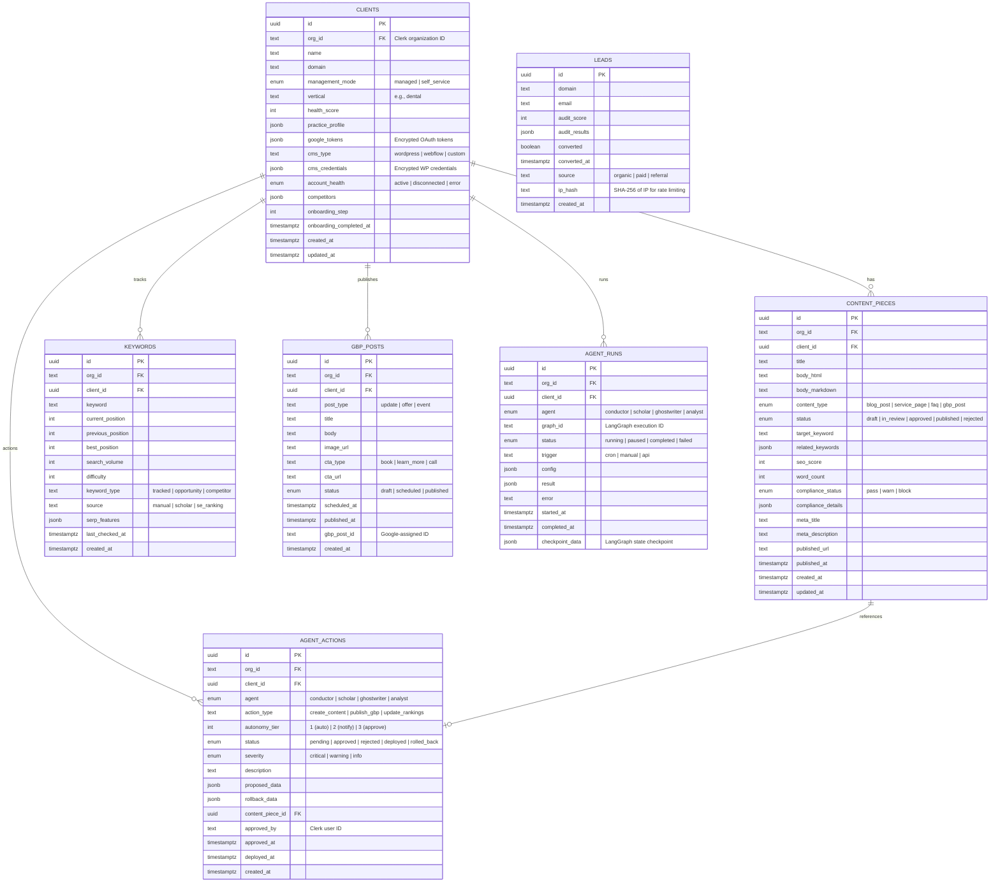

# Architecture Overview

**Zintas AI V2** - High-Level Design Document

Version: 1.0
Last Updated: February 2026
Status: Implementation Phase

---

## Table of Contents

1. [System Context](#1-system-context)
2. [High-Level Architecture Diagram](#2-high-level-architecture-diagram)
3. [Technology Stack](#3-technology-stack)
4. [Application Architecture](#4-application-architecture)
5. [Route Group Architecture](#5-route-group-architecture)
6. [Package Architecture](#6-package-architecture)
7. [Data Architecture](#7-data-architecture)
8. [Security Architecture](#8-security-architecture)
9. [Deployment Architecture](#9-deployment-architecture)
10. [Related Documentation](#10-related-documentation)

---

## 1. System Context

### 1.1 What is Zintas AI?

Zintas AI is an **AI-powered dental SEO SaaS platform** that automates content creation, local SEO optimization, and Google Business Profile management for dental practices. The platform uses LangGraph-based AI agents to orchestrate workflows, generate compliant content, and maintain continuous SEO improvement.

**Core Value Proposition:**
- Autonomous SEO content creation with dental compliance checking
- Automated Google Business Profile (GBP) posting
- Practice website auditing and lead generation
- Multi-client management for agencies
- Full transparency with human-in-the-loop approval queues

---

### 1.2 User Personas

| Persona | Role | Access Level | Primary Goals |
|---------|------|--------------|---------------|
| **Practice Owner** | Single dental practice owner | `org:practice_owner` | View SEO performance, approve content, manage settings |
| **Manager** | Digital marketing agency manager | `org:manager` | Manage multiple clients, approve/edit content, monitor pipelines |
| **Anonymous Lead** | Website visitor | No authentication | Run free practice audit, receive report via email |

**Access Patterns:**
- **Practice Owner**: Single organization, one client (their practice)
- **Manager**: Single organization, multiple clients (agency model)
- **Anonymous Lead**: Public API access, rate-limited by IP hash

---

### 1.3 Key Features

**For Practice Owners:**
- SEO dashboard with keyword rankings (via SE Ranking API)
- Content approval queue (blog posts, service pages, FAQs)
- Google Business Profile auto-posting
- Compliance reports (HIPAA, FTC, state dental board rules)

**For Managers:**
- Multi-client dashboard
- Bulk content operations
- Lead management from free audits
- Client onboarding wizard

**For Anonymous Leads:**
- Free website audit (limited to 3 per hour per IP)
- Email delivery of audit results
- Automatic lead capture

---

## 2. High-Level Architecture Diagram


---

## 3. Technology Stack

| Category | Technology | Version | Purpose |
|----------|-----------|---------|---------|
| **Framework** | Next.js | 14.2 | App Router, Server Components, API routes |
| **Language** | TypeScript | 5.9 | Type-safe development |
| **UI Library** | React | 18.3 | Component-based UI |
| **Styling** | Tailwind CSS | 3.4 | Utility-first styling |
| **Component Library** | shadcn/ui | - | Pre-built accessible components |
| **Icons** | Lucide React | 0.563 | Icon library |
| **Authentication** | Clerk | 6.12 | User auth, org management, RLS integration |
| **Database** | Supabase (PostgreSQL) | 2.95 | Multi-tenant data storage with RLS |
| **ORM** | Supabase Client | - | Type-safe database queries |
| **Caching/Rate Limiting** | Upstash Redis | 1.34 | Distributed rate limiting |
| **AI/LLM** | Anthropic Claude | - | Claude Sonnet 4.5 via LangChain |
| **Agent Framework** | LangGraph | 0.2 | Stateful agent orchestration |
| **SEO API** | SE Ranking | - | Keyword tracking, SERP analysis |
| **Google APIs** | Google APIs | - | GSC, GBP, Places, OAuth2 |
| **CMS Integration** | WordPress API | - | Auto-publish to client sites |
| **Email** | Resend | 4.0 | Transactional email delivery |
| **Forms** | React Hook Form | 7.54 | Form state management |
| **Validation** | Zod | 3.24 | Schema validation |
| **Rich Text Editor** | Tiptap | 3.19 | Markdown/HTML content editing |
| **Charts** | Recharts | 3.7 | Data visualization |
| **Testing** | Vitest | 2.1 | Unit and integration tests |
| **Deployment** | Vercel | - | Serverless hosting, edge functions |

---

## 4. Application Architecture

```mermaid
C4Component
    title Zintas AI V2 - Application Component Diagram

    Container_Boundary(frontend, "Next.js App Router") {
        Component(publicRoutes, "(public)", "Landing, audit, sign-in/up")
        Component(onboardingRoutes, "(onboarding)", "Client setup wizard")
        Component(practiceRoutes, "(practice)", "Practice owner dashboard")
        Component(managerRoutes, "(manager)", "Agency manager dashboard")
        Component(apiRoutes, "API Routes", "REST endpoints")
        Component(cronRoutes, "Cron Routes", "Scheduled jobs")
    }

    Container_Boundary(packages, "Business Logic Packages") {
        Component(dbPackage, "@packages/db", "Database client, queries, types")
        Component(agentsPackage, "@packages/agents", "LangGraph agents (conductor, scholar, ghostwriter)")
        Component(auditPackage, "@packages/audit-engine", "Free audit, CMS detection, competitor finder")
        Component(compliancePackage, "@packages/compliance", "HIPAA, FTC, state board rules")
        Component(localSeoPackage, "@packages/local-seo", "GBP service, scheduler")
        Component(plainEnglishPackage, "@packages/plain-english", "Jargon-free explanations")
    }

    Container_Boundary(external, "External Services") {
        ComponentDb(supabase, "Supabase PostgreSQL", "Database")
        ComponentDb(redis, "Upstash Redis", "Cache/Rate Limiter")
        ComponentExt(clerk, "Clerk", "Auth")
        ComponentExt(anthropic, "Anthropic", "LLM")
        ComponentExt(seRanking, "SE Ranking", "SEO API")
        ComponentExt(google, "Google APIs", "GBP, GSC, Places")
    }

    Rel(publicRoutes, apiRoutes, "Calls", "POST /api/audit/free")
    Rel(onboardingRoutes, apiRoutes, "Calls", "POST /api/onboarding")
    Rel(practiceRoutes, apiRoutes, "Calls", "GET /api/content, /api/keywords")
    Rel(managerRoutes, apiRoutes, "Calls", "GET /api/clients, /api/queue")
    Rel(cronRoutes, apiRoutes, "Executes", "Cron jobs")

    Rel(apiRoutes, dbPackage, "Uses")
    Rel(apiRoutes, agentsPackage, "Invokes")
    Rel(apiRoutes, auditPackage, "Uses")
    Rel(apiRoutes, compliancePackage, "Uses")
    Rel(apiRoutes, localSeoPackage, "Uses")

    Rel(dbPackage, supabase, "Queries")
    Rel(dbPackage, redis, "Rate limits")
    Rel(agentsPackage, anthropic, "Calls")
    Rel(agentsPackage, dbPackage, "Stores results")
    Rel(localSeoPackage, google, "Publishes")
    Rel(auditPackage, seRanking, "Fetches data")

    Rel(publicRoutes, clerk, "Authenticates")
```

---

## 5. Route Group Architecture

Next.js 14 App Router uses **route groups** to organize pages without affecting the URL structure. All authenticated routes are protected by Clerk middleware with role-based redirects.

### 5.1 Route Group: `(public)`

**Purpose**: Publicly accessible pages (no authentication required)

**Middleware Behavior**: `isPublicRoute` matcher — Clerk allows access without authentication

**Pages:**

| Route | File | Purpose |
|-------|------|---------|
| `/` | `app/page.tsx` | Landing page with hero, features, pricing |
| `/audit` | `app/audit/page.tsx` | Free website audit form |
| `/audit/results/[leadId]` | `app/audit/results/[leadId]/page.tsx` | Audit results display |
| `/pricing` | Redirect to `/#pricing` | Pricing section anchor |
| `/sign-in` | `app/sign-in/[[...sign-in]]/page.tsx` | Clerk sign-in component |
| `/sign-up` | `app/sign-up/[[...sign-up]]/page.tsx` | Clerk sign-up component |

**API Routes:**
- `POST /api/audit/free` - Run free audit (rate-limited: 3/hour per IP)

---

### 5.2 Route Group: `(onboarding)`

**Purpose**: First-time client setup wizard

**Middleware Behavior**: `isOnboardingRoute` matcher — requires authentication, no org_id required

**Layout**: `app/(onboarding)/layout.tsx` — minimal layout without sidebar

**Pages:**

| Route | File | Purpose |
|-------|------|---------|
| `/onboarding/start` | `app/(onboarding)/onboarding/start/page.tsx` | Multi-step wizard: domain input, CMS detection, Google OAuth, profile setup |

**Flow:**
1. User signs in → Clerk creates account
2. Middleware checks: no `orgId` → redirect to `/onboarding/start`
3. Wizard collects: domain, connects Google, detects CMS
4. On completion: creates Clerk org, creates `clients` row, sets `onboarding_completed_at`
5. Redirects to `/practice/dashboard` or `/dashboard` based on role

**API Routes:**
- `POST /api/onboarding/detect-cms` - Detect WordPress/Webflow/etc
- `POST /api/onboarding/google-connect` - OAuth2 flow for GBP/GSC
- `POST /api/onboarding/complete` - Finalize setup, create client record

---

### 5.3 Route Group: `(practice)`

**Purpose**: Practice owner dashboard (single client)

**Middleware Behavior**:
- Requires `orgRole === 'org:practice_owner'`
- If manager tries to access → redirect to `/dashboard`

**Layout**: `app/(practice)/layout.tsx` — sidebar with navigation

**Pages:**

| Route | File | Purpose |
|-------|------|---------|
| `/practice/dashboard` | `app/(practice)/practice/dashboard/page.tsx` | SEO metrics, keyword rankings, recent content |
| `/practice/content` | `app/(practice)/practice/content/page.tsx` | Content library (blog posts, service pages) |
| `/practice/reports` | `app/(practice)/practice/reports/page.tsx` | Monthly SEO reports |
| `/practice/settings` | `app/(practice)/practice/settings/page.tsx` | Practice profile, Google accounts, autonomy tier |

**API Routes:**
- `GET /api/practice/dashboard` - Fetch dashboard metrics
- `GET /api/keywords` - Keyword rankings
- `GET /api/content` - Content pieces
- `PATCH /api/content/[id]` - Update content status

---

### 5.4 Route Group: `(manager)`

**Purpose**: Agency manager dashboard (multiple clients)

**Middleware Behavior**:
- Requires `orgRole === 'org:manager'`
- If practice owner tries to access → redirect to `/practice/dashboard`

**Layout**: `app/(manager)/layout.tsx` — sidebar with client switcher

**Pages:**

| Route | File | Purpose |
|-------|------|---------|
| `/dashboard` | `app/(manager)/dashboard/page.tsx` | Client overview, health scores |
| `/dashboard/[client]` | `app/(manager)/dashboard/[client]/page.tsx` | Single client dashboard |
| `/dashboard/[client]/content/[id]/edit` | `app/(manager)/dashboard/[client]/content/[id]/edit/page.tsx` | Edit content piece with Tiptap editor |
| `/dashboard/queue` | `app/(manager)/dashboard/queue/page.tsx` | Approval queue (pending agent actions) |
| `/dashboard/leads` | `app/(manager)/dashboard/leads/page.tsx` | Leads from free audits |
| `/dashboard/onboard` | `app/(manager)/dashboard/onboard/page.tsx` | Add new client to agency |

**API Routes:**
- `GET /api/clients` - List all clients for org
- `GET /api/clients/[id]` - Single client details
- `GET /api/queue` - Pending agent actions
- `POST /api/queue/[id]/approve` - Approve agent action
- `POST /api/queue/[id]/reject` - Reject agent action
- `GET /api/leads` - All leads from audits

---

### 5.5 Middleware Routing Logic

**File**: `middleware.ts`

```typescript
// Public routes — no auth required
isPublicRoute([
  '/',
  '/audit(.*)',
  '/pricing',
  '/api/audit/free(.*)',
  '/sign-in(.*)',
  '/sign-up(.*)',
])

// Authenticated routes
if (!orgId && !isOnboardingRoute(request)) {
  redirect('/onboarding/start')  // First-time setup
}

// Role-based redirects
if (isPracticeRoute && orgRole === 'org:manager') {
  redirect('/dashboard')  // Managers can't access practice routes
}

if (isManagerRoute && orgRole === 'org:practice_owner') {
  redirect('/practice/dashboard')  // Practice owners can't access manager routes
}
```

---

## 6. Package Architecture

### 6.1 `@packages/db`

**Purpose**: Database client, queries, types, and encryption

**Key Files:**

| File | Exports | Description |
|------|---------|-------------|
| `client.ts` | `supabaseServer()`, `supabaseAdmin` | Supabase clients (RLS vs admin) |
| `types.ts` | All database types | TypeScript interfaces for tables |
| `encryption.ts` | `encryptTokens()`, `decryptTokens()` | AES-256-GCM for Google tokens |
| `rate-limit.ts` | 5 rate limiters | Upstash Redis rate limiters |
| `google-tokens.ts` | `saveGoogleTokens()`, `getGoogleTokens()` | Encrypted token CRUD |
| `queries/clients.ts` | `getClientById()`, `updateClient()`, etc. | Client CRUD |
| `queries/content.ts` | `getContentPieces()`, `createContentPiece()`, etc. | Content CRUD |
| `queries/keywords.ts` | `getKeywords()`, `createKeyword()`, etc. | Keyword CRUD |
| `queries/leads.ts` | `createLead()`, `getLeads()`, etc. | Lead CRUD |
| `queries/gbp-posts.ts` | `getScheduledPosts()`, `createGbpPost()`, etc. | GBP post CRUD |
| `queries/queue.ts` | `getPendingActions()`, `approveAction()`, etc. | Agent action CRUD |
| `queries/agent-runs.ts` | `createAgentRun()`, `updateAgentRun()`, etc. | Agent run tracking |

**Database Clients:**

```typescript
// User-scoped client (RLS enforced)
const supabase = supabaseServer()
const { data } = await supabase
  .from('clients')
  .select('*')
  // Automatically filtered by org_id from JWT

// Admin client (bypasses RLS — use only in agents/cron)
const { data } = await supabaseAdmin
  .from('clients')
  .select('*')
  .eq('org_id', orgId)  // MUST manually filter by org_id
```

**Rate Limiters:**

| Limiter | Limit | Window | Purpose |
|---------|-------|--------|---------|
| `auditRateLimiter` | 3 requests | 1 hour | Free audit per IP |
| `apiRateLimiter` | 100 requests | 1 minute | General API routes |
| `agentRateLimiter` | 10 requests | 1 minute | Agent invocations |
| `emailRateLimiter` | 10 requests | 1 hour | Email sending |
| `emailPerLeadLimiter` | 1 request | 24 hours | Email per unique lead |

---

### 6.2 `@packages/agents`

**Purpose**: LangGraph-based AI agents for content generation and orchestration

**Architecture**: Each agent is a LangGraph `StateGraph` with nodes, edges, and checkpointing

**Agents:**

| Agent | Graph File | Purpose |
|-------|-----------|---------|
| **Conductor** | `agents/conductor/graph.ts` | Orchestrates weekly pipeline: keyword research → content planning → ghostwriter invocation |
| **Scholar** | `agents/scholar/graph.ts` | Keyword research, competitor analysis, SERP intent analysis |
| **Ghostwriter** | `agents/ghostwriter/graph.ts` | Content generation (blog posts, service pages, FAQs) with compliance checking |
| **Analyst** | `agents/analyst/graph.ts` | Monthly SEO reporting, rank tracking, GSC analysis |

**Key Files:**

| File | Exports | Description |
|------|---------|-------------|
| `practice-intelligence.ts` | `populatePracticeProfile()` | Crawls practice website, extracts structured data with Claude, verifies NPI numbers |
| `conductor/graph.ts` | `buildConductorGraph()` | Weekly pipeline orchestrator |
| `conductor/index.ts` | `runWeeklyPipeline()` | Conductor invocation wrapper |
| `scholar/graph.ts` | `buildScholarGraph()` | Keyword research graph |
| `scholar/index.ts` | `runKeywordResearch()` | Scholar invocation wrapper |
| `ghostwriter/graph.ts` | `buildGhostwriterGraph()` | Content generation graph |
| `ghostwriter/index.ts` | `generateContent()` | Ghostwriter invocation wrapper |
| `integrations/se-ranking.ts` | `fetchKeywordRankings()`, `discoverKeywords()` | SE Ranking API client |
| `integrations/google-search-console.ts` | `fetchSearchAnalytics()` | GSC API client |

**Agent State Pattern:**

```typescript
// Each graph defines a state interface
interface ConductorState {
  clientId: string
  keywords: Keyword[]
  contentPlan: ContentPlanItem[]
  errors: string[]
}

// Nodes update state
const keywordResearchNode = async (state: ConductorState) => {
  const keywords = await scholarAgent.runKeywordResearch(state.clientId)
  return { ...state, keywords }
}

// Graph execution
const graph = buildConductorGraph()
const result = await graph.invoke({ clientId })
```

**Autonomy Tiers:**

| Tier | Behavior | Example |
|------|----------|---------|
| 1 | Full autonomy (no approval) | Update keyword rankings, fetch analytics |
| 2 | Auto-deploy with notification | Create GBP post (auto-publish after 1 hour) |
| 3 | Require approval before deploy | Publish blog post to WordPress |

---

### 6.3 `@packages/audit-engine`

**Purpose**: Free practice website audit for lead generation

**Key Files:**

| File | Exports | Description |
|------|---------|-------------|
| `index.ts` | `runFreeAudit()` | Main audit orchestrator |
| `detect-cms.ts` | `detectCMS()` | WordPress, Webflow, Wix detection |
| `competitor-finder.ts` | `findCompetitors()` | Google Places API to find nearby dentists |
| `emails/audit-report.tsx` | `AuditReportEmail` | React Email template for audit results |

**Audit Checks:**

| Category | Checks | Score Weight |
|----------|--------|--------------|
| **Technical SEO** | Page speed, mobile-friendliness, HTTPS, sitemap, robots.txt | 25% |
| **On-Page SEO** | Title tags, meta descriptions, H1 tags, image alt text | 25% |
| **Local SEO** | GBP listing, NAP consistency, local keywords | 30% |
| **Content** | Blog presence, service pages, word count | 20% |

**Audit Flow:**

1. User submits domain via `/audit` form
2. Rate limit check (3/hour per IP via `auditRateLimiter`)
3. reCAPTCHA verification
4. `runFreeAudit()` executes checks (30-60 seconds)
5. Create `leads` row with audit results
6. Send audit report email via Resend
7. Redirect to `/audit/results/[leadId]`

---

### 6.4 `@packages/compliance`

**Purpose**: HIPAA, FTC, and state dental board compliance checking

**Key Files:**

| File | Exports | Description |
|------|---------|-------------|
| `engine.ts` | `checkCompliance()` | Main compliance checker (regex + Claude verification) |
| `index.ts` | Re-exports | Package entry point |

**Compliance Rules:**

| Category | Rules | Action |
|----------|-------|--------|
| **HIPAA Violations** | Patient names, PHI references, before/after photos without consent | `block` (prevent publish) |
| **FTC Guidelines** | Unsubstantiated claims ("pain-free", "guaranteed results") | `warn` (flag for review) |
| **State Dental Boards** | Unlicensed practice claims, false advertising | `block` |
| **Jargon** | Complex medical terms without explanation | `warn` (suggest Plain English) |

**Compliance Check Example:**

```typescript
const result = await checkCompliance(contentHtml, 'blog_post')

// result.status: 'pass' | 'warn' | 'block'
// result.details: [
//   { rule: 'HIPAA-001', severity: 'critical', message: 'Contains patient identifier' },
//   { rule: 'FTC-012', severity: 'warning', message: 'Unsubstantiated claim detected' }
// ]
```

---

### 6.5 `@packages/local-seo`

**Purpose**: Google Business Profile management and scheduling

**Key Files:**

| File | Exports | Description |
|------|---------|-------------|
| `gbp-service.ts` | `publishGbpPost()`, `createGbpPost()` | Google Business Profile API client |
| `scheduler.ts` | `scheduleGbpPosts()` | Weekly post planning (1 post every 3 days) |
| `index.ts` | Re-exports | Package entry point |

**GBP Post Types:**

| Type | Frequency | Content | CTA |
|------|-----------|---------|-----|
| `update` | 2x/week | Practice news, tips | Book appointment |
| `offer` | 1x/week | Seasonal promotions | Learn more |
| `event` | As needed | Open houses, webinars | Reserve spot |

**Scheduling Logic:**

```typescript
// Conductor agent calls scheduler.scheduleGbpPosts()
// Creates draft posts for next 7 days:
// - Monday: Tip post
// - Thursday: Offer post
// - Sunday: Update post

// Cron job /api/cron/publish-gbp runs every 30 minutes:
// - Fetches posts with status='scheduled' and scheduled_at < now
// - Calls gbpService.publishGbpPost()
// - Updates status='published', sets published_at
```

---

### 6.6 `@packages/plain-english`

**Purpose**: Convert dental jargon to patient-friendly language

**Key Files:**

| File | Exports | Description |
|------|---------|-------------|
| `index.ts` | `convertToPlainEnglish()`, `detectJargon()` | Claude-powered jargon detection and simplification |

**Examples:**

| Jargon | Plain English |
|--------|---------------|
| "Periodontal disease" | "Gum disease" |
| "Endodontic therapy" | "Root canal treatment" |
| "Caries" | "Tooth decay" |
| "Prophylaxis" | "Teeth cleaning" |

**Usage:**

```typescript
const simplified = await convertToPlainEnglish(
  "Patients with severe periodontal disease may require scaling and root planing."
)
// "Patients with severe gum disease may need a deep cleaning treatment."
```

---

## 7. Data Architecture

### 7.1 Entity-Relationship Diagram



---

### 7.2 Multi-Tenancy and Data Isolation

**Strategy**: Organization-scoped Row-Level Security (RLS) via Clerk JWT claims

**Implementation:**

1. **Clerk JWT**: Contains `org_id` claim
2. **Supabase RLS Policies**: Filter all queries by `org_id`
3. **Middleware**: Clerk middleware injects JWT into requests
4. **Database Queries**: Automatically scoped to user's organization

**RLS Policy Example:**

```sql
CREATE POLICY "org_isolation" ON clients FOR ALL
  USING (org_id = (current_setting('request.jwt.claims', true)::json->>'org_id'));
```

**Tables with RLS:**
- `clients`
- `content_pieces`
- `keywords`
- `agent_actions`
- `gbp_posts`
- `agent_runs`

**Tables WITHOUT RLS:**
- `leads` (public API access, rate-limited by IP)

---

### 7.3 Token Encryption

**Purpose**: Encrypt Google OAuth tokens and WordPress credentials

**Algorithm**: AES-256-GCM (authenticated encryption)

**Process:**

```typescript
// Encryption
const tokens = { access_token, refresh_token, expiry_date, scope }
const encrypted = encryptTokens(tokens)
// Returns: "iv:authTag:ciphertext" (base64-encoded)

// Storage
await supabase
  .from('clients')
  .update({ google_tokens: encrypted })

// Decryption
const row = await supabase.from('clients').select('google_tokens').single()
const tokens = decryptTokens(row.google_tokens)
```

**Environment Variable:**
- `ENCRYPTION_KEY`: 32-byte hex string (64 hex characters)

---

### 7.4 Client Access Patterns

**Pattern 1: Practice Owner (Single Client)**

```typescript
// User has org_id from Clerk
// Query automatically filtered by RLS
const { data: client } = await supabase
  .from('clients')
  .select('*')
  .eq('org_id', orgId)
  .single()

// Returns only the client belonging to this org
```

**Pattern 2: Agency Manager (Multiple Clients)**

```typescript
// User has org_id from Clerk
// Query returns all clients for agency
const { data: clients } = await supabase
  .from('clients')
  .select('*')
  .eq('org_id', orgId)

// Returns all clients managed by this agency
```

**Pattern 3: Agent/Cron (Admin Access)**

```typescript
// Use supabaseAdmin (bypasses RLS)
// MUST manually filter by org_id
const { data: clients } = await supabaseAdmin
  .from('clients')
  .select('*')
  .eq('org_id', orgId)  // CRITICAL: Always filter manually
```

---

### 7.5 Database Indexes

**Performance Optimization:**

```sql
-- Agent actions
CREATE INDEX idx_agent_actions_status ON agent_actions(status, org_id);
CREATE INDEX idx_agent_actions_client ON agent_actions(client_id, status);

-- Content pieces
CREATE INDEX idx_content_pieces_client ON content_pieces(client_id, status);

-- Keywords
CREATE INDEX idx_keywords_client ON keywords(client_id, keyword_type);
CREATE INDEX idx_keywords_position ON keywords(client_id, current_position);

-- Leads
CREATE INDEX idx_leads_email ON leads(email) WHERE email IS NOT NULL;
CREATE INDEX idx_leads_domain ON leads(domain);

-- GBP posts
CREATE INDEX idx_gbp_posts_scheduled ON gbp_posts(scheduled_at) WHERE status = 'scheduled';
```

---

## 8. Security Architecture

### 8.1 Authentication Flow


**Key Points:**
- **Clerk JWT**: Contains `userId`, `orgId`, `orgRole`
- **Middleware**: Protects routes, enforces role-based access
- **RLS**: Database-level isolation (defense in depth)
- **Session**: Stored in HTTP-only cookies (XSS protection)

---

### 8.2 Data Isolation

**Multi-Tenancy Enforcement:**

| Layer | Mechanism | Bypass Protection |
|-------|-----------|-------------------|
| **Application** | Middleware role checks | N/A |
| **API** | `requireAuth()`, `requireRole()` helpers | Admin routes require `AGENT_API_KEY` |
| **Database** | RLS policies on all tables | Service role queries must manually filter `org_id` |

**Example: Admin Route Protection**

```typescript
// API route for agent-internal operations
export async function POST(request: Request) {
  const authError = requireAgentKey(request)
  if (authError) return authError

  // Proceed with admin Supabase client
  const { data } = await supabaseAdmin.from('clients').select('*')
}
```

---

### 8.3 Encryption

**Sensitive Data:**

| Data Type | Storage | Encryption |
|-----------|---------|------------|
| Google OAuth tokens | `clients.google_tokens` | AES-256-GCM |
| WordPress credentials | `clients.cms_credentials` | AES-256-GCM |
| User passwords | Clerk (never stored) | bcrypt (Clerk-managed) |
| JWT tokens | HTTP-only cookies | Signed by Clerk |

**Key Management:**
- `ENCRYPTION_KEY` stored in Vercel environment variables
- Rotated quarterly (requires re-encryption of all tokens)

---

### 8.4 Rate Limiting

**Limiters (via Upstash Redis):**

| Endpoint | Limiter | Limit | Window | Identifier |
|----------|---------|-------|--------|------------|
| `POST /api/audit/free` | `auditRateLimiter` | 3 | 1 hour | IP hash |
| `POST /api/*` (general) | `apiRateLimiter` | 100 | 1 minute | `orgId` |
| Agent invocations | `agentRateLimiter` | 10 | 1 minute | `clientId` |
| Email sending | `emailRateLimiter` | 10 | 1 hour | `orgId` |
| Email per lead | `emailPerLeadLimiter` | 1 | 24 hours | `email` |

**Implementation:**

```typescript
const result = await auditRateLimiter.limit(ipHash)
if (!result.success) {
  return NextResponse.json(
    { error: 'Rate limit exceeded' },
    { status: 429, headers: { 'Retry-After': String(result.reset) } }
  )
}
```

---

### 8.5 Input Validation

**Zod Schemas for API Routes:**

```typescript
import { z } from 'zod'

const CreateContentSchema = z.object({
  title: z.string().min(10).max(200),
  body: z.string().min(100),
  content_type: z.enum(['blog_post', 'service_page', 'faq']),
  target_keyword: z.string().optional(),
})

export async function POST(request: Request) {
  const body = await request.json()
  const validated = CreateContentSchema.parse(body)  // Throws if invalid
  // ...
}
```

---

### 8.6 Security Headers

**Configured in `next.config.js` and `vercel.json`:**

```javascript
headers: [
  { key: 'X-Content-Type-Options', value: 'nosniff' },
  { key: 'X-Frame-Options', value: 'DENY' },
  { key: 'X-XSS-Protection', value: '1; mode=block' },
  { key: 'Referrer-Policy', value: 'strict-origin-when-cross-origin' },
  { key: 'Permissions-Policy', value: 'camera=(), microphone=(), geolocation=()' },
]
```

---

## 9. Deployment Architecture

### 9.1 Deployment Diagram

```mermaid
C4Deployment
    title Zintas AI V2 - Deployment Architecture

    Deployment_Node(vercel, "Vercel Edge Network") {
        Container(nextApp, "Next.js App", "Node 20, Edge Runtime")
        Container(apiRoutes, "API Routes", "Serverless Functions")
        Container(cronJobs, "Cron Jobs", "Vercel Cron")
    }

    Deployment_Node(supabase, "Supabase Cloud") {
        ContainerDb(postgres, "PostgreSQL 15", "Database with RLS")
        Container(storage, "Storage", "File uploads (unused)")
    }

    Deployment_Node(upstash, "Upstash") {
        ContainerDb(redis, "Redis", "Rate limiting, caching")
    }

    Deployment_Node(clerk, "Clerk") {
        Container(auth, "Auth Service", "User + org management")
    }

    Deployment_Node(anthropic, "Anthropic") {
        Container(claudeAPI, "Claude API", "Sonnet 4.5")
    }

    Deployment_Node(github, "GitHub") {
        Container(repo, "Git Repository", "Source code")
        Container(actions, "GitHub Actions", "CI/CD pipelines")
    }

    Rel(nextApp, postgres, "Queries", "PostgreSQL protocol")
    Rel(apiRoutes, redis, "Rate limits", "Redis protocol")
    Rel(nextApp, auth, "Authenticates", "HTTPS")
    Rel(apiRoutes, claudeAPI, "Generates content", "HTTPS")
    Rel(actions, vercel, "Deploys", "Vercel CLI")
```

---

### 9.2 CI/CD Pipelines

**GitHub Actions Workflows:**

#### **Workflow 1: CI (`.github/workflows/ci.yml`)**

**Trigger**: Push to `main`, pull requests

**Steps:**
1. Checkout code
2. Setup Node 20
3. Install dependencies (`npm ci`)
4. Lint (`npm run lint`)
5. Type check (`npx tsc --noEmit`)
6. Unit tests (`npm test`)
7. Build (`npm run build`)

**Environment Variables (Secrets):**
- All `NEXT_PUBLIC_*` and service keys

---

#### **Workflow 2: Deploy (`.github/workflows/deploy.yml`)**

**Trigger**: Push to `main` (after CI passes)

**Steps:**
1. Checkout code
2. Setup Node 20
3. Install dependencies
4. Install Vercel CLI
5. Pull Vercel environment (`vercel pull`)
6. Build (`vercel build --prod`)
7. Deploy (`vercel deploy --prebuilt --prod`)

**Environment Variables (Secrets):**
- `VERCEL_TOKEN`
- `VERCEL_ORG_ID`
- `VERCEL_PROJECT_ID`

---

### 9.3 Cron Jobs (Vercel Cron)

**Configuration: `vercel.json`**

```json
{
  "crons": [
    {
      "path": "/api/cron/publish-gbp",
      "schedule": "*/30 * * * *"
    },
    {
      "path": "/api/cron/weekly-pipeline",
      "schedule": "0 6 * * 1"
    }
  ]
}
```

**Cron Job Details:**

| Cron | Schedule | Purpose | Actions |
|------|----------|---------|---------|
| `publish-gbp` | Every 30 minutes | Publish scheduled GBP posts | Fetch posts with `status='scheduled'` and `scheduled_at < now`, call `publishGbpPost()`, update status |
| `weekly-pipeline` | Monday 6:00 AM | Run Conductor agent for all clients | For each client: invoke Conductor → Scholar → Ghostwriter → create draft content |

**Authentication:**
- Cron routes require `x-agent-api-key` header (matches `AGENT_API_KEY` env var)

---

### 9.4 Environment Variables

**Complete List (values redacted):**

| Variable | Required | Description | Example |
|----------|----------|-------------|---------|
| **Clerk** ||||
| `NEXT_PUBLIC_CLERK_PUBLISHABLE_KEY` | Yes | Clerk frontend key | `pk_test_...` |
| `CLERK_SECRET_KEY` | Yes | Clerk backend key | `sk_test_...` |
| `NEXT_PUBLIC_CLERK_SIGN_IN_URL` | Yes | Sign-in route | `/sign-in` |
| `NEXT_PUBLIC_CLERK_SIGN_UP_URL` | Yes | Sign-up route | `/sign-up` |
| **Supabase** ||||
| `NEXT_PUBLIC_SUPABASE_URL` | Yes | Supabase project URL | `https://xxx.supabase.co` |
| `NEXT_PUBLIC_SUPABASE_ANON_KEY` | Yes | Public anon key (RLS enforced) | `eyJ...` |
| `SUPABASE_SERVICE_ROLE_KEY` | Yes | Admin key (bypasses RLS) | `eyJ...` |
| **AI/LLM** ||||
| `ANTHROPIC_API_KEY` | Yes | Claude API key | `sk-ant-...` |
| **SEO Tools** ||||
| `SE_RANKING_API_KEY` | No | SE Ranking API key | `xxx` |
| **Google Integration** ||||
| `GOOGLE_CLIENT_ID` | Yes | OAuth2 client ID | `xxx.apps.googleusercontent.com` |
| `GOOGLE_CLIENT_SECRET` | Yes | OAuth2 client secret | `xxx` |
| `GOOGLE_REDIRECT_URI` | Yes | OAuth2 redirect URI | `https://zintas.ai/api/onboarding/google-callback` |
| **Redis** ||||
| `UPSTASH_REDIS_REST_URL` | Yes | Upstash Redis URL | `https://xxx.upstash.io` |
| `UPSTASH_REDIS_REST_TOKEN` | Yes | Upstash Redis token | `xxx` |
| **Email** ||||
| `RESEND_API_KEY` | Yes | Resend API key | `re_...` |
| **Security** ||||
| `RECAPTCHA_SECRET_KEY` | No | reCAPTCHA v3 secret | `xxx` |
| `ENCRYPTION_KEY` | Yes | AES-256 encryption key (32-byte hex) | `abcd1234...` (64 chars) |
| `AGENT_API_KEY` | Yes | Agent/cron route authentication | `xxx` |
| **App** ||||
| `NEXT_PUBLIC_APP_URL` | Yes | App base URL | `https://zintas.ai` |
| **CI/CD** ||||
| `VERCEL_TOKEN` | Yes (CI) | Vercel deployment token | `xxx` |
| `VERCEL_ORG_ID` | Yes (CI) | Vercel org ID | `xxx` |
| `VERCEL_PROJECT_ID` | Yes (CI) | Vercel project ID | `prj_xxx` |

---

### 9.5 Infrastructure Costs (Estimated)

| Service | Plan | Monthly Cost |
|---------|------|--------------|
| Vercel | Pro | $20 |
| Supabase | Pro | $25 |
| Upstash Redis | Pay-as-you-go | ~$5 |
| Clerk | Pro | $25 |
| Anthropic Claude | Pay-per-token | ~$50-200 (varies with usage) |
| SE Ranking | Essential | $39 |
| Resend | Pro | $20 |
| **Total** || **$184-334/month** |

---

## 10. Related Documentation

**Deep-Dive Technical Docs:**

| Document | Description |
|----------|-------------|
| [agent-system.md](./agent-system.md) | LangGraph architecture, agent graphs, checkpointing, autonomy tiers |
| [database-schema.md](./database-schema.md) | Full schema, RLS policies, indexes, migration guide |
| [api-reference.md](./api-reference.md) | REST API endpoints, request/response schemas, error codes |
| [content-pipeline.md](./content-pipeline.md) | Conductor → Scholar → Ghostwriter → Compliance → Publish flow |
| [onboarding-and-auth.md](./onboarding-and-auth.md) | Clerk setup, OAuth flow, role-based routing |
| [local-seo-and-integrations.md](./local-seo-and-integrations.md) | GBP API, GSC API, SE Ranking, WordPress publishing |
| [development-guide.md](./development-guide.md) | Setup, testing, code style, commit conventions |

**Product/Business Docs:**

| Document | Description |
|----------|-------------|
| `Zintas-Pilot-Build-BRD.docx` | Business Requirements Document |
| `zintas-pilot-build-playbook.md` | Product playbook, feature specs |
| `zintas-claude-code-dev-guide.md` | Claude Code agent instructions |

---

## Appendix: Key Design Decisions

### A.1 Why Next.js App Router?

- **Server Components**: Reduce client bundle size, fetch data server-side
- **Route Groups**: Clean URL structure without nested folders
- **Middleware**: Centralized auth logic
- **API Routes**: Co-located with frontend code
- **Vercel Integration**: Seamless deployment, edge functions

### A.2 Why LangGraph for Agents?

- **Stateful Workflows**: Checkpointing allows pausing/resuming
- **Human-in-the-Loop**: Built-in support for approval nodes
- **Observability**: LangSmith integration for debugging
- **Composability**: Agents can invoke other agents (Conductor → Scholar → Ghostwriter)

### A.3 Why Supabase over Prisma/Drizzle?

- **RLS**: Database-level multi-tenancy enforcement
- **Real-time**: Future feature for live content collaboration
- **Auth Integration**: Clerk JWT → Supabase RLS seamless
- **Managed Service**: No DB ops overhead

### A.4 Why Clerk over NextAuth?

- **Organizations**: First-class multi-tenancy support
- **Role Management**: `org:practice_owner`, `org:manager` roles
- **Prebuilt UI**: Sign-in/up components
- **JWTs**: Supabase RLS integration via JWT claims

### A.5 Why Upstash Redis over Vercel KV?

- **Cost**: More predictable pricing
- **Features**: Built-in rate limiting library (`@upstash/ratelimit`)
- **Persistence**: Optional data persistence

---

**End of Document**

For questions or updates, contact the Zintas AI development team.
