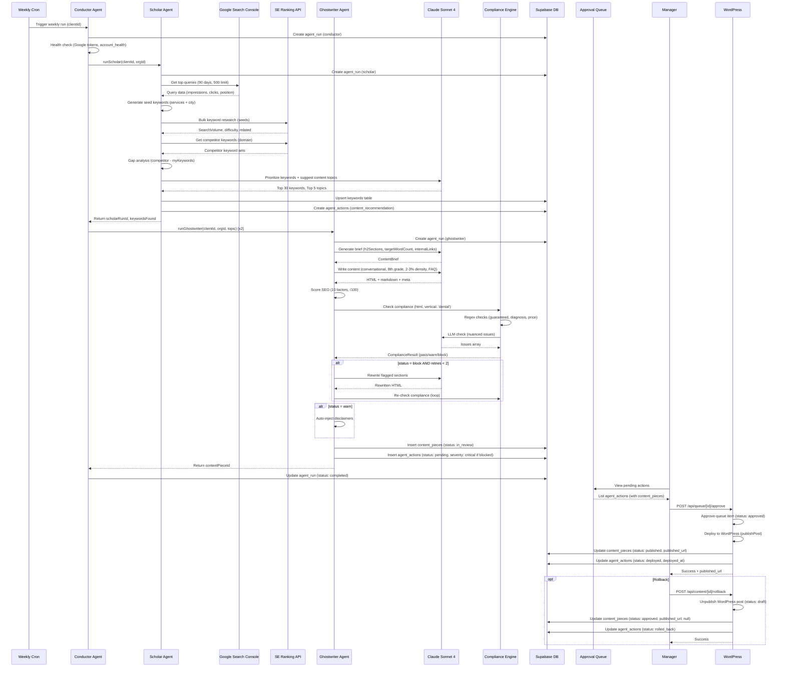
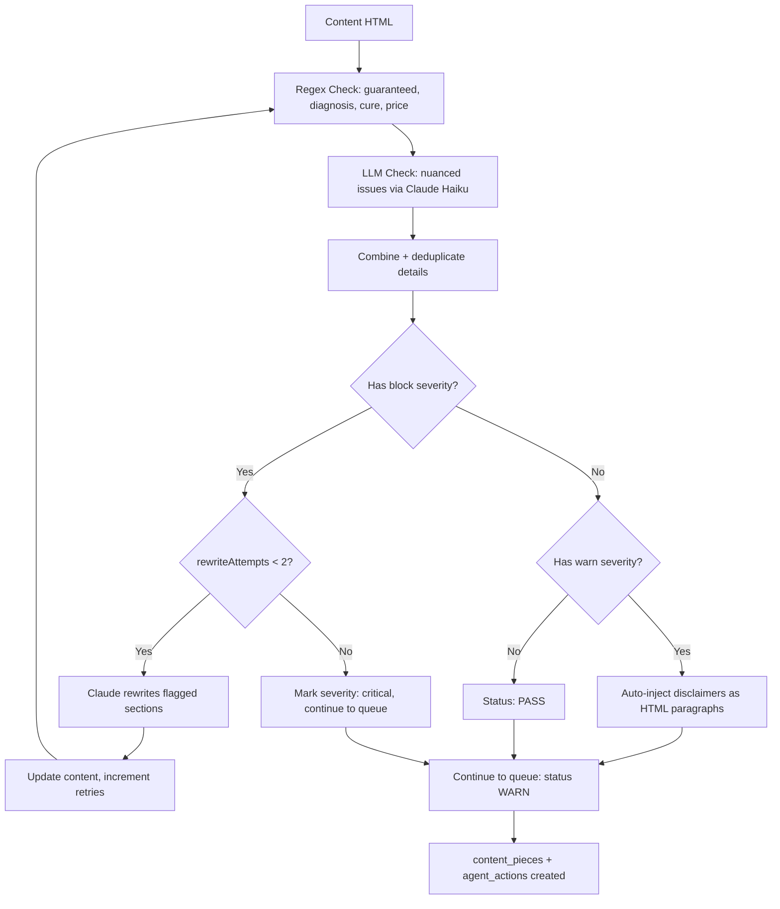
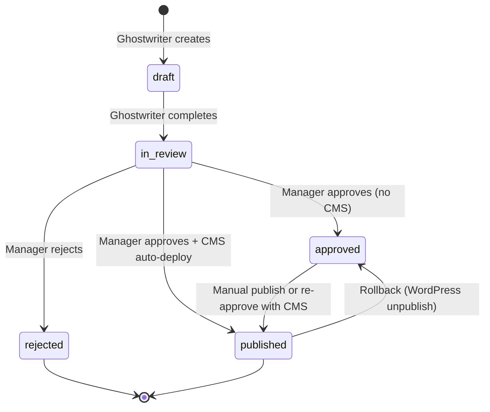
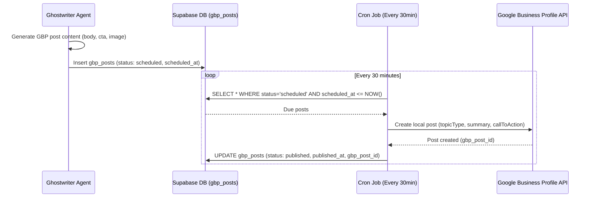

# Content Pipeline: End-to-End Workflow

This document describes the complete content generation, review, and publishing pipeline for Zintas AI. The pipeline orchestrates three LangGraph agents (Conductor, Scholar, Ghostwriter) to generate SEO-optimized, compliance-checked dental content from keyword research through WordPress deployment.

## 1. Pipeline Overview

The content pipeline transforms keyword opportunities into published blog posts through an autonomous, manager-reviewed workflow. Weekly cron jobs trigger the Conductor agent, which orchestrates Scholar (keyword research) and Ghostwriter (content generation). All content passes through compliance checks before entering the approval queue, where managers review and publish to WordPress.



---

## 2. Stage 1: Keyword Research (Scholar Agent)

**File**: `E:\Ideas\Smiley\Zintas-AI\Zintas-AI-V2\packages\agents\scholar\graph.ts`

### Trigger Sources
1. **Weekly Cron**: Conductor agent schedules Scholar runs for active clients
2. **Manual**: Manager triggers one-time keyword refresh via dashboard

### Inputs
- **clientId**: UUID of the dental practice
- **orgId**: Organization scope for RLS filtering
- **practiceProfile**: Services, city, state, practice_name, doctors
- **siteUrl**: Domain for Google Search Console queries
- **gscData**: Historical query performance (last 90 days)

### 6-Node Scholar Pipeline

#### Node 1: `fetchGSCData`
```typescript
// Get top 500 queries from last 90 days
const queries = await gscClient.getTopQueries({
  siteUrl: state.siteUrl,
  startDate: formatDate(startDate), // 90 days ago
  endDate: formatDate(endDate),     // today
  rowLimit: 500,
})
// Returns: GSCQuery[] with query, clicks, impressions, position
```

#### Node 2: `researchKeywords`
**Seed Generation Algorithm**:
```typescript
function generateSeedKeywords(profile: PracticeProfile): string[] {
  const services = profile.services ?? []
  const city = profile.city ?? ''
  const seeds: string[] = []

  for (const service of services) {
    seeds.push(`${service} near me`)
    if (city) {
      seeds.push(`${service} ${city}`)
      seeds.push(`best ${service} ${city}`)
      seeds.push(`${service} cost ${city}`)
    }
  }

  // Fallback if no services specified
  if (seeds.length === 0 && city) {
    const defaults = ['dentist', 'dental implants', 'teeth whitening', 'emergency dentist']
    for (const term of defaults) {
      seeds.push(`${term} ${city}`)
      seeds.push(`${term} near me`)
    }
  }

  return seeds
}
```

**SE Ranking Integration**:
```typescript
const seClient = new SERankingClient()
const results = await seClient.bulkKeywordResearch(seeds)
// Returns: KeywordData[] with keyword, searchVolume, difficulty, relatedKeywords
```

#### Node 3: `analyzeCompetitors`
```typescript
const competitors = client.competitors // [{ domain, name }]
const competitorData: CompetitorKeywordSet[] = []

for (const comp of competitors) {
  const keywords = await seClient.getCompetitorKeywords(comp.domain)
  competitorData.push({ competitor: comp.name, keywords })
}
// Returns: Array of competitor keyword sets
```

#### Node 4: `gapAnalysis`
**Gap Detection Algorithm**:
```typescript
const myKeywords = new Set([
  ...state.gscData.map(q => q.query.toLowerCase()),
  ...state.researchedKeywords.map(k => k.keyword.toLowerCase())
])

const gaps = state.competitorKeywords.flatMap(comp =>
  comp.keywords.filter(k =>
    !myKeywords.has(k.keyword.toLowerCase()) &&
    k.searchVolume > 50 &&  // Minimum search volume
    k.difficulty < 60       // Winnable keywords
  )
)

const topGaps = gaps
  .sort((a, b) => b.searchVolume - a.searchVolume)
  .slice(0, 50)
```

#### Node 5: `prioritize`
**Claude Sonnet 4 Prompt**:
```typescript
const response = await model.invoke([
  {
    role: 'system',
    content: 'You are an expert dental SEO strategist. Analyze keyword data and prioritize opportunities for a dental practice. Always respond with valid JSON.'
  },
  {
    role: 'user',
    content: `Practice profile:
${JSON.stringify(state.practiceProfile, null, 2)}

Current GSC performance (top queries):
${JSON.stringify(state.gscData.slice(0, 20), null, 2)}

Keyword opportunities (${allKeywords.length} total):
${JSON.stringify(allKeywords.slice(0, 100), null, 2)}

Tasks:
1. Rank the top 30 keywords by priority. Consider: search volume, difficulty (prefer <40), relevance to this practice's services, and local intent.
2. For the top 5 keywords, suggest a content topic (blog post title + brief angle).
3. Return JSON with this exact structure:
{
  "prioritizedKeywords": [{ "keyword": "...", "searchVolume": 0, "difficulty": 0, "priority": 1, "reasoning": "...", "keywordType": "target|gap|branded", "source": "research|gap" }],
  "contentTopics": [{ "keyword": "...", "suggestedTitle": "...", "angle": "...", "estimatedVolume": 0 }]
}`
  }
])
```

**Prioritization Factors**:
- Search volume (higher = better)
- Difficulty < 40 (winnable keywords)
- Relevance to practice services
- Local intent ("near me", city name)
- Gap keywords (competitors rank, we don't)

#### Node 6: `saveResults`
```typescript
// Upsert keywords table (30 prioritized keywords)
await supabase.from('keywords').upsert(keywordInputs, { onConflict: 'client_id,keyword' })

// Create agent_actions for content recommendations (5 topics)
const actions = state.contentTopics.map(topic => ({
  agent: 'scholar',
  action_type: 'content_recommendation',
  autonomy_tier: 1,
  status: 'pending',
  severity: 'info',
  description: `Content topic: ${topic.suggestedTitle} — ${topic.angle}`,
  proposed_data: { keyword, suggestedTitle, angle, estimatedVolume }
}))

await supabase.from('agent_actions').insert(actions)
```

### Outputs
- **keywords** table: 30 prioritized keywords with searchVolume, difficulty, keywordType, source
- **agent_actions** table: 5 content_recommendation rows (status: pending, severity: info)
- **Scholar run result**: `{ keywordsTracked: 30, contentTopics: 5, gapKeywords: 50 }`

---

## 3. Stage 2: Content Generation (Ghostwriter Agent)

**File**: `E:\Ideas\Smiley\Zintas-AI\Zintas-AI-V2\packages\agents\ghostwriter\graph.ts`

### Trigger Sources
1. **Conductor Agent**: Processes top 2 Scholar content topics automatically
2. **Manual**: Manager selects specific topic from recommendations queue

### Inputs
- **clientId**: UUID of the dental practice
- **orgId**: Organization scope
- **topic**: `{ keyword, suggestedTitle, angle, estimatedVolume }`
- **practiceProfile**: Services, city, doctors, practice_name

### Brief Generation (Node 1: `generateBrief`)

**Claude Prompt Pattern**:
```typescript
const response = await model.invoke([
  {
    role: 'system',
    content: 'You are an expert dental SEO content strategist. Generate a detailed content brief. Always respond with valid JSON.'
  },
  {
    role: 'user',
    content: `Create a content brief for a dental practice blog post.

Practice profile:
${JSON.stringify(state.practiceProfile, null, 2)}

Target keyword: "${state.topic.keyword}"
Suggested title: "${state.topic.suggestedTitle}"
Angle: "${state.topic.angle}"

Return JSON:
{
  "suggestedTitle": "SEO-optimized title with keyword",
  "h2Sections": ["Section 1", "Section 2", ...],
  "targetWordCount": 1200,
  "internalLinks": ["suggested internal page links"],
  "uniqueAngles": ["angles to differentiate from competitors"],
  "practiceHooks": ["practice-specific details to weave in"]
}`
  }
])
```

**Output Structure**:
```typescript
interface ContentBrief {
  suggestedTitle: string       // "How Much Do Dental Implants Cost in Chicago?"
  h2Sections: string[]         // ["What Are Dental Implants?", "Average Cost Breakdown", ...]
  targetWordCount: number      // 1200
  internalLinks: string[]      // ["/services/implants", "/insurance"]
  uniqueAngles: string[]       // ["Chicago-specific pricing", "Insurance navigation"]
  practiceHooks: string[]      // ["Mention Dr. Smith's 20 years experience"]
}
```

### Content Writing (Node 2: `writeContent`)

**System Prompt Details**:
```typescript
const response = await model.invoke([
  {
    role: 'system',
    content: `You are a professional dental content writer. Write warm, professional content that:
- Uses a conversational yet authoritative tone
- Weaves in practice-specific details (doctor names, location)
- Maintains 2-3% keyword density for the target keyword
- Targets 8th grade reading level
- Includes a FAQ section with 3-4 questions
- Never gives specific medical advice or diagnoses
- Uses proper HTML formatting (h1, h2, h3, p, ul, li tags)

Practice: ${practiceName}${city ? ` in ${city}` : ''}
${doctors.length > 0 ? `Doctors: ${doctors.join(', ')}` : ''}

Return JSON with html, markdown, metaTitle, metaDescription.`
  },
  {
    role: 'user',
    content: `Write a blog post based on this brief:

Title: "${brief.suggestedTitle}"
Target keyword: "${state.topic.keyword}"
Sections: ${JSON.stringify(brief.h2Sections)}
Target word count: ${brief.targetWordCount}
Unique angles: ${JSON.stringify(brief.uniqueAngles)}
Practice hooks: ${JSON.stringify(brief.practiceHooks)}

Return JSON:
{
  "html": "<h1>Title</h1><p>...</p>...",
  "markdown": "# Title\n\n...",
  "metaTitle": "50-70 char SEO title",
  "metaDescription": "120-160 char meta description"
}`
  }
])
```

**Content Requirements**:
- **Tone**: Conversational yet authoritative
- **Reading Level**: 8th grade (measured by avg sentence length 10-20 words)
- **Keyword Density**: 2-3% of target keyword
- **Structure**: H1 → Intro → H2 Sections → FAQ (3-4 Q&A) → Conclusion
- **Practice Integration**: Weave in doctor names, location, unique services
- **Medical Safety**: No diagnoses, no "you have X", no guaranteed outcomes

### SEO Scoring (Node 3: `scoreSEO`)

**Algorithm**: 10-factor scoring system, 100 points total

| Factor | Points | Condition | Implementation |
|--------|--------|-----------|----------------|
| Keyword in Title | 15 | Primary keyword appears in metaTitle | `title.toLowerCase().includes(keyword)` |
| Keyword in First Paragraph | 10 | Keyword appears in first 500 chars | `plainText.slice(0, 500).includes(keyword)` |
| Keyword in H2 | 5 | Keyword appears in any H2 heading | `/<h2[^>]*>(.*?)<\/h2>/gi.test(html)` |
| Keyword Density 1-3% | 15 | Keyword appears 1-3% of total words | `(keywordCount / totalWords) * 100` |
| Readability | 10 | Avg sentence length 10-20 words | `totalWords / sentences.length` |
| Meta Title Length | 10 | 50-70 characters | `title.length >= 50 && title.length <= 70` |
| Meta Description Length | 10 | 120-160 characters | `metaDesc.length >= 120 && metaDesc.length <= 160` |
| Internal Links | 10 | Has at least one `<a href>` tag | `/<a\s+[^>]*href/i.test(html)` |
| H2/H3 Structure | 10 | Has H2 or H3 headings | `/<h[23][^>]*>/i.test(html)` |
| Word Count > 800 | 5 | At least 800 words | `wordCount > 800` |
| **TOTAL** | **100** | | `Math.min(score, 100)` |

---

## 4. Stage 3: Compliance Gate

**File**: `E:\Ideas\Smiley\Zintas-AI\Zintas-AI-V2\packages\compliance\engine.ts`

### Decision Flowchart



### 3 Outcome Paths

#### Outcome 1: PASS (No Issues)
```typescript
if (result.status === 'pass') {
  // Continue to queue unchanged
  await queueForReview(state)
}
```

#### Outcome 2: WARN (Needs Disclaimers)
```typescript
if (result.status === 'warn') {
  let html = state.content?.html ?? ''
  const disclaimers = result.details
    .filter(d => d.disclaimer)
    .map(d => d.disclaimer as string)

  if (disclaimers.length > 0) {
    const disclaimerHtml = disclaimers
      .map(d => `<p class="disclaimer"><em>${d}</em></p>`)
      .join('\n')
    html = html + '\n' + disclaimerHtml
  }

  // Continue to queue with updated HTML
}
```

**Example Disclaimer Injection**:
```html
<!-- Original content -->
<p>Before and after photos show dramatic results.</p>

<!-- After WARN injection -->
<p>Before and after photos show dramatic results.</p>
<p class="disclaimer"><em>Individual results may vary.</em></p>
```

#### Outcome 3: BLOCK + Retries
```typescript
if (result.status === 'block' && state.rewriteAttempts < 2) {
  const flaggedSections = result.details
    .filter(d => d.severity === 'block')
    .map(d => `- "${d.phrase}" — ${d.reason}${d.suggestion ? `. Fix: ${d.suggestion}` : ''}`)
    .join('\n')

  const response = await model.invoke([
    {
      role: 'system',
      content: 'You are a dental content compliance editor. Rewrite ONLY the flagged sections while preserving the rest of the content.'
    },
    {
      role: 'user',
      content: `Rewrite the flagged sections:
Current HTML: ${state.content?.html}
Compliance issues: ${flaggedSections}`
    }
  ])

  // Update content, increment rewriteAttempts, loop back to compliance check
}
```

**Max Retries Reached**:
```typescript
if (result.status === 'block' && state.rewriteAttempts >= 2) {
  // Mark as severity: critical, continue to queue anyway
  const actionInput = {
    severity: 'critical', // Manager sees red flag
    description: `COMPLIANCE BLOCKED: ${state.brief?.suggestedTitle}`,
    proposed_data: {
      complianceStatus: 'block',
      complianceDetails: result.details
    }
  }
  await supabase.from('agent_actions').insert(actionInput)
}
```

### Compliance Rules

**BLOCK Severity Rules**:
1. **guaranteed_results**: `/\bguaranteed\b/i`, `/\b100%\s+success\b/i`
2. **diagnosis**: `/\byou have\b/i`, `/\byou suffer from\b/i`
3. **cure_language**: `/\bcure\b/i`, `/\bheal completely\b/i`
4. **price_without_context**: `/\$\d+/` (unless "starting at" or disclaimer within 200 chars)

**WARN Severity Rules**:
1. **before_after**: `/\bbefore and after\b/i` → Disclaimer: "Individual results may vary."
2. **insurance_claim**: `/\bcovered by insurance\b/i` → Disclaimer: "Contact your insurance provider to verify coverage."

---

## 5. Stage 4: Approval Queue

**Files**:
- `E:\Ideas\Smiley\Zintas-AI\Zintas-AI-V2\packages\db\queries\content.ts`
- `E:\Ideas\Smiley\Zintas-AI\Zintas-AI-V2\packages\db\queries\queue.ts`
- `E:\Ideas\Smiley\Zintas-AI\Zintas-AI-V2\app\api\queue\route.ts`

### Database Rows Created

#### `content_pieces` Table
```typescript
{
  id: uuid,
  org_id: uuid,
  client_id: uuid,
  title: "How Much Do Dental Implants Cost in Chicago?",
  body_html: "<h1>...</h1><p>...</p>",
  body_markdown: "# ...\n\n...",
  content_type: 'blog_post',
  status: 'in_review', // Key status
  target_keyword: "dental implants cost chicago",
  seo_score: 87,
  word_count: 1245,
  compliance_status: 'warn',
  compliance_details: [{...}],
  meta_title: "Dental Implant Costs in Chicago | Dr. Smith",
  meta_description: "Learn about dental implant costs...",
  published_url: null,
  published_at: null,
  created_at: "2026-02-12T10:30:00Z"
}
```

#### `agent_actions` Table
```typescript
{
  id: uuid,
  org_id: uuid,
  client_id: uuid,
  agent: 'ghostwriter',
  action_type: 'content_review',
  autonomy_tier: 2,
  status: 'pending', // Key status
  severity: 'info', // 'critical' if compliance blocked
  description: 'New blog post: "How Much Do Dental Implants Cost in Chicago?" targeting "dental implants cost chicago"',
  proposed_data: {
    contentPieceId: uuid,
    seoScore: 87,
    wordCount: 1245,
    complianceStatus: 'warn'
  },
  rollback_data: {},
  content_piece_id: uuid, // Foreign key link
  approved_by: null,
  approved_at: null,
  deployed_at: null,
  created_at: "2026-02-12T10:30:00Z"
}
```

### Manager View

**Queue API**: `GET /api/queue?status=pending&clientId=xyz`

**Response**:
```json
[
  {
    "id": "action-uuid",
    "agent": "ghostwriter",
    "action_type": "content_review",
    "status": "pending",
    "severity": "critical",
    "description": "New blog post: \"How Much Do Dental Implants Cost in Chicago?\"",
    "proposed_data": {
      "contentPieceId": "content-uuid",
      "seoScore": 87,
      "complianceStatus": "block"
    },
    "content_piece_id": "content-uuid",
    "created_at": "2026-02-12T10:30:00Z"
  }
]
```

**Manager Actions**:

1. **Approve** (no CMS): `POST /api/queue/[id]/approve` → `content_pieces.status = 'approved'`, `agent_actions.status = 'approved'`
2. **Approve + Publish**: `POST /api/queue/[id]/approve` → Auto-deploys to WordPress → `content_pieces.status = 'published'`, `agent_actions.status = 'deployed'`
3. **Reject**: `POST /api/queue/[id]/reject` → `content_pieces.status = 'rejected'`, `agent_actions.status = 'rejected'`
4. **Bulk Approve**: `POST /api/queue/bulk-approve` with `actionIds: [...]` → Approves multiple items

---

## 6. Stage 5: WordPress Publishing

**File**: `E:\Ideas\Smiley\Zintas-AI\Zintas-AI-V2\app\api\queue\[id]\approve\route.ts`

### Approval Flow with Auto-Deploy

```typescript
async function deployToWordPress(
  contentPieceId: string,
  clientId: string
): Promise<{ postId: number; link: string } | null> {
  const content = await getContentById(contentPieceId)
  const client = await getClientById(clientId)

  // WordPress client initialization
  const creds = client.cms_credentials as { username, applicationPassword }
  const wpClient = new WordPressClient(client.domain, creds)

  // Publish to WordPress
  const wpPost = await wpClient.publishPost({
    title: content.title,
    content: content.body_html,
    status: 'publish',
    slug: content.target_keyword?.toLowerCase().replace(/\s+/g, '-'),
    excerpt: content.meta_description,
    meta: {
      yoast_wpseo_title: content.meta_title,
      yoast_wpseo_metadesc: content.meta_description,
      rank_math_title: content.meta_title,
      rank_math_description: content.meta_description
    }
  })

  // Update content_pieces
  await publishContent(contentPieceId, wpPost.link)

  return { postId: wpPost.id, link: wpPost.link }
}
```

### WordPress Client Authentication

**Method**: Basic Auth with Application Password

```typescript
private getAuthHeader(): string {
  const token = Buffer.from(
    `${this.credentials.username}:${this.credentials.applicationPassword}`
  ).toString('base64')
  return `Basic ${token}`
}
```

**WordPress REST API Endpoint**:
```
POST https://example-dental-practice.com/wp-json/wp/v2/posts
Authorization: Basic base64(username:applicationPassword)
Content-Type: application/json

{
  "title": "How Much Do Dental Implants Cost in Chicago?",
  "content": "<h1>...</h1><p>...</p>",
  "status": "publish",
  "slug": "dental-implants-cost-chicago",
  "excerpt": "Learn about dental implant costs...",
  "meta": {
    "yoast_wpseo_title": "Dental Implant Costs in Chicago | Dr. Smith",
    "yoast_wpseo_metadesc": "Learn about dental implant costs..."
  }
}
```

### Yoast/Rank Math Meta Fields

**Yoast SEO**:
- `yoast_wpseo_title` → SEO title (50-70 chars)
- `yoast_wpseo_metadesc` → Meta description (120-160 chars)

**Rank Math SEO**:
- `rank_math_title` → SEO title
- `rank_math_description` → Meta description

### Database Updates on Success

```typescript
// Update content_pieces
await supabase
  .from('content_pieces')
  .update({
    status: 'published',
    published_url: wpPost.link, // https://example.com/blog/dental-implants-cost-chicago/
    published_at: new Date().toISOString()
  })
  .eq('id', contentPieceId)

// Update agent_actions
await supabase
  .from('agent_actions')
  .update({
    status: 'deployed',
    deployed_at: new Date().toISOString(),
    rollback_data: { wordpress_post_id: wpPost.id } // For rollback
  })
  .eq('id', actionId)
```

---

## 7. Stage 6: Rollback

**File**: `E:\Ideas\Smiley\Zintas-AI\Zintas-AI-V2\app\api\content\[id]\rollback\route.ts`

### Trigger
- **API**: `POST /api/content/[id]/rollback`
- **Authorization**: `org:manager` role required

### Rollback Flow

```typescript
// 1. Validate content is published
const content = await getContentById(id)
if (content.status !== 'published') {
  throw new Error('Only published content can be rolled back')
}

// 2. Find deployed agent_action
const { data: actions } = await supabase
  .from('agent_actions')
  .select('*')
  .eq('content_piece_id', id)
  .eq('status', 'deployed')
  .order('deployed_at', { ascending: false })
  .limit(1)

const action = actions[0]
const wpPostId = action.rollback_data.wordpress_post_id

// 3. Unpublish WordPress post (set to draft)
const wpClient = new WordPressClient(client.domain, creds)
await wpClient.unpublishPost(wpPostId)
// PUT https://example.com/wp-json/wp/v2/posts/{wpPostId}
// Body: { "status": "draft" }

// 4. Revert content_pieces status
await updateContent(id, {
  status: 'approved',
  published_url: null,
  published_at: null
})

// 5. Update agent_actions status
await supabase
  .from('agent_actions')
  .update({ status: 'rolled_back' })
  .eq('id', action.id)
```

### Rollback Effects
- WordPress post → `status: 'draft'` (unpublished but not deleted)
- `content_pieces.status` → `'approved'` (can be re-published)
- `content_pieces.published_url` → `null`
- `agent_actions.status` → `'rolled_back'`

---

## 8. Content Status Lifecycle



### Status Definitions

| Status | Definition | Can Transition To |
|--------|------------|-------------------|
| `draft` | Initial creation, incomplete | `in_review` |
| `in_review` | Awaiting manager approval | `approved`, `rejected`, `published` |
| `approved` | Manager approved, not yet published | `published` |
| `published` | Live on WordPress | `approved` (via rollback) |
| `rejected` | Manager rejected, terminal state | None (end state) |

### Trigger Conditions

- **draft → in_review**: Ghostwriter completes `queueForReview` node
- **in_review → approved**: `POST /api/queue/[id]/approve` (no CMS configured)
- **in_review → published**: `POST /api/queue/[id]/approve` (CMS configured, auto-deploy succeeds)
- **in_review → rejected**: `POST /api/queue/[id]/reject`
- **approved → published**: `POST /api/content/[id]/publish` or re-approve with CMS
- **published → approved**: `POST /api/content/[id]/rollback`

---

## 9. GBP Post Pipeline

**File**: `E:\Ideas\Smiley\Zintas-AI\Zintas-AI-V2\packages\local-seo\gbp-service.ts`

### Parallel Pipeline Overview

The GBP (Google Business Profile) post pipeline runs independently from the blog content pipeline. It generates short-form social posts for Google Maps/Search listings.



### GBP Post Creation

```typescript
async createPost(
  locationId: string,
  post: GBPPostInput
): Promise<GBPPostResult> {
  const url = `${GBP_API_BASE}/${locationId}/localPosts`

  const requestBody = {
    languageCode: 'en',
    summary: post.body,              // Max 1500 chars
    topicType: post.topicType,       // STANDARD, OFFER, EVENT
    callToAction: {
      actionType: 'LEARN_MORE',      // BOOK, ORDER, LEARN_MORE, SIGN_UP
      url: post.callToAction.url
    },
    media: [{
      mediaFormat: 'PHOTO',
      sourceUrl: post.mediaUrl
    }]
  }

  return await this.request(url, tokens, { method: 'POST', body: JSON.stringify(requestBody) })
}
```

### `gbp_posts` Table Schema

```typescript
interface GbpPost {
  id: string
  org_id: string
  client_id: string
  post_type: string               // 'standard', 'offer', 'event'
  title: string | null
  body: string                    // Max 1500 chars
  image_url: string | null
  cta_type: string | null         // 'learn_more', 'book', 'order'
  cta_url: string | null
  status: 'draft' | 'scheduled' | 'published'
  scheduled_at: string | null     // ISO timestamp
  published_at: string | null
  gbp_post_id: string | null      // Google's post ID
  created_at: string
}
```

### Cron Job Logic (Every 30 Minutes)

```typescript
// Pseudo-code for cron implementation
async function publishDueGBPPosts() {
  const now = new Date().toISOString()

  const { data: duePosts } = await supabase
    .from('gbp_posts')
    .select('*')
    .eq('status', 'scheduled')
    .lte('scheduled_at', now)

  for (const post of duePosts) {
    try {
      const gbpService = new GBPService(post.client_id)
      const locations = await gbpService.getLocations()
      const locationId = locations[0].locationId

      const result = await gbpService.createPost(locationId, {
        body: post.body,
        topicType: post.post_type.toUpperCase(),
        callToAction: post.cta_url ? { actionType: post.cta_type.toUpperCase(), url: post.cta_url } : undefined,
        mediaUrl: post.image_url ?? undefined
      })

      await supabase
        .from('gbp_posts')
        .update({
          status: 'published',
          published_at: new Date().toISOString(),
          gbp_post_id: result.name
        })
        .eq('id', post.id)
    } catch (error) {
      // Log error, continue to next post
    }
  }
}
```

### Key Differences from Blog Pipeline

| Aspect | Blog Pipeline | GBP Pipeline |
|--------|---------------|--------------|
| Content Length | 800-1500 words | 100-1500 chars |
| Approval | Required (`agent_actions` queue) | Optional (can be auto-scheduled) |
| Publishing | WordPress REST API | Google Business Profile API |
| Frequency | Weekly (Scholar → Ghostwriter) | Daily/weekly (scheduled batches) |
| Format | HTML blog post | Plain text + image + CTA |
| SEO Scoring | 10-factor algorithm | No scoring |
| Compliance | Full regex + LLM check | Minimal (no medical claims) |

---

## 10. Monitoring & Debugging

### Tracing a Content Piece

**Query Chain**: `agent_runs` → `agent_actions` → `content_pieces`

```sql
-- 1. Find the conductor run
SELECT * FROM agent_runs
WHERE agent = 'conductor' AND client_id = 'xyz'
ORDER BY started_at DESC LIMIT 1;
-- Result: { id: 'run-conductor-123', config: { scholarRunId: 'run-scholar-456' } }

-- 2. Find the scholar run
SELECT * FROM agent_runs WHERE id = 'run-scholar-456';
-- Result: { result: { keywordsTracked: 30, contentTopics: 5 } }

-- 3. Find content recommendations from scholar
SELECT * FROM agent_actions
WHERE client_id = 'xyz' AND agent = 'scholar' AND action_type = 'content_recommendation'
ORDER BY created_at DESC;
-- Result: 5 rows with proposed_data.suggestedTitle

-- 4. Find ghostwriter runs triggered by conductor
SELECT * FROM agent_runs
WHERE agent = 'ghostwriter' AND client_id = 'xyz'
ORDER BY started_at DESC;
-- Result: { id: 'run-ghostwriter-789', result: { contentPieceId: 'content-abc' } }

-- 5. Find the content piece
SELECT * FROM content_pieces WHERE id = 'content-abc';
-- Result: { status: 'published', published_url: 'https://...' }

-- 6. Find the approval action
SELECT * FROM agent_actions
WHERE content_piece_id = 'content-abc' AND action_type = 'content_review';
-- Result: { status: 'deployed', approved_by: 'user-xyz', deployed_at: '2026-02-12T12:00:00Z' }
```

### Common Failure Points

#### 1. Google Token Expired
**Symptom**: Conductor health check fails with "Google tokens expired or invalid."

**Debug**:
```sql
SELECT google_tokens FROM clients WHERE id = 'xyz';
-- Check if refresh_token is null or access_token expiry is in the past
```

**Fix**:
```typescript
// Re-authenticate via Google OAuth
// packages/db/google-tokens.ts will auto-refresh if refresh_token is valid
await refreshTokenIfNeeded(clientId)
```

#### 2. WordPress 401 Unauthorized
**Symptom**: `deployToWordPress` throws "WordPress credentials invalid."

**Debug**:
```typescript
const wpClient = new WordPressClient(siteUrl, creds)
const isValid = await wpClient.testConnection()
// Returns false if credentials are wrong
```

**Fix**:
```sql
-- Regenerate WordPress Application Password
-- Update clients.cms_credentials
UPDATE clients
SET cms_credentials = '{"username": "admin", "applicationPassword": "new-app-password"}'
WHERE id = 'xyz';
```

#### 3. Compliance Infinite Loop
**Symptom**: Ghostwriter run hangs in `check_compliance` → `handle_compliance` loop.

**Debug**:
```sql
SELECT checkpoint_data FROM agent_runs WHERE id = 'run-ghostwriter-789';
-- Check if rewriteAttempts is stuck at 1-2
```

**Root Cause**: Claude's rewrite doesn't fix the compliance issue (still contains blocked phrase).

**Fix**:
```typescript
// Max retries enforced in complianceRouting:
if (result.status === 'block' && state.rewriteAttempts >= 2) {
  return 'queue_for_review' // Force exit after 2 retries
}
```

#### 4. SE Ranking API Rate Limit
**Symptom**: Scholar `researchKeywords` node fails with "429 Too Many Requests."

**Debug**:
```typescript
// Check SE Ranking API response headers
// X-RateLimit-Remaining: 0
```

**Fix**:
```typescript
// Reduce seed keyword count or add delay between requests
const seeds = generateSeedKeywords(profile).slice(0, 10) // Limit to 10 seeds
```

#### 5. Content Piece Created but Not in Queue
**Symptom**: `content_pieces` row exists with `status: 'in_review'`, but no corresponding `agent_actions` row.

**Debug**:
```sql
SELECT * FROM content_pieces WHERE id = 'content-abc';
-- status = 'in_review', created_at = '2026-02-12T10:30:00Z'

SELECT * FROM agent_actions WHERE content_piece_id = 'content-abc';
-- No rows found
```

**Root Cause**: Ghostwriter `queueForReview` node failed after creating `content_pieces` but before creating `agent_actions`.

**Fix**:
```sql
-- Manually create agent_action
INSERT INTO agent_actions (org_id, client_id, agent, action_type, status, severity, description, content_piece_id, proposed_data, rollback_data)
VALUES ('org-id', 'client-id', 'ghostwriter', 'content_review', 'pending', 'info', 'Manually queued', 'content-abc', '{}', '{}');
```

### Debugging Queries

**Find failed runs in last 24 hours**:
```sql
SELECT * FROM agent_runs
WHERE status = 'failed' AND started_at > NOW() - INTERVAL '24 hours'
ORDER BY started_at DESC;
```

**Find pending queue items older than 7 days**:
```sql
SELECT * FROM agent_actions
WHERE status = 'pending' AND created_at < NOW() - INTERVAL '7 days'
ORDER BY created_at ASC;
```

**Find published content with no WordPress URL**:
```sql
SELECT * FROM content_pieces
WHERE status = 'published' AND published_url IS NULL;
```

**Find deployed actions with no rollback_data**:
```sql
SELECT * FROM agent_actions
WHERE status = 'deployed' AND rollback_data = '{}';
```

**Count content pieces by status (last 30 days)**:
```sql
SELECT status, COUNT(*) FROM content_pieces
WHERE created_at > NOW() - INTERVAL '30 days'
GROUP BY status;
```

---

## Summary

The Zintas AI content pipeline transforms keyword opportunities into published blog posts through a 7-stage autonomous workflow:

1. **Weekly Cron** triggers Conductor for active clients
2. **Scholar** performs keyword research (GSC + SE Ranking), identifies 30 keywords + 5 content topics
3. **Ghostwriter** generates briefs, writes content (Claude Sonnet 4), scores SEO (10 factors)
4. **Compliance** checks via regex + LLM, rewrites blocked sections (max 2 retries)
5. **Approval Queue** presents content to managers (`agent_actions` with `content_pieces`)
6. **WordPress Publishing** auto-deploys on approval, updates statuses to `deployed`
7. **Rollback** unpublishes WordPress posts, reverts statuses to `approved`

**Key Files**:
- Conductor: `E:\Ideas\Smiley\Zintas-AI\Zintas-AI-V2\packages\agents\conductor\graph.ts`
- Scholar: `E:\Ideas\Smiley\Zintas-AI\Zintas-AI-V2\packages\agents\scholar\graph.ts`
- Ghostwriter: `E:\Ideas\Smiley\Zintas-AI\Zintas-AI-V2\packages\agents\ghostwriter\graph.ts`
- Compliance: `E:\Ideas\Smiley\Zintas-AI\Zintas-AI-V2\packages\compliance\engine.ts`
- WordPress: `E:\Ideas\Smiley\Zintas-AI\Zintas-AI-V2\packages\agents\integrations\wordpress.ts`
- Queue APIs: `E:\Ideas\Smiley\Zintas-AI\Zintas-AI-V2\app\api\queue\`
- Content APIs: `E:\Ideas\Smiley\Zintas-AI\Zintas-AI-V2\app\api\content\`

**Database Tables**:
- `agent_runs`: Tracks agent execution (conductor, scholar, ghostwriter)
- `keywords`: Stores prioritized keywords (30 per Scholar run)
- `content_pieces`: Stores generated content (blog posts, GBP posts)
- `agent_actions`: Approval queue items (pending → approved → deployed)
- `gbp_posts`: GBP-specific posts (scheduled → published every 30min)
