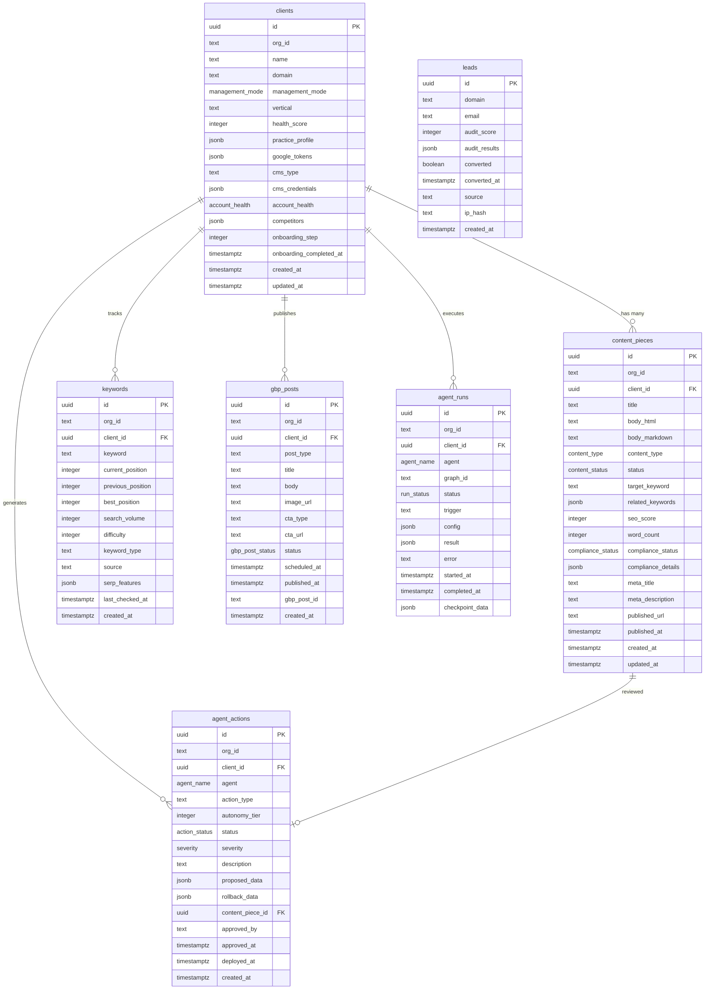

# Zintas AI Database Schema Reference

Complete technical reference for the Zintas AI Pilot Build database architecture.

## 1. Overview

**Database**: PostgreSQL (Supabase-hosted)
**Multi-tenancy**: Organization-scoped via `org_id` column
**Security**: Row-Level Security (RLS) policies on all tables except `leads`
**Client Modes**: Two Supabase client types:
- `supabaseServer()` - RLS-enforced, user session via cookies, JWT claims
- `supabaseAdmin` - RLS bypass, service role key, server-side operations only

All tables use UUID primary keys and timestamptz for dates. Tables with `org_id` enforce tenant isolation via RLS policies matching the JWT `org_id` claim.

---

## 2. Entity-Relationship Diagram



---

## 3. Table Definitions

### clients

Dental practice client accounts. Each client maps to one organization.

| Column | Type | Nullable | Default | Description |
|--------|------|----------|---------|-------------|
| `id` | UUID | NO | `gen_random_uuid()` | Primary key |
| `org_id` | TEXT | NO | - | Clerk organization ID (RLS scope) |
| `name` | TEXT | NO | - | Practice name |
| `domain` | TEXT | NO | - | Practice website domain (unique) |
| `management_mode` | management_mode | NO | `'managed'` | `'managed'` or `'self_service'` |
| `vertical` | TEXT | NO | `'dental'` | Industry vertical |
| `health_score` | INTEGER | NO | `0` | Overall account health 0-100 |
| `practice_profile` | JSONB | NO | `'{}'` | Location, services, hours, etc. |
| `google_tokens` | JSONB | NO | `'{}'` | Encrypted OAuth tokens `{encrypted: "..."}` |
| `cms_type` | TEXT | YES | NULL | CMS platform (e.g., "wordpress") |
| `cms_credentials` | JSONB | NO | `'{}'` | Encrypted CMS API credentials |
| `account_health` | account_health | NO | `'active'` | Google account connection status |
| `competitors` | JSONB | NO | `'[]'` | Array of competitor domains |
| `onboarding_step` | INTEGER | YES | NULL | Current onboarding step (0-based) |
| `onboarding_completed_at` | TIMESTAMPTZ | YES | NULL | Onboarding completion timestamp |
| `created_at` | TIMESTAMPTZ | NO | `NOW()` | Record creation timestamp |
| `updated_at` | TIMESTAMPTZ | NO | `NOW()` | Last update timestamp (auto-updated) |

**Primary Key**: `id`
**Indexes**: None (low volume table)
**RLS**: Enabled - `org_id = JWT claim`
**Triggers**: `update_updated_at()` on UPDATE

**JSONB Structures**:
- `practice_profile`: `{ address: string, phone: string, services: string[], hours: object }`
- `google_tokens`: `{ encrypted: string }` (AES-256-GCM encrypted GoogleTokens)
- `cms_credentials`: `{ encrypted: string }` (encrypted API keys)
- `competitors`: `string[]` (domain list)

---

### content_pieces

AI-generated content for blog posts, service pages, FAQs, and GBP posts.

| Column | Type | Nullable | Default | Description |
|--------|------|----------|---------|-------------|
| `id` | UUID | NO | `gen_random_uuid()` | Primary key |
| `org_id` | TEXT | NO | - | Organization ID (RLS scope) |
| `client_id` | UUID | NO | - | Foreign key to `clients.id` |
| `title` | TEXT | NO | - | Content title/headline |
| `body_html` | TEXT | YES | NULL | HTML content body |
| `body_markdown` | TEXT | YES | NULL | Markdown content body |
| `content_type` | content_type | NO | - | Content type enum |
| `status` | content_status | NO | `'draft'` | Publishing workflow status |
| `target_keyword` | TEXT | YES | NULL | Primary SEO keyword |
| `related_keywords` | JSONB | NO | `'[]'` | Related keywords array |
| `seo_score` | INTEGER | NO | `0` | SEO quality score 0-100 |
| `word_count` | INTEGER | NO | `0` | Content word count |
| `compliance_status` | compliance_status | NO | `'pass'` | HIPAA/legal compliance check |
| `compliance_details` | JSONB | NO | `'[]'` | Compliance issue details |
| `meta_title` | TEXT | YES | NULL | SEO meta title |
| `meta_description` | TEXT | YES | NULL | SEO meta description |
| `published_url` | TEXT | YES | NULL | Live URL after publishing |
| `published_at` | TIMESTAMPTZ | YES | NULL | Publication timestamp |
| `created_at` | TIMESTAMPTZ | NO | `NOW()` | Record creation timestamp |
| `updated_at` | TIMESTAMPTZ | NO | `NOW()` | Last update timestamp (auto-updated) |

**Primary Key**: `id`
**Foreign Keys**: `client_id` REFERENCES `clients(id)` ON DELETE CASCADE
**Indexes**:
- `idx_content_pieces_client` on `(client_id, status)`

**RLS**: Enabled - `org_id = JWT claim`
**Triggers**: `update_updated_at()` on UPDATE

**JSONB Structures**:
- `related_keywords`: `string[]`
- `compliance_details`: `Array<{ rule: string, severity: string, message: string }>`

---

### keywords

Tracked SEO keywords with position monitoring.

| Column | Type | Nullable | Default | Description |
|--------|------|----------|---------|-------------|
| `id` | UUID | NO | `gen_random_uuid()` | Primary key |
| `org_id` | TEXT | NO | - | Organization ID (RLS scope) |
| `client_id` | UUID | NO | - | Foreign key to `clients.id` |
| `keyword` | TEXT | NO | - | Keyword phrase |
| `current_position` | INTEGER | YES | NULL | Current SERP position (1-100) |
| `previous_position` | INTEGER | YES | NULL | Previous SERP position |
| `best_position` | INTEGER | YES | NULL | Best historical position |
| `search_volume` | INTEGER | NO | `0` | Monthly search volume |
| `difficulty` | INTEGER | NO | `0` | SEO difficulty score 0-100 |
| `keyword_type` | TEXT | NO | `'tracked'` | Type: tracked, discovered, target |
| `source` | TEXT | NO | `'manual'` | Source: manual, scholar, serpapi |
| `serp_features` | JSONB | NO | `'[]'` | SERP features array |
| `last_checked_at` | TIMESTAMPTZ | YES | NULL | Last position check timestamp |
| `created_at` | TIMESTAMPTZ | NO | `NOW()` | Record creation timestamp |

**Primary Key**: `id`
**Foreign Keys**: `client_id` REFERENCES `clients(id)` ON DELETE CASCADE
**Unique Constraint**: `(client_id, keyword)` (enforced at application layer via upsert)
**Indexes**:
- `idx_keywords_client` on `(client_id, keyword_type)`
- `idx_keywords_position` on `(client_id, current_position)`

**RLS**: Enabled - `org_id = JWT claim`

**JSONB Structures**:
- `serp_features`: `string[]` (e.g., `["featured_snippet", "local_pack", "knowledge_panel"]`)

---

### agent_actions

Human-in-the-loop approval queue for agent-proposed actions.

| Column | Type | Nullable | Default | Description |
|--------|------|----------|---------|-------------|
| `id` | UUID | NO | `gen_random_uuid()` | Primary key |
| `org_id` | TEXT | NO | - | Organization ID (RLS scope) |
| `client_id` | UUID | NO | - | Foreign key to `clients.id` |
| `agent` | agent_name | NO | - | Agent that created the action |
| `action_type` | TEXT | NO | - | Action type (e.g., "publish_content") |
| `autonomy_tier` | INTEGER | NO | `2` | Autonomy level (1=auto, 2=notify, 3=approve) |
| `status` | action_status | NO | `'pending'` | Approval workflow status |
| `severity` | severity | NO | `'info'` | Impact severity |
| `description` | TEXT | NO | - | Human-readable description |
| `proposed_data` | JSONB | NO | `'{}'` | Action payload data |
| `rollback_data` | JSONB | NO | `'{}'` | Rollback state if needed |
| `content_piece_id` | UUID | YES | NULL | Related content piece (optional) |
| `approved_by` | TEXT | YES | NULL | User ID who approved |
| `approved_at` | TIMESTAMPTZ | YES | NULL | Approval timestamp |
| `deployed_at` | TIMESTAMPTZ | YES | NULL | Deployment timestamp |
| `created_at` | TIMESTAMPTZ | NO | `NOW()` | Record creation timestamp |

**Primary Key**: `id`
**Foreign Keys**:
- `client_id` REFERENCES `clients(id)` ON DELETE CASCADE
- `content_piece_id` REFERENCES `content_pieces(id)` ON DELETE SET NULL

**Indexes**:
- `idx_agent_actions_status` on `(status, org_id)`
- `idx_agent_actions_client` on `(client_id, status)`

**RLS**: Enabled - `org_id = JWT claim`

**JSONB Structures**:
- `proposed_data`: Action-specific (e.g., `{ url: string, metadata: object }`)
- `rollback_data`: Snapshot of state before action

---

### leads

Anonymous lead captures from the free SEO audit tool. No RLS.

| Column | Type | Nullable | Default | Description |
|--------|------|----------|---------|-------------|
| `id` | UUID | NO | `gen_random_uuid()` | Primary key |
| `domain` | TEXT | NO | - | Practice website domain |
| `email` | TEXT | YES | NULL | Contact email (optional) |
| `audit_score` | INTEGER | YES | NULL | SEO audit score 0-100 |
| `audit_results` | JSONB | NO | `'{}'` | Detailed audit findings |
| `converted` | BOOLEAN | NO | `FALSE` | Converted to paid client |
| `converted_at` | TIMESTAMPTZ | YES | NULL | Conversion timestamp |
| `source` | TEXT | YES | NULL | Traffic source (UTM) |
| `ip_hash` | TEXT | YES | NULL | SHA-256 hashed IP (rate limiting) |
| `created_at` | TIMESTAMPTZ | NO | `NOW()` | Record creation timestamp |

**Primary Key**: `id`
**Indexes**:
- `idx_leads_email` on `(email)` WHERE `email IS NOT NULL`
- `idx_leads_domain` on `(domain)`

**RLS**: DISABLED - No authentication required for lead submission

**JSONB Structures**:
- `audit_results`: `{ technical: object, content: object, local: object, overall_score: number }`

---

### gbp_posts

Google Business Profile posts scheduled and published.

| Column | Type | Nullable | Default | Description |
|--------|------|----------|---------|-------------|
| `id` | UUID | NO | `gen_random_uuid()` | Primary key |
| `org_id` | TEXT | NO | - | Organization ID (RLS scope) |
| `client_id` | UUID | NO | - | Foreign key to `clients.id` |
| `post_type` | TEXT | NO | `'update'` | GBP post type (update, offer, event) |
| `title` | TEXT | YES | NULL | Post title (optional) |
| `body` | TEXT | NO | - | Post body content |
| `image_url` | TEXT | YES | NULL | Image URL (optional) |
| `cta_type` | TEXT | YES | NULL | Call-to-action type (book, call, etc.) |
| `cta_url` | TEXT | YES | NULL | CTA link URL |
| `status` | gbp_post_status | NO | `'draft'` | Publishing status |
| `scheduled_at` | TIMESTAMPTZ | YES | NULL | Scheduled publish time |
| `published_at` | TIMESTAMPTZ | YES | NULL | Actual publish timestamp |
| `gbp_post_id` | TEXT | YES | NULL | Google's post ID after publishing |
| `created_at` | TIMESTAMPTZ | NO | `NOW()` | Record creation timestamp |

**Primary Key**: `id`
**Foreign Keys**: `client_id` REFERENCES `clients(id)` ON DELETE CASCADE
**Indexes**:
- `idx_gbp_posts_scheduled` on `(scheduled_at)` WHERE `status = 'scheduled'`

**RLS**: Enabled - `org_id = JWT claim`

---

### agent_runs

LangGraph agent execution tracking.

| Column | Type | Nullable | Default | Description |
|--------|------|----------|---------|-------------|
| `id` | UUID | NO | `gen_random_uuid()` | Primary key |
| `org_id` | TEXT | NO | - | Organization ID (RLS scope) |
| `client_id` | UUID | NO | - | Foreign key to `clients.id` |
| `agent` | agent_name | NO | - | Agent type |
| `graph_id` | TEXT | YES | NULL | LangGraph graph instance ID |
| `status` | run_status | NO | `'running'` | Execution status |
| `trigger` | TEXT | NO | `'manual'` | Trigger type (manual, cron, webhook) |
| `config` | JSONB | NO | `'{}'` | Agent configuration |
| `result` | JSONB | NO | `'{}'` | Execution result data |
| `error` | TEXT | YES | NULL | Error message if failed |
| `started_at` | TIMESTAMPTZ | NO | `NOW()` | Execution start timestamp |
| `completed_at` | TIMESTAMPTZ | YES | NULL | Execution completion timestamp |
| `checkpoint_data` | JSONB | NO | `'{}'` | LangGraph checkpoint state |

**Primary Key**: `id`
**Foreign Keys**: `client_id` REFERENCES `clients(id)` ON DELETE CASCADE
**Indexes**: None (low volume, monitoring queries)
**RLS**: Enabled - `org_id = JWT claim`

**JSONB Structures**:
- `config`: Agent-specific (e.g., `{ content_type: string, keyword: string }`)
- `result`: Output data from graph execution
- `checkpoint_data`: LangGraph state for pause/resume

---

## 4. Enum Types

All enums defined in `001_pilot_schema.sql` and mirrored in TypeScript `types.ts`.

```typescript
// Management mode
type ManagementMode = 'managed' | 'self_service'

// Content statuses
type ContentStatus = 'draft' | 'in_review' | 'approved' | 'published' | 'rejected'

// Content types
type ContentType = 'blog_post' | 'service_page' | 'faq' | 'gbp_post'

// Compliance check results
type ComplianceStatus = 'pass' | 'warn' | 'block'

// Agent action approval statuses
type ActionStatus = 'pending' | 'approved' | 'rejected' | 'deployed' | 'rolled_back'

// Action severity levels
type Severity = 'critical' | 'warning' | 'info'

// Agent names
type AgentName = 'conductor' | 'scholar' | 'ghostwriter' | 'analyst'

// Agent run statuses
type RunStatus = 'running' | 'paused' | 'completed' | 'failed'

// GBP post statuses
type GbpPostStatus = 'draft' | 'scheduled' | 'published'

// Google account health
type AccountHealth = 'active' | 'disconnected' | 'error'
```

---

## 5. Row-Level Security (RLS)

### Enabled Tables
All tables EXCEPT `leads` have RLS enabled:
- `clients`
- `content_pieces`
- `keywords`
- `agent_actions`
- `gbp_posts`
- `agent_runs`

### RLS Policy Pattern
All RLS-enabled tables use the same policy:

```sql
CREATE POLICY "org_isolation" ON [table_name] FOR ALL
  USING (org_id = (current_setting('request.jwt.claims', true)::json->>'org_id'));
```

This policy:
- Applies to ALL operations (SELECT, INSERT, UPDATE, DELETE)
- Extracts `org_id` from the JWT claims set by Supabase auth
- Ensures users can only access rows where `org_id` matches their authenticated organization

### Client Selection

**Use `supabaseServer()` when:**
- User-facing API routes (Next.js Route Handlers)
- Reading/writing data for the authenticated user's org
- Default choice for 95% of operations

**Use `supabaseAdmin` when:**
- Cross-org operations (e.g., analytics, admin dashboard)
- Server-side agent operations (agents run server-side)
- Leads table operations (no RLS)
- Token refresh operations
- Cron jobs (scheduled posts, monitoring)

### Leads Exception
The `leads` table has NO RLS because:
- Anonymous users submit audit requests
- No authentication required
- Rate limiting via IP hash instead

---

## 6. TypeScript Types

Complete type definitions from `packages/db/types.ts`.

```typescript
// ─── Row Interfaces ─────────────────────────────────────────────────

export interface Client {
  id: string
  org_id: string
  name: string
  domain: string
  management_mode: ManagementMode
  vertical: string
  health_score: number
  practice_profile: Record<string, unknown>
  google_tokens: Record<string, unknown>
  cms_type: string | null
  cms_credentials: Record<string, unknown>
  account_health: AccountHealth
  competitors: unknown[]
  onboarding_step: number | null
  onboarding_completed_at: string | null
  created_at: string
  updated_at: string
}

export interface ContentPiece {
  id: string
  org_id: string
  client_id: string
  title: string
  body_html: string | null
  body_markdown: string | null
  content_type: ContentType
  status: ContentStatus
  target_keyword: string | null
  related_keywords: unknown[]
  seo_score: number
  word_count: number
  compliance_status: ComplianceStatus
  compliance_details: unknown[]
  meta_title: string | null
  meta_description: string | null
  published_url: string | null
  published_at: string | null
  created_at: string
  updated_at: string
}

export interface Keyword {
  id: string
  org_id: string
  client_id: string
  keyword: string
  current_position: number | null
  previous_position: number | null
  best_position: number | null
  search_volume: number
  difficulty: number
  keyword_type: string
  source: string
  serp_features: unknown[]
  last_checked_at: string | null
  created_at: string
}

export interface AgentAction {
  id: string
  org_id: string
  client_id: string
  agent: AgentName
  action_type: string
  autonomy_tier: number
  status: ActionStatus
  severity: Severity
  description: string
  proposed_data: Record<string, unknown>
  rollback_data: Record<string, unknown>
  content_piece_id: string | null
  approved_by: string | null
  approved_at: string | null
  deployed_at: string | null
  created_at: string
}

export interface Lead {
  id: string
  domain: string
  email: string | null
  audit_score: number | null
  audit_results: Record<string, unknown>
  converted: boolean
  converted_at: string | null
  source: string | null
  ip_hash: string | null
  created_at: string
}

export interface GbpPost {
  id: string
  org_id: string
  client_id: string
  post_type: string
  title: string | null
  body: string
  image_url: string | null
  cta_type: string | null
  cta_url: string | null
  status: GbpPostStatus
  scheduled_at: string | null
  published_at: string | null
  gbp_post_id: string | null
  created_at: string
}

export interface AgentRun {
  id: string
  org_id: string
  client_id: string
  agent: AgentName
  graph_id: string | null
  status: RunStatus
  trigger: string
  config: Record<string, unknown>
  result: Record<string, unknown>
  error: string | null
  started_at: string
  completed_at: string | null
  checkpoint_data: Record<string, unknown>
}

// ─── Insert Types ───────────────────────────────────────────────────

export type CreateClientInput = Omit<Client, 'id' | 'created_at' | 'updated_at'>
export type CreateContentPieceInput = Omit<ContentPiece, 'id' | 'created_at' | 'updated_at'>
export type CreateKeywordInput = Omit<Keyword, 'id' | 'created_at'>
export type CreateAgentActionInput = Omit<AgentAction, 'id' | 'created_at'>
export type CreateLeadInput = Omit<Lead, 'id' | 'created_at'>
export type CreateGbpPostInput = Omit<GbpPost, 'id' | 'created_at'>
export type CreateAgentRunInput = Omit<AgentRun, 'id' | 'started_at'>

// ─── Update Types ───────────────────────────────────────────────────

export type UpdateClientInput = Partial<Omit<Client, 'id' | 'created_at' | 'updated_at'>>
export type UpdateContentPieceInput = Partial<Omit<ContentPiece, 'id' | 'created_at' | 'updated_at'>>
export type UpdateKeywordInput = Partial<Omit<Keyword, 'id' | 'created_at'>>
export type UpdateAgentActionInput = Partial<Omit<AgentAction, 'id' | 'created_at'>>
export type UpdateLeadInput = Partial<Omit<Lead, 'id' | 'created_at'>>
export type UpdateGbpPostInput = Partial<Omit<GbpPost, 'id' | 'created_at'>>
export type UpdateAgentRunInput = Partial<Omit<AgentRun, 'id' | 'started_at'>>
```

---

## 7. Query Modules

### clients.ts

```typescript
getClientByOrgId(orgId: string): Promise<Client | null>
// Get client by their organization ID. Uses RLS.

getClientById(clientId: string): Promise<Client | null>
// Get client by UUID. Uses RLS.

getClientByDomain(domain: string): Promise<Client | null>
// Get client by domain (cross-org). Uses admin client to check domain uniqueness.

getAllClients(): Promise<Client[]>
// Get all clients (admin operation). Bypasses RLS.

createClient(data: CreateClientInput): Promise<Client>
// Create a new client. Uses RLS (org_id must match JWT claim).

updateClient(clientId: string, data: UpdateClientInput): Promise<Client>
// Update an existing client. Uses RLS.

updateClientHealth(clientId: string, score: number): Promise<void>
// Update client's health score. Uses RLS.
```

### content.ts

```typescript
getContentByClient(clientId: string, filters?: ContentFilters): Promise<ContentPiece[]>
// Get all content pieces for a client, with optional status/type filters. Uses RLS.

getContentById(contentId: string): Promise<ContentPiece | null>
// Get a single content piece by ID. Uses RLS.

createContent(data: CreateContentPieceInput): Promise<ContentPiece>
// Create a new content piece. Uses RLS.

updateContent(contentId: string, data: UpdateContentPieceInput): Promise<ContentPiece>
// Update an existing content piece. Uses RLS.

publishContent(contentId: string, publishedUrl: string): Promise<ContentPiece>
// Publish a content piece by setting status and published URL. Uses RLS.
```

### keywords.ts

```typescript
getKeywordsByClient(clientId: string, type?: string): Promise<Keyword[]>
// Get all keywords for a client, optionally filtered by type. Uses RLS.

upsertKeyword(data: CreateKeywordInput): Promise<Keyword>
// Upsert a single keyword (requires UNIQUE constraint on client_id, keyword). Uses RLS.

bulkUpsertKeywords(clientId: string, keywords: CreateKeywordInput[]): Promise<void>
// Bulk upsert keywords for a client. Uses RLS.

getKeywordTrends(clientId: string): Promise<KeywordTrend[]>
// Get keyword trends (position changes) for a client. Uses RLS.
```

### queue.ts

```typescript
getQueueItems(filters: QueueFilters): Promise<AgentAction[]>
// Get queue items with optional filters (clientId, status, severity, actionType). Uses RLS.

getQueueItemById(actionId: string): Promise<AgentAction | null>
// Get a single queue item by ID. Uses RLS.

approveQueueItem(actionId: string, approvedBy: string): Promise<AgentAction>
// Approve a queue item. Uses RLS.

rejectQueueItem(actionId: string): Promise<AgentAction>
// Reject a queue item. Uses RLS.

bulkApprove(actionIds: string[], approvedBy: string): Promise<AgentAction[]>
// Bulk approve multiple queue items. Uses RLS.

updateQueueItem(actionId: string, data: UpdateAgentActionInput): Promise<AgentAction>
// Update a queue item with arbitrary fields. Uses RLS.

getPendingCount(orgId?: string): Promise<number>
// Get count of pending queue items. Uses admin client for cross-org count.
```

### leads.ts

```typescript
createLead(data: CreateLeadInput): Promise<Lead>
// Create a new lead from the free audit tool. Uses admin client (no RLS).

getLeadById(leadId: string): Promise<Lead | null>
// Get a lead by its ID. Uses admin client (no RLS).

getLeads(filters?: LeadFilters): Promise<Lead[]>
// Get leads with optional filters (converted, minScore). Uses admin client (no RLS).

markLeadConverted(leadId: string): Promise<void>
// Mark a lead as converted. Uses admin client (no RLS).
```

### gbp-posts.ts

```typescript
getGbpPosts(clientId: string): Promise<GbpPost[]>
// Get all GBP posts for a client. Uses RLS.

createGbpPost(data: CreateGbpPostInput): Promise<GbpPost>
// Create a new GBP post. Uses RLS.

updateGbpPost(postId: string, data: UpdateGbpPostInput): Promise<GbpPost>
// Update an existing GBP post. Uses RLS.

getScheduledPosts(): Promise<GbpPost[]>
// Get all scheduled posts due for publishing (cross-org, for cron job). Uses admin client.
```

### agent-runs.ts

```typescript
createRun(data: CreateAgentRunInput): Promise<AgentRun>
// Create a new agent run. Uses admin client (agents run server-side).

updateRun(runId: string, data: UpdateAgentRunInput): Promise<void>
// Update an agent run. Uses admin client.

getRunsByClient(clientId: string): Promise<AgentRun[]>
// Get all runs for a client. Uses RLS.

getActiveRuns(): Promise<AgentRun[]>
// Get all currently running agent runs (cross-org, for monitoring). Uses admin client.
```

---

## 8. Encryption

Google OAuth tokens are encrypted at rest using AES-256-GCM.

### Algorithm Details
- **Algorithm**: `aes-256-gcm` (Galois/Counter Mode)
- **Key**: 256-bit (32 bytes) hex string from `ENCRYPTION_KEY` environment variable
- **IV**: 12 bytes, randomly generated per encryption
- **Auth Tag**: 16 bytes, for authenticated encryption

### Encrypted Format
Encrypted strings are stored as base64-encoded with format:
```
iv:authTag:ciphertext
```

Example:
```
R3x9Kp2mVnQ7Lw==:Hs8vP1YzQcJ4TbWx9Kf3Ag==:Zx7Md2Nq5YtLwRp8Hc3Vj...
```

### Encryption Functions

```typescript
encrypt(data: Record<string, unknown>): string
// Encrypt arbitrary JSON data. Returns base64 iv:authTag:ciphertext string.

decrypt(encrypted: string): Record<string, unknown>
// Decrypt encrypted string. Validates auth tag for integrity. Throws on tamper.

encryptTokens(tokens: GoogleTokens): string
// Type-safe wrapper for encrypting Google OAuth tokens.

decryptTokens(encrypted: string): GoogleTokens
// Type-safe wrapper for decrypting Google OAuth tokens.
```

### GoogleTokens Interface

```typescript
interface GoogleTokens {
  access_token: string
  refresh_token: string
  expiry_date: number      // Unix timestamp in milliseconds
  scope: string
}
```

### Storage Pattern
Encrypted tokens are stored in `clients.google_tokens` JSONB column as:
```json
{ "encrypted": "iv:authTag:ciphertext" }
```

---

## 9. Google Token Management

Automatic Google OAuth token refresh with expiry handling.

### Token Refresh Flow

```typescript
refreshTokenIfNeeded(clientId: string): Promise<GoogleTokens>
```

**Process**:
1. Fetch client record and extract encrypted tokens
2. Decrypt tokens to check `expiry_date`
3. If `expiry_date > now + 5 minutes`, return current tokens
4. If expired or about to expire:
   - POST to Google OAuth token endpoint with `refresh_token`
   - Update `access_token` and `expiry_date`
   - Re-encrypt and save to database
   - Return new tokens
5. On refresh failure:
   - Set `account_health = 'disconnected'`
   - Throw error (triggers user reconnection flow)

### Expiry Buffer
- **Buffer**: 5 minutes (300,000 ms)
- **Reason**: Avoid race conditions where token expires between check and API call

### Auto-Retry Pattern
API calls to Google should:
1. Call `refreshTokenIfNeeded(clientId)` to get valid tokens
2. Make Google API request
3. On 401 response, call `refreshTokenIfNeeded(clientId)` again (forces refresh)
4. Retry API request once
5. On second 401, mark account as disconnected

### Token Revocation

```typescript
revokeTokens(clientId: string): Promise<void>
```

**Process**:
1. Fetch and decrypt current tokens
2. POST to Google revoke endpoint (best-effort, non-fatal on failure)
3. Clear `google_tokens` column (`{}`)
4. Set `account_health = 'disconnected'`

---

## 10. Rate Limiting

Five rate limiters using Upstash Redis with sliding/fixed windows.

| Limiter | Limit | Window | Algorithm | Prefix | Identifier | Usage |
|---------|-------|--------|-----------|--------|------------|-------|
| `auditRateLimiter` | 3 | 1 hour | Sliding | `@zintas/ratelimit/audit` | IP hash | Free audit tool |
| `apiRateLimiter` | 100 | 1 minute | Sliding | `@zintas/ratelimit/api` | `org_id` | General API calls |
| `agentRateLimiter` | 10 | 1 minute | Sliding | `@zintas/ratelimit/agent` | `client_id` | Agent runs |
| `emailRateLimiter` | 10 | 1 hour | Sliding | `@zintas/ratelimit/email` | `org_id` | Email sends |
| `emailPerLeadLimiter` | 1 | 24 hours | Fixed | `@zintas/ratelimit/email-lead` | `lead_id` | Lead notifications |

### Sliding vs Fixed Window
- **Sliding**: More accurate, smooths traffic bursts (e.g., API calls)
- **Fixed**: Simpler, prevents exact duplicate actions (e.g., one email per lead)

### Middleware Integration

```typescript
import { withRateLimit } from '@/lib/rate-limit-middleware'
import { apiRateLimiter } from '@packages/db/rate-limit'

export const GET = withRateLimit(
  apiRateLimiter,
  (req) => req.headers.get('x-org-id') || 'anonymous'
)(async (req) => {
  // Handler code
})
```

### Response Headers
All rate-limited responses include:
- `X-RateLimit-Remaining`: Requests remaining in window
- `X-RateLimit-Reset`: Unix timestamp when limit resets
- `Retry-After`: Seconds to wait (on 429 only)

### Rate Limit Result

```typescript
interface RateLimitResult {
  success: boolean      // true if request allowed
  remaining: number     // requests remaining
  reset: number         // timestamp when limit resets
}
```

---

## 11. Migration Guide

### Adding a New Table

1. **Create migration SQL** (`supabase/migrations/00X_name.sql`):
```sql
CREATE TABLE new_table (
  id UUID PRIMARY KEY DEFAULT gen_random_uuid(),
  org_id TEXT NOT NULL,
  -- other columns
  created_at TIMESTAMPTZ DEFAULT NOW()
);

ALTER TABLE new_table ENABLE ROW LEVEL SECURITY;

CREATE POLICY "org_isolation" ON new_table FOR ALL
  USING (org_id = (current_setting('request.jwt.claims', true)::json->>'org_id'));

CREATE INDEX idx_new_table_org ON new_table(org_id);
```

2. **Add TypeScript interface** (`packages/db/types.ts`):
```typescript
export interface NewTable {
  id: string
  org_id: string
  // other fields
  created_at: string
}

export type CreateNewTableInput = Omit<NewTable, 'id' | 'created_at'>
export type UpdateNewTableInput = Partial<Omit<NewTable, 'id' | 'created_at'>>
```

3. **Create query module** (`packages/db/queries/new-table.ts`):
```typescript
import { supabaseServer } from '@packages/db/client'
import type { NewTable, CreateNewTableInput } from '@packages/db/types'

export async function getNewTableItems(orgId: string): Promise<NewTable[]> {
  const supabase = supabaseServer()
  const { data, error } = await supabase
    .from('new_table')
    .select('*')
    .eq('org_id', orgId)

  if (error) throw new Error(`Failed to get items: ${error.message}`)
  return (data as NewTable[]) || []
}
```

4. **Run migration**:
```bash
supabase db push
```

### Adding Columns to Existing Table

1. **Create migration**:
```sql
ALTER TABLE clients ADD COLUMN new_field TEXT;
```

2. **Update TypeScript interface**:
```typescript
export interface Client {
  // existing fields...
  new_field: string | null
}
```

3. **Update query functions** if needed (e.g., add to SELECT list, filters)

### Adding a New Enum

1. **Create enum in migration**:
```sql
CREATE TYPE new_enum AS ENUM ('value1', 'value2', 'value3');
```

2. **Add to types.ts**:
```typescript
export type NewEnum = 'value1' | 'value2' | 'value3'
```

3. **Use in table column**:
```sql
ALTER TABLE table_name ADD COLUMN status new_enum DEFAULT 'value1';
```

### Adding RLS Policy Variations

For more complex policies (e.g., read-only for certain roles):

```sql
-- Separate policies for different operations
CREATE POLICY "read_access" ON table_name FOR SELECT
  USING (org_id = (current_setting('request.jwt.claims', true)::json->>'org_id'));

CREATE POLICY "write_access" ON table_name FOR INSERT
  USING (
    org_id = (current_setting('request.jwt.claims', true)::json->>'org_id')
    AND (current_setting('request.jwt.claims', true)::json->>'role') = 'admin'
  );
```

### Adding Indexes

For performance optimization:

```sql
-- Single column index
CREATE INDEX idx_table_column ON table_name(column_name);

-- Composite index
CREATE INDEX idx_table_multi ON table_name(col1, col2);

-- Partial index (filtered)
CREATE INDEX idx_table_active ON table_name(status) WHERE status = 'active';

-- JSON path index
CREATE INDEX idx_table_json ON table_name USING GIN ((data->'field'));
```

---

## Best Practices

1. **Always filter by org_id** - Even though RLS enforces it, explicit filtering improves query performance
2. **Use supabaseServer() by default** - Only use supabaseAdmin when absolutely necessary
3. **Encrypt sensitive data** - Use encryption module for OAuth tokens, API keys, credentials
4. **Validate inputs with Zod** - Never trust client input, validate before database operations
5. **Use transactions for multi-step operations** - Ensure data consistency with `.transaction()` or RPC functions
6. **Index foreign keys** - Already done for high-traffic tables, add for new relationships
7. **Test RLS policies** - Verify tenant isolation with different org_id JWT claims
8. **Monitor rate limits** - Check `X-RateLimit-Remaining` headers in responses
9. **Handle token refresh errors** - Set account to disconnected state, prompt user reconnection
10. **Use JSONB wisely** - Great for flexible schemas, but avoid deep nesting (poor performance)

---

**Last Updated**: 2026-02-12
**Schema Version**: Pilot v1.0 (Migration 001)
