# Local SEO and External Integrations

> **Comprehensive documentation for all external API integrations in Zintas AI V2**
>
> Last updated: 2026-02-12

---

## Table of Contents

1. [Integration Map](#integration-map)
2. [Google Business Profile](#google-business-profile)
3. [Free SEO Audit Engine](#free-seo-audit-engine)
4. [SE Ranking](#se-ranking)
5. [Google Search Console](#google-search-console)
6. [WordPress Publishing](#wordpress-publishing)
7. [Email System (Resend)](#email-system-resend)
8. [Anthropic Claude](#anthropic-claude)
9. [NPI Registry](#npi-registry)
10. [Google Places API](#google-places-api)

---

## Integration Map

The following diagram shows Zintas AI's integration with 10 external services:

```mermaid
graph TB
    ZintasAI[Zintas AI Platform]

    %% Authentication & Database
    Clerk[Clerk Auth]
    Supabase[Supabase PostgreSQL]
    Redis[Upstash Redis]

    %% AI & Content
    Claude[Anthropic Claude]

    %% SEO & Analytics
    SERanking[SE Ranking API]
    GSC[Google Search Console]
    GBP[Google Business Profile]
    Places[Google Places API]

    %% Publishing
    WordPress[WordPress REST API]

    %% Email & Data
    Resend[Resend Email]
    NPI[NPI Registry]

    %% Data flow connections
    ZintasAI -->|User auth & roles| Clerk
    ZintasAI -->|Store/query data| Supabase
    ZintasAI -->|Rate limiting & caching| Redis
    ZintasAI -->|Content generation| Claude
    ZintasAI -->|Keyword research| SERanking
    ZintasAI -->|Search analytics| GSC
    ZintasAI -->|Local posts & reviews| GBP
    ZintasAI -->|Competitor discovery| Places
    ZintasAI -->|Publish content| WordPress
    ZintasAI -->|Transactional emails| Resend
    ZintasAI -->|Doctor verification| NPI

    Clerk -.->|OAuth tokens| ZintasAI
    Supabase -.->|Query results| ZintasAI
    Redis -.->|Cached data| ZintasAI
    Claude -.->|Generated text| ZintasAI
    SERanking -.->|Keyword metrics| ZintasAI
    GSC -.->|Query/page stats| ZintasAI
    GBP -.->|Post/review data| ZintasAI
    Places -.->|Competitor list| ZintasAI
    WordPress -.->|Published post URL| ZintasAI
    Resend -.->|Delivery status| ZintasAI
    NPI -.->|NPI numbers| ZintasAI
```



**Data Flow Summary:**

| Service | Direction | Purpose |
|---------|-----------|---------|
| Clerk | Bidirectional | User authentication, organization roles |
| Supabase | Bidirectional | Primary database (clients, content, agents) |
| Upstash Redis | Bidirectional | Rate limiting, session caching |
| Anthropic Claude | Request → Response | AI content generation |
| SE Ranking | Request → Response | Keyword research, rank tracking |
| Google Search Console | Request → Response | Search performance analytics |
| Google Business Profile | Bidirectional | Publish posts, fetch reviews/insights |
| Google Places API | Request → Response | Competitor discovery |
| WordPress | Request → Response | Content publishing |
| Resend | Request → Response | Transactional emails |
| NPI Registry | Request → Response | Doctor credential verification |

---

## Google Business Profile

**Location:** `packages/local-seo/gbp-service.ts`, `packages/local-seo/scheduler.ts`

### Overview

The GBP integration allows Zintas AI to manage Google Business Profile listings for dental practices, including creating posts, fetching reviews, generating AI-powered review responses, and retrieving performance insights.

### API Configuration

| Parameter | Value |
|-----------|-------|
| Base URL (Business Info) | `https://mybusinessbusinessinformation.googleapis.com/v1` |
| Base URL (Account Management) | `https://mybusinessaccountmanagement.googleapis.com/v1/accounts` |
| Authentication | OAuth 2.0 (Bearer token) |
| Token Refresh | Automatic via `refreshTokenIfNeeded(clientId)` |
| Scopes Required | `business.manage`, `business.readonly` |

### OAuth Token Flow

1. User initiates Google OAuth connection during onboarding
2. Access token and refresh token stored encrypted in `google_tokens` column
3. Before each API call, `refreshTokenIfNeeded(clientId)` checks token expiration
4. If 401 response received, retry once with fresh token
5. 403 errors indicate missing permissions

### GBP Service Methods

#### `getLocations(): Promise<GBPLocation[]>`

Fetches all GBP locations for a practice.

**Request Flow:**
1. Get accounts: `GET /v1/accounts`
2. Get locations: `GET /v1/{accountName}/locations`

**Returns:**
```typescript
interface GBPLocation {
  locationId: string     // GBP location resource name
  name: string           // Business name
  address: string        // Full formatted address
  phone: string          // Primary phone number
  categories: string[]   // Primary + additional categories
  websiteUrl: string     // Website URL
}
```

---

#### `createPost(locationId, post): Promise<GBPPostResult>`

Creates a local post on a GBP listing.

**Parameters:**
```typescript
interface GBPPostInput {
  body: string                              // Post text (150-300 words recommended)
  topicType: 'STANDARD' | 'OFFER' | 'EVENT' // Post type
  callToAction?: {
    actionType: string                      // 'BOOK', 'CALL', 'LEARN_MORE', etc.
    url: string                             // CTA destination URL
  }
  mediaUrl?: string                         // Optional image URL
}
```

**Request:**
```http
POST /v1/{locationId}/localPosts
Content-Type: application/json

{
  "languageCode": "en",
  "summary": "Post body text...",
  "topicType": "STANDARD",
  "callToAction": {
    "actionType": "BOOK",
    "url": "https://example.com/book"
  },
  "media": [{
    "mediaFormat": "PHOTO",
    "sourceUrl": "https://example.com/image.jpg"
  }]
}
```

**Returns:**
```typescript
interface GBPPostResult {
  name: string         // GBP post resource name
  state: string        // 'LIVE' or 'PROCESSING'
  topicType: string    // Confirmed post type
  createTime: string   // ISO 8601 timestamp
}
```

---

#### `getReviews(locationId): Promise<GBPReview[]>`

Fetches reviews for a location.

**Request:**
```http
GET /v1/{locationId}/reviews
```

**Returns:**
```typescript
interface GBPReview {
  reviewId: string         // Review resource name
  reviewer: string         // Display name (or 'Anonymous')
  rating: number           // 1-5
  comment: string          // Review text
  createTime: string       // ISO 8601 timestamp
  reviewReply: string | null  // Existing reply (if any)
}
```

**Star Rating Mapping:**
- API returns: `ONE`, `TWO`, `THREE`, `FOUR`, `FIVE`
- Mapped to: `1`, `2`, `3`, `4`, `5`

---

#### `generateReviewResponse(review, practiceProfile): Promise<string>`

Generates AI-powered review responses using Claude.

**Model:** `claude-sonnet-4-5-20250929`
**Max Tokens:** 256

**Prompt Pattern:**
```
You are responding to a Google review for a dental practice.
Practice: {practice.name}
Reviewer: {reviewer}
Rating: {rating}/5
Review: "{comment}"

Guidelines:
- Keep under 150 words
- Tone: {warm and grateful | empathetic and professional}
- [For positive (4-5 stars)]: Thank by name, mention the team, warm closing
- [For negative (1-3 stars)]: Show empathy, invite to contact the office directly, never argue, never disclose health information
- Do NOT use clinical terms or make health claims
- Sign off with the practice name

Write ONLY the response text, no quotes or metadata.
```

**Tone Rules:**
- Rating ≥ 4: "warm and grateful"
- Rating < 4: "empathetic and professional"

**Compliance:**
- No clinical terms
- No health claims
- No patient health information disclosure
- Always under 150 words

---

#### `getInsights(locationId, period): Promise<GBPInsights>`

Retrieves performance metrics for a location.

**Parameters:**
- `period`: `DAILY`, `WEEKLY`, `MONTHLY`

**Request:**
```http
GET /v1/{locationId}/insights?period={period}
```

**Returns:**
```typescript
interface GBPInsights {
  views: number              // VIEWS_MAPS + VIEWS_SEARCH
  searches: number           // QUERIES_DIRECT + QUERIES_INDIRECT
  actions: number            // Total actions (website + phone + directions)
  calls: number              // ACTIONS_PHONE
  websiteClicks: number      // ACTIONS_WEBSITE
  directionRequests: number  // ACTIONS_DRIVING_DIRECTIONS
}
```

**Error Handling:** Returns zeros if insights unavailable.

---

#### `suggestCategoryOptimizations(locationId): Promise<CategorySuggestion[]>`

Suggests dental categories to add for better visibility.

**Dental Categories List:**
- Dentist
- Cosmetic Dentist
- Pediatric Dentist
- Orthodontist
- Oral Surgeon
- Endodontist
- Periodontist
- Emergency Dental Service
- Dental Implants Provider
- Teeth Whitening Service

**Returns:**
```typescript
interface CategorySuggestion {
  category: string  // Recommended category name
  reason: string    // Why this helps visibility
}
```

---

### GBP Scheduler

**Location:** `packages/local-seo/scheduler.ts`

#### `schedulePost(input): Promise<GbpPost>`

Schedules a GBP post for future publishing.

**Parameters:**
```typescript
interface SchedulePostInput {
  clientId: string
  orgId: string
  title?: string
  body: string
  postType?: string        // default: 'update'
  imageUrl?: string
  ctaType?: string
  ctaUrl?: string
  scheduledAt: Date        // When to publish
}
```

**Database:** Creates record in `gbp_posts` table with `status: 'scheduled'`.

---

#### `publishScheduledPosts(): Promise<PublishResult>`

Publishes all posts whose `scheduled_at` has passed. Called by cron job.

**Cron Job:** `/api/cron/publish-gbp` every 30 minutes

**Process:**
1. Query all posts where `scheduled_at <= NOW()` and `status = 'scheduled'`
2. For each post:
   - Get client's GBP locations
   - Create post via `GBPService.createPost()`
   - Update database: `status = 'published'`, `published_at = NOW()`, `gbp_post_id = result.name`
3. On failure: Leave as `scheduled` for retry on next run

**Returns:**
```typescript
interface PublishResult {
  published: number  // Successfully published count
  failed: number     // Failed count
}
```

**Error Resilience:** Each post is isolated in try-catch block.

---

#### `generateWeeklyGBPPosts(clientId): Promise<GBPPostDraft[]>`

Generates 2 weekly GBP post drafts using AI.

**Model:** `claude-sonnet-4-5-20250929`
**Max Tokens:** 1024

**Prompt Pattern:**
```
You are a dental marketing assistant creating Google Business Profile posts.

Practice: {practiceName}
Domain: {domain}
Month: {current month}

Generate exactly 2 GBP post drafts in JSON format. Each post should be:
- 150-300 words
- Engaging, professional dental practice tone
- Include a seasonal or educational angle relevant to {month}
- Avoid medical claims or guarantees
- Include a call-to-action

Return ONLY a JSON array with this structure:
[
  {
    "title": "Post title",
    "body": "Post body text...",
    "ctaType": "BOOK" or "CALL" or "LEARN_MORE"
  }
]
```

**Returns:** Array of 2 post drafts (or empty array on parse failure).

---

## Free SEO Audit Engine

**Location:** `packages/audit-engine/index.ts`

### Overview

The audit engine provides a free SEO audit tool that generates qualified leads. It checks 7 categories and produces a graded score (A-F) with actionable recommendations.

### Audit Categories

| Category | Max Points | Checks | API/Tool Used |
|----------|-----------|--------|---------------|
| Page Speed | 20 | Mobile performance score via Lighthouse | Google PageSpeed Insights API |
| Mobile Friendly | 15 | Mobile accessibility score | Google PageSpeed Insights API |
| Meta Tags | 15 | Title tag, meta description, Open Graph tags | Direct HTML parsing |
| Schema Markup | 15 | JSON-LD presence, dental-specific schema | Direct HTML parsing |
| Google Business Profile | 15 | GBP listing exists for domain | Google Places API |
| Security (SSL) | 10 | HTTPS enabled | Direct HTTPS check |
| Heading Structure | 10 | Proper H1/H2 hierarchy | Direct HTML parsing |
| **Total** | **100** | | |

### Grading System

| Grade | Score Range | Description |
|-------|-------------|-------------|
| A | 90-100 | Excellent SEO health |
| B | 75-89 | Good, minor improvements needed |
| C | 60-74 | Fair, several issues to address |
| D | 40-59 | Poor, significant work required |
| F | 0-39 | Critical issues, immediate action needed |

### Finding Status Levels

```typescript
function getStatus(score: number, maxScore: number): FindingStatus {
  const pct = score / maxScore
  if (pct >= 0.7) return 'pass'    // 70%+ of category max
  if (pct >= 0.4) return 'warning' // 40-69% of category max
  return 'fail'                    // <40% of category max
}
```

### Error Resilience

**Pattern:** `Promise.allSettled()` ensures one check failure doesn't block others.

```typescript
const results = await Promise.allSettled([
  checkPageSpeed(url),
  checkMobileFriendly(url),
  checkMetaTags(url),
  // ... etc
])

// Map failures to error findings
const findings = results.map((result, index) => {
  if (result.status === 'fulfilled') return result.value
  return makeErrorFinding(index, result.reason)
})
```

**Error Findings:**
```typescript
interface Finding {
  category: string
  icon: string
  score: 0           // Always 0 for errors
  maxScore: number
  status: 'error'
  finding: 'Unable to complete check: {reason}'
  recommendation: 'This check could not be completed. Try again later.'
}
```

### Lead Creation

Audits automatically create leads in the database:

```typescript
const lead = await createLead({
  domain: extractedDomain,
  email: providedEmail ?? null,
  audit_score: auditResult.score,
  audit_results: auditResult,  // Full findings JSON
  converted: false,
  source: refererHeader ?? 'direct',
  ip_hash: sha256(ip),          // Hashed for privacy
})
```

**Privacy:** IP addresses are SHA-256 hashed before storage.

### Rate Limiting

**Limiter:** `auditRateLimiter` from `@packages/db/rate-limit`

**Limit:** 3 audits per hour per IP address

**Implementation:**
```typescript
const rateLimitResult = await checkRateLimit(auditRateLimiter, ip)
if (!rateLimitResult.success) {
  return 429 response with headers:
    X-RateLimit-Remaining: {remaining}
    X-RateLimit-Reset: {reset timestamp}
}
```

### API Endpoint

**Route:** `POST /api/audit/free`

**Request:**
```json
{
  "url": "https://example.com",
  "email": "optional@email.com",
  "recaptchaToken": "g-recaptcha-response"
}
```

**Response (with email):**
```json
{
  "id": "uuid",
  "score": 67,
  "grade": "C",
  "findings": [
    {
      "category": "Page Speed",
      "icon": "zap",
      "score": 14,
      "maxScore": 20,
      "status": "warning",
      "finding": "Mobile performance score: 70/100",
      "recommendation": "Improve page speed by optimizing images..."
    }
  ]
}
```

**Response (without email):**
Recommendations are redacted to encourage email signup:
```typescript
function redactFindings(findings: Finding[]): Array<Omit<Finding, 'recommendation'>> {
  return findings.map(({ recommendation: _, ...rest }) => rest)
}
```

---

## SE Ranking

**Location:** `packages/agents/integrations/se-ranking.ts`

### Overview

SE Ranking provides keyword research, competitor analysis, and rank tracking. Used primarily by the Scholar agent for SEO intelligence.

### Authentication

**Method:** API Key in header

```http
X-Api-Key: {apiKey}
Content-Type: application/json
```

**Configuration:** `process.env.SE_RANKING_API_KEY`

### Client Methods

| Method | Endpoint | Purpose |
|--------|----------|---------|
| `keywordResearch(keywords)` | `POST /research/keywords` | Get volume, difficulty, CPC, competition |
| `getCompetitorKeywords(domain)` | `GET /research/competitors?domain={domain}` | Find keywords competitor ranks for |
| `createProject(name, domain)` | `POST /projects` | Create rank tracking project |
| `addKeywordsToProject(projectId, keywords)` | `POST /projects/{id}/keywords` | Add keywords to track |
| `getPositions(projectId)` | `GET /projects/{id}/positions` | Get current rankings |
| `bulkKeywordResearch(seeds)` | Multiple batches | Research up to 100 keywords |

### Batching Strategy

**Keyword Research Batches:**
- Size: 10 keywords per batch
- Delay: 500ms between batches
- Use case: `bulkKeywordResearch()`

**Project Keyword Batches:**
- Size: 50 keywords per batch
- Delay: 500ms between batches
- Use case: `addKeywordsToProject()`

**Example:**
```typescript
async bulkKeywordResearch(seeds: string[]): Promise<KeywordData[]> {
  const allResults: KeywordData[] = []

  for (let i = 0; i < seeds.length; i += 10) {
    const batch = seeds.slice(i, i + 10)
    const results = await this.keywordResearch(batch)
    allResults.push(...results)

    if (i + 10 < seeds.length) {
      await sleep(500)  // Inter-batch delay
    }
  }

  return deduplicateByKeyword(allResults)
}
```

### Rate Limit Handling

**429 (Too Many Requests):**
```typescript
if (response.status === 429) {
  const retryAfter = parseInt(response.headers.get('Retry-After') ?? '1', 10)
  await sleep(retryAfter * 1000)
  return this.request(path, options, retryCount + 1)  // Retry
}
```

**500 (Server Error):**
```typescript
if (response.status === 500 && retryCount < 1) {
  await sleep(2000)
  return this.request(path, options, retryCount + 1)  // Retry once
}
```

**401 (Invalid API Key):**
```typescript
if (response.status === 401) {
  throw new Error('Invalid SE Ranking API key. Check SE_RANKING_API_KEY.')
}
```

### Data Structures

**KeywordData:**
```typescript
interface KeywordData {
  keyword: string
  searchVolume: number      // Monthly searches
  difficulty: number        // 0-100 (higher = harder)
  cpc: number               // Cost-per-click in USD
  competition: number       // 0-1 (PPC competition)
}
```

**PositionData:**
```typescript
interface PositionData {
  keyword: string
  position: number          // Current SERP position
  previousPosition: number | null
  url: string               // Ranking URL
  searchVolume: number
}
```

### Usage by Scholar Agent

1. **Initial Keyword Research:** `bulkKeywordResearch(seedKeywords)`
2. **Competitor Analysis:** `getCompetitorKeywords(competitorDomain)`
3. **Project Setup:** `createProject(clientName, clientDomain)`
4. **Keyword Tracking:** `addKeywordsToProject(projectId, selectedKeywords)`
5. **Monitoring:** `getPositions(projectId)` (weekly)

---

## Google Search Console

**Location:** `packages/agents/integrations/google-search-console.ts`

### Overview

GSC integration fetches search performance data (queries, pages, trends) for a client's verified website.

### Authentication

**Method:** OAuth 2.0 (same token pool as GBP)

```typescript
private async getTokens(): Promise<GoogleTokens> {
  return refreshTokenIfNeeded(this.clientId)  // Auto-refresh on 401
}
```

### API Configuration

| Parameter | Value |
|-----------|-------|
| Base URL | `https://www.googleapis.com/webmasters/v3/sites` |
| Authentication | OAuth Bearer token |
| Auto-refresh | 401 triggers token refresh + retry |

### Client Methods

#### `getTopQueries(params): Promise<GSCQuery[]>`

Fetches top search queries for a site.

**Parameters:**
```typescript
{
  siteUrl: string      // 'sc-domain:example.com' or 'https://example.com/'
  startDate: string    // 'YYYY-MM-DD'
  endDate: string      // 'YYYY-MM-DD'
  rowLimit?: number    // default: 100
}
```

**Request Body:**
```json
{
  "startDate": "2026-01-01",
  "endDate": "2026-01-31",
  "rowLimit": 100,
  "dimensions": ["query"]
}
```

**Returns:**
```typescript
interface GSCQuery {
  query: string       // Search query text
  clicks: number
  impressions: number
  ctr: number         // Click-through rate (0-1)
  position: number    // Average SERP position
}
```

---

#### `getTopPages(params): Promise<GSCPage[]>`

Fetches top landing pages.

**Request Body:**
```json
{
  "startDate": "2026-01-01",
  "endDate": "2026-01-31",
  "rowLimit": 100,
  "dimensions": ["page"]
}
```

**Returns:**
```typescript
interface GSCPage {
  page: string        // Full URL
  clicks: number
  impressions: number
  ctr: number
  position: number
}
```

---

#### `getQueryTrends(params): Promise<TrendData[]>`

Fetches historical trend data for a specific query.

**Parameters:**
```typescript
{
  siteUrl: string
  query: string       // Specific query to track
  months: number      // Look back N months
}
```

**Request Body:**
```json
{
  "startDate": "2025-11-12",
  "endDate": "2026-02-12",
  "dimensions": ["date"],
  "dimensionFilterGroups": [{
    "filters": [{
      "dimension": "query",
      "expression": "dental implants near me"
    }]
  }]
}
```

**Returns:**
```typescript
interface TrendData {
  date: string        // 'YYYY-MM-DD'
  clicks: number
  impressions: number
  position: number
}
```

---

#### `getSiteList(): Promise<string[]>`

Gets all verified sites for the authenticated user.

**Request:**
```http
GET https://www.googleapis.com/webmasters/v3/sites
```

**Returns:** Array of site URLs (e.g., `['sc-domain:example.com', 'https://blog.example.com/']`)

---

### Error Handling

**403 Forbidden:**
```typescript
if (response.status === 403) {
  throw new Error('Access denied to Google Search Console. Verify the site is added and permissions are granted.')
}
```

**401 Unauthorized:**
Automatically refreshes token and retries once:
```typescript
if (response.status === 401 && !isRetry) {
  const freshTokens = await this.getTokens()
  return this.request(url, freshTokens, options, true)
}
```

---

## WordPress Publishing

**Location:** `packages/agents/integrations/wordpress.ts`

### Overview

WordPress REST API client for publishing blog posts with SEO meta support (Yoast, Rank Math).

### Authentication

**Method:** Basic Auth with Application Passwords

```typescript
const token = Buffer.from(
  `${username}:${applicationPassword}`
).toString('base64')

Authorization: Basic {token}
```

**Application Password Setup:**
1. WordPress Admin → Users → Profile
2. Scroll to "Application Passwords"
3. Enter name (e.g., "Zintas AI"), click "Add New Application Password"
4. Copy generated password (format: `xxxx xxxx xxxx xxxx xxxx xxxx`)

### Client Methods

#### `publishPost(post): Promise<WPPost>`

Publishes a new blog post.

**Parameters:**
```typescript
interface WPPostInput {
  title: string
  content: string               // HTML content
  status: 'publish' | 'draft' | 'pending'
  slug?: string                 // URL slug
  excerpt?: string              // Post excerpt
  meta?: {
    yoast_wpseo_title?: string         // Yoast SEO title
    yoast_wpseo_metadesc?: string      // Yoast meta description
    rank_math_title?: string           // Rank Math title
    rank_math_description?: string     // Rank Math description
  }
}
```

**Request:**
```http
POST /wp-json/wp/v2/posts
Content-Type: application/json
Authorization: Basic {token}

{
  "title": "5 Signs You Need a Dental Checkup",
  "content": "<p>HTML content here...</p>",
  "status": "publish",
  "slug": "5-signs-dental-checkup",
  "excerpt": "Don't ignore these warning signs...",
  "meta": {
    "yoast_wpseo_title": "5 Signs You Need a Dental Checkup | Practice Name",
    "yoast_wpseo_metadesc": "Learn the 5 warning signs..."
  }
}
```

**Returns:**
```typescript
interface WPPost {
  id: number          // WordPress post ID
  link: string        // Published URL
  status: string      // 'publish', 'draft', etc.
  title: { rendered: string }
  content: { rendered: string }
}
```

---

#### `updatePost(postId, data): Promise<WPPost>`

Updates an existing post.

**Request:**
```http
PUT /wp-json/wp/v2/posts/{postId}
```

**Use case:** Fix typos, update content, change meta tags.

---

#### `unpublishPost(postId): Promise<void>`

**Rollback mechanism:** Sets post status to `draft`.

**Request:**
```http
PUT /wp-json/wp/v2/posts/{postId}

{
  "status": "draft"
}
```

**Use case:** Revert agent-published content if manager disapproves.

---

#### `testConnection(): Promise<boolean>`

Tests credentials by fetching current user.

**Request:**
```http
GET /wp-json/wp/v2/users/me
Authorization: Basic {token}
```

**Returns:** `true` if 200 OK, `false` otherwise.

---

#### `checkPlugins(): Promise<WPPluginCheck>`

Detects installed SEO plugins.

**Request:**
```http
GET /wp-json/
Authorization: Basic {token}
```

**Returns:**
```typescript
interface WPPluginCheck {
  yoast: boolean      // Yoast SEO installed
  rankMath: boolean   // Rank Math installed
}
```

**Detection:** Checks `namespaces` array for `yoast` or `rankmath` prefix.

---

### SEO Meta Support

**Field Mapping:**

| Plugin | Title Field | Description Field |
|--------|-------------|-------------------|
| Yoast SEO | `yoast_wpseo_title` | `yoast_wpseo_metadesc` |
| Rank Math | `rank_math_title` | `rank_math_description` |

**Strategy:** Zintas AI sets both Yoast and Rank Math meta fields to ensure compatibility regardless of which plugin is active.

---

### Error Handling

| Status | Error Message | Cause |
|--------|---------------|-------|
| 401 | `WordPress credentials invalid. Check application password.` | Wrong username/password |
| 403 | `WordPress user doesn't have permission to publish.` | Insufficient user role |
| 404 | `WordPress REST API not found. Is it enabled?` | REST API disabled |
| Network error | `Cannot reach WordPress site.` | Site unreachable |

---

## Email System (Resend)

**Location:** Email sending logic in API routes (`/api/audit/free`, `/api/leads/[id]/email`, `/api/onboarding/complete`)

### Overview

Resend provides transactional email delivery for audit results, lead nurture, and onboarding welcome emails.

### Configuration

| Parameter | Value |
|-----------|-------|
| API Key | `process.env.RESEND_API_KEY` |
| From Address (Audit) | `Zintas AI <audit@zintas.ai>` |
| From Address (General) | `Zintas AI <hello@zintas.ai>` |
| Template Engine | React Email (TSX components) |

### Email Types

#### 1. Audit Results Email

**Trigger:** Free audit submission with email provided

**Route:** `POST /api/audit/free`

**Code:**
```typescript
await resend.emails.send({
  from: 'Zintas AI <audit@zintas.ai>',
  to: userEmail,
  subject: `Your SEO Audit: Score ${score}/100 (Grade ${grade})`,
  react: AuditResultsEmail({
    score,
    grade,
    findings,
    auditId,
  }),
})
```

**Template:** `packages/audit-engine/emails/audit-results.tsx`

**Fire-and-forget:** Email failure does not block audit response.

---

#### 2. Lead Nurture Email

**Trigger:** Manual send from manager dashboard

**Route:** `POST /api/leads/[id]/email`

**Code:**
```typescript
await resend.emails.send({
  from: 'Zintas AI <hello@zintas.ai>',
  to: lead.email,
  subject: `Your SEO audit for ${domain}: ${score}/100`,
  html: `
    <p>Hi,</p>
    <p>You recently audited <strong>${domain}</strong> and scored <strong>${score}/100</strong>.</p>
    <p>We can fix these issues automatically. Start your free trial at
    <a href="https://zintas.ai/sign-up">zintas.ai/sign-up</a>.</p>
    <p>&mdash; The Zintas AI Team</p>
  `,
})
```

**Rate Limits:**
- 10 emails/hour per user (`emailRateLimiter`)
- 1 email/24h per lead (`emailPerLeadLimiter`)

---

#### 3. Welcome Email

**Trigger:** Onboarding completion

**Route:** `POST /api/onboarding/complete`

**Code:**
```typescript
await resend.emails.send({
  from: 'Zintas AI <hello@zintas.ai>',
  to: userEmail,
  subject: 'Welcome to Zintas AI! Your marketing team is getting to work.',
  react: WelcomeEmail({
    practiceName,
    dashboardUrl,
  }),
})
```

**Template:** `packages/audit-engine/emails/welcome.tsx`

---

### Rate Limiters

**emailRateLimiter:**
```typescript
new Ratelimit({
  redis,
  limiter: Ratelimit.slidingWindow(10, '1 h'),
  prefix: '@zintas/ratelimit/email',
})
```
**Purpose:** Prevent user email spam (10/hour).

**emailPerLeadLimiter:**
```typescript
new Ratelimit({
  redis,
  limiter: Ratelimit.fixedWindow(1, '24 h'),
  prefix: '@zintas/ratelimit/email-lead',
})
```
**Purpose:** Prevent duplicate lead emails (1 per 24 hours).

---

### Error Handling

**Pattern:** All email sends are wrapped in try-catch and fail silently.

```typescript
try {
  await resend.emails.send({ /* ... */ })
} catch {
  // Email failure should not block the response
}
```

**Rationale:** Email is a secondary concern; core functionality (audit, onboarding) must succeed even if email fails.

---

## Anthropic Claude

**Location:** Used throughout agents and services via `@langchain/anthropic`

### Overview

Anthropic Claude powers all AI content generation, SEO analysis, and practice intelligence extraction in Zintas AI.

### Models & Use Cases

| Model | Model ID | Use Case | Max Tokens |
|-------|----------|----------|------------|
| Claude Sonnet 4.5 | `claude-sonnet-4-5-20250929` | Content briefs, blog writing, review responses, practice intelligence | 1024-2048 |
| Claude Sonnet 4.5 | `claude-sonnet-4-5-20250929` | SEO scoring, compliance checking | 512 |
| Claude Sonnet 4.5 | `claude-sonnet-4-5-20250929` | Keyword prioritization, competitor analysis | 1024 |

**Integration:** `ChatAnthropic` from `@langchain/anthropic`

**Configuration:**
```typescript
const llm = new ChatAnthropic({
  model: 'claude-sonnet-4-5-20250929',
  maxTokens: 2048,
})

const response = await llm.invoke(prompt)
```

### Prompt Patterns

#### 1. Content Brief Generation

**Agent:** Editor
**Tokens:** 1024

```
You are an SEO content strategist for a dental practice.

Practice: {practiceName}
Target Keyword: {targetKeyword}
Search Intent: {intent}
Top Ranking Competitor: {competitorUrl}

Create a content brief for a blog post that can rank for this keyword.

Include:
- Working title
- Target word count (1200-2000 words)
- Primary and secondary keywords
- Suggested H2 headings
- Key points to cover
- Internal linking opportunities

Return ONLY valid JSON with this structure:
{
  "title": "...",
  "targetWordCount": 1500,
  "primaryKeyword": "...",
  "secondaryKeywords": ["...", "..."],
  "headings": ["...", "..."],
  "keyPoints": ["...", "..."]
}
```

---

#### 2. Blog Post Writing

**Agent:** Writer
**Tokens:** 2048

```
You are a dental marketing content writer.

Write a blog post based on this brief:
{contentBrief}

Guidelines:
- {targetWordCount} words
- Conversational, friendly tone
- Use {primaryKeyword} 3-5 times naturally
- Include {secondaryKeywords} throughout
- No medical claims or guarantees (FDA compliance)
- Patient-focused language
- Include clear call-to-action at end

Return ONLY the HTML-formatted blog post content.
```

---

#### 3. SEO Compliance Scoring

**Agent:** Scholar
**Tokens:** 512

```
Analyze this content for SEO and dental compliance:

Content: {contentText}
Target Keyword: {keyword}

Check:
1. Keyword density (should be 1-2%)
2. FDA compliance (no guarantees or medical claims)
3. Readability (Grade 8-10 level)
4. CTA presence
5. Internal/external linking

Return ONLY valid JSON:
{
  "score": 85,
  "issues": ["Issue 1", "Issue 2"],
  "recommendations": ["Fix 1", "Fix 2"]
}
```

---

#### 4. Review Response Generation

**Service:** GBP Service
**Tokens:** 256
**Max Words:** 150

**See [GBP Review Response](#generatereviewresponsereview-practiceprofile-promisestring) section above for full prompt pattern.**

---

#### 5. Practice Intelligence Extraction

**Agent:** Conductor (Practice Intelligence)
**Tokens:** 2048

```
Analyze this dental practice website content and extract structured information.

Website: {domain}

Content:
{crawledPageText}

Extract and return ONLY valid JSON with this structure:
{
  "name": "Practice Name",
  "description": "Brief description of the practice",
  "doctors": [{"name": "Dr. Full Name", "title": "DDS/DMD", "specializations": ["General Dentistry"]}],
  "services": ["Dental Implants", "Teeth Whitening", ...],
  "locations": [{"address": "123 Main St", "city": "City", "state": "ST", "zip": "12345", "phone": "555-123-4567"}],
  "insuranceNetworks": ["Delta Dental", ...],
  "uniqueSellingPoints": ["25+ years experience", ...],
  "officeHours": "Mon-Fri 8am-5pm" or null,
  "awards": ["Best Dentist 2024", ...]
}

If information is not found, use empty arrays or null. Return ONLY the JSON object.
```

---

#### 6. Keyword Prioritization

**Agent:** Scholar
**Tokens:** 1024

```
You are an SEO strategist prioritizing keywords for a dental practice.

Practice: {practiceName}
Location: {city}, {state}
Services: {servicesArray}

Keyword Research Data:
{keywordDataJSON}

Rank these keywords by opportunity score considering:
- Search volume (higher = better)
- Difficulty (lower = better)
- Relevance to services offered
- Local intent

Return top 20 keywords as JSON array:
[
  {"keyword": "...", "priority": "high", "reason": "..."}
]
```

---

### LangChain Integration

**Package:** `@langchain/anthropic`

**Invoke Pattern:**
```typescript
const response = await llm.invoke(prompt)
const text = typeof response.content === 'string'
  ? response.content
  : String(response.content)
```

**JSON Extraction:**
```typescript
const jsonMatch = text.match(/\{[\s\S]*\}/)
if (!jsonMatch) throw new Error('No JSON found')
const data = JSON.parse(jsonMatch[0])
```

---

## NPI Registry

**Location:** `packages/agents/practice-intelligence.ts`

### Overview

The National Plan and Provider Enumeration System (NPPES) NPI Registry provides doctor credential verification via a free public API.

### API Configuration

| Parameter | Value |
|-----------|-------|
| Base URL | `https://npiregistry.cms.hhs.gov/api` |
| Authentication | None (public API) |
| Rate Limit | None enforced |
| Timeout | 5 seconds |

### Query Parameters

| Parameter | Description | Example |
|-----------|-------------|---------|
| `version` | API version (always `2.1`) | `2.1` |
| `first_name` | Doctor's first name | `John` |
| `last_name` | Doctor's last name | `Smith` |
| `enumeration_type` | NPI type (`NPI-1` for individuals) | `NPI-1` |
| `state` | Two-letter state code (optional) | `CA` |
| `limit` | Max results (optional) | `5` |

### Request Example

```http
GET https://npiregistry.cms.hhs.gov/api/?version=2.1&first_name=John&last_name=Smith&enumeration_type=NPI-1&state=CA&limit=5
```

### Response Structure

```json
{
  "result_count": 1,
  "results": [
    {
      "number": "1234567890",
      "basic": {
        "first_name": "JOHN",
        "last_name": "SMITH",
        "credential": "DDS",
        "sole_proprietor": "NO",
        "gender": "M",
        "enumeration_date": "2010-05-15",
        "last_updated": "2023-01-10"
      },
      "taxonomies": [
        {
          "code": "122300000X",
          "desc": "Dentist",
          "primary": true,
          "state": "CA",
          "license": "12345"
        }
      ],
      "addresses": [...]
    }
  ]
}
```

### Usage in Practice Intelligence

**Function:** `verifyDoctorNPIs(doctors, state)`

**Process:**
1. Extract first and last name from doctor name string
2. Query NPI Registry with name + state
3. If match found (`result_count > 0`), store NPI number
4. Mark doctor as `verified: true` if NPI found

**Code:**
```typescript
async function verifyDoctorNPIs(
  doctors: { name: string; title: string; specializations: string[] }[],
  state: string
): Promise<Doctor[]> {
  const verified: Doctor[] = []

  for (const doc of doctors) {
    const parts = doc.name.replace(/^Dr\.?\s*/i, '').split(/\s+/)
    const firstName = parts[0] ?? ''
    const lastName = parts[parts.length - 1] ?? ''

    let npi: string | null = null
    let isVerified = false

    try {
      const params = new URLSearchParams({
        version: '2.1',
        first_name: firstName,
        last_name: lastName,
        enumeration_type: 'NPI-1',
        limit: '5',
      })
      if (state) params.set('state', state)

      const response = await fetch(`${NPI_API}/?${params.toString()}`, {
        signal: AbortSignal.timeout(5000),
      })

      if (response.ok) {
        const data = await response.json()
        if (data.result_count > 0 && data.results[0].number) {
          npi = data.results[0].number
          isVerified = true
        }
      }
    } catch {
      // NPI lookup failed — continue without NPI
    }

    verified.push({
      ...doc,
      npi,
      verified: isVerified,
    })
  }

  return verified
}
```

**Error Handling:** Failures are silent; doctors added without NPI if lookup fails.

---

## Google Places API

**Location:** `packages/audit-engine/competitor-finder.ts`

### Overview

Google Places API discovers local dental competitors by searching for practices in a specific location.

### API Configuration

| Parameter | Value |
|-----------|-------|
| Endpoint | `https://places.googleapis.com/v1/places:searchText` |
| Method | POST |
| Authentication | API Key in `X-Goog-Api-Key` header |
| Timeout | 10 seconds |

### Request Format

**Headers:**
```http
Content-Type: application/json
X-Goog-Api-Key: {apiKey}
X-Goog-FieldMask: places.displayName,places.websiteUri,places.formattedAddress,places.id
```

**Body:**
```json
{
  "textQuery": "dentist in San Francisco, CA",
  "maxResultCount": 10
}
```

### Response Structure

```json
{
  "places": [
    {
      "id": "ChIJd8BlQ2BZwokRAFUEcm_qrcA",
      "displayName": {
        "text": "San Francisco Dental Group"
      },
      "formattedAddress": "123 Market St, San Francisco, CA 94102, USA",
      "websiteUri": "https://www.sfdental.com"
    }
  ]
}
```

### Field Mask

Limits response size and billing:

| Field | Purpose |
|-------|---------|
| `places.displayName` | Business name |
| `places.websiteUri` | Website URL (for domain extraction) |
| `places.formattedAddress` | Full address string |
| `places.id` | Google Place ID |

### Usage in Competitor Finder

**Function:** `findCompetitors(location, vertical, excludeDomain)`

**Parameters:**
- `location`: "San Francisco, CA"
- `vertical`: "dentist" or "cosmetic dentist"
- `excludeDomain`: Client's own domain (to exclude)

**Process:**
1. Build text query: `"{vertical} in {location}"`
2. Call Places API with `maxResultCount: 10`
3. Extract domain from `websiteUri`
4. Filter out client's own domain
5. Limit to 5 results
6. Optionally enrich with SE Ranking metrics

**Code:**
```typescript
export async function findCompetitors(
  location: string,
  vertical: string,
  excludeDomain: string
): Promise<Competitor[]> {
  const apiKey = process.env.GOOGLE_PLACES_API_KEY
  if (!apiKey) return []

  const textQuery = `${vertical} in ${location}`
  const response = await fetchWithTimeout(PLACES_API_URL, {
    method: 'POST',
    headers: {
      'Content-Type': 'application/json',
      'X-Goog-Api-Key': apiKey,
      'X-Goog-FieldMask': 'places.displayName,places.websiteUri,places.formattedAddress,places.id',
    },
    body: JSON.stringify({ textQuery, maxResultCount: 10 }),
  })

  const data = await response.json()
  const places = data.places ?? []

  const competitors = places
    .map(place => ({
      name: place.displayName?.text ?? '',
      domain: extractDomain(place.websiteUri ?? ''),
      address: place.formattedAddress ?? '',
      placeId: place.id ?? '',
    }))
    .filter(c => c.domain && normalizeDomain(c.domain) !== normalizeDomain(excludeDomain))
    .slice(0, 5)

  return enrichWithSEMetrics(competitors)  // Optional SE Ranking enrichment
}
```

**Max Results:** 5 competitors per search

**Domain Extraction:**
```typescript
function extractDomain(websiteUri: string): string {
  try {
    const url = new URL(websiteUri)
    return url.hostname.replace(/^www\./, '')
  } catch {
    return ''
  }
}
```

---

## Summary

Zintas AI V2 integrates with **10 external services** to deliver a complete dental marketing automation platform:

1. **Clerk** — User authentication
2. **Supabase** — PostgreSQL database
3. **Upstash Redis** — Rate limiting and caching
4. **Anthropic Claude** — AI content generation
5. **SE Ranking** — Keyword research and rank tracking
6. **Google Search Console** — Search analytics
7. **Google Business Profile** — Local SEO automation
8. **Google Places API** — Competitor discovery
9. **WordPress** — Content publishing
10. **Resend** — Transactional emails
11. **NPI Registry** — Doctor verification

**Key Design Principles:**

- **OAuth token auto-refresh** (GBP, GSC)
- **Rate limit handling** (SE Ranking 429 retry, Upstash limiters)
- **Error resilience** (Promise.allSettled, silent failures)
- **Fire-and-forget emails** (never block core operations)
- **Batching strategies** (SE Ranking keyword research)
- **Multi-tenancy enforcement** (practiceId filtering)
- **Security-first** (no hardcoded secrets, input validation)

---

**File:** `E:\Ideas\Smiley\Zintas-AI\Zintas-AI-V2\docs\local-seo-and-integrations.md`
**Last Updated:** 2026-02-12
**Maintained By:** Zintas AI Engineering Team
